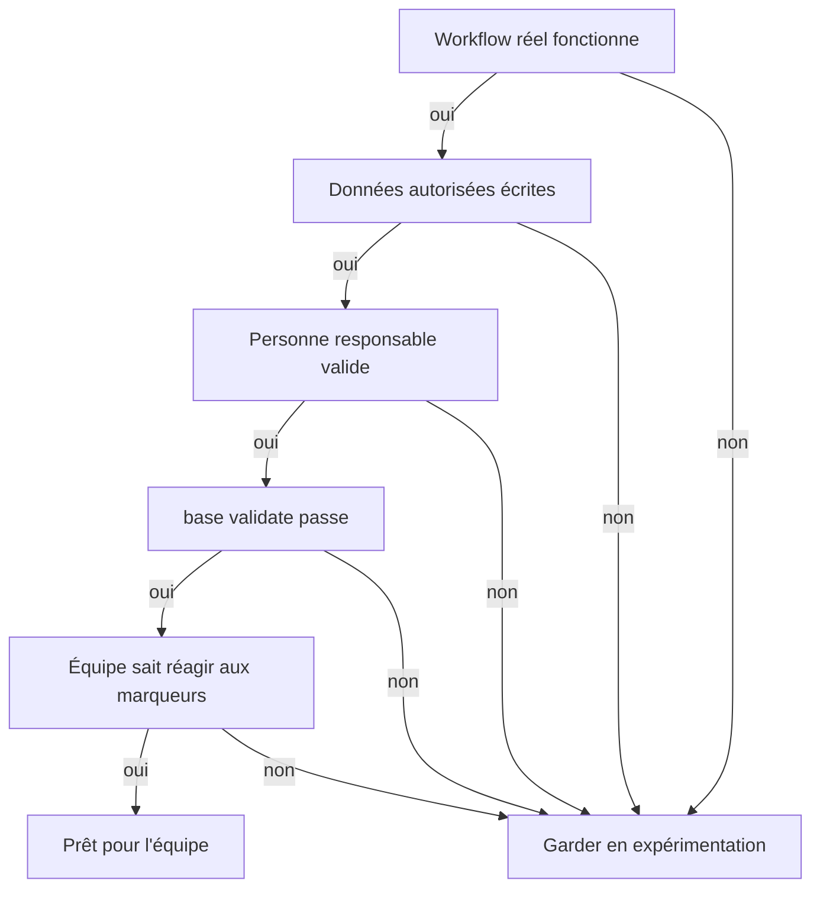

# Démarrer avec BASE en PME suisse

Faire travailler une petite équipe suisse avec l'IA sans déraper ni déployer une plateforme lourde: voilà ce qui se joue ici. Ce kit donne le minimum praticable pour démarrer proprement avec BASE et cadrer un premier usage maîtrisé. Il ne remplace ni un avis juridique, ni une politique de sécurité, ni une gouvernance documentaire.

## 1. Choisir un premier workflow

Commencez par une tâche répétable, visible et peu risquée:

- préparer un devis;
- rédiger une newsletter;
- préparer un entretien;
- structurer un projet;
- traiter une demande support.

Évitez comme premier cas d'usage les décisions juridiques, RH sensibles, médicales, financières réglementées ou irréversibles.

## 2. Définir les données autorisées

Avant d'utiliser un outil IA, l'équipe écrit une règle simple:

```text
On peut entrer: informations publiques, exemples fictifs, modèles internes non sensibles, données client nécessaires à la tâche et validées pour cet usage.
On n'entre pas: secrets, mots de passe, données médicales, données RH sensibles, données client non nécessaires, documents confidentiels sans accord ou environnement adapté.
```

BASE garde les fichiers localement, mais l'outil IA utilisé peut traiter le contenu de la conversation selon ses propres conditions. Pour la nLPD, le RGPD ou des obligations sectorielles, l'organisation reste responsable du traitement, du fournisseur choisi et des droits d'accès.

## 3. Nommer les responsabilités

Pour chaque assistant partagé, décidez:

- qui tient les fichiers métier à jour;
- qui valide les sorties avant envoi externe;
- qui peut modifier les prix, conditions, modèles et règles;
- qui lance l'entretien mensuel;
- qui tranche quand l'assistant signale une incertitude.

Une bonne règle: l'IA propose, la personne responsable signe.

## 4. Versionner simplement

Pour une petite équipe, Git est idéal si elle le maîtrise. Sinon, commencez plus simplement:

- gardez les fichiers dans un dossier partagé maîtrisé;
- datez les changements importants dans un journal;
- ne modifiez pas les modèles critiques sans relecture;
- conservez une copie avant les changements majeurs;
- lancez `base validate` avant de partager une nouvelle version.

Si l'équipe grandit, passez à Git, à des revues de changements et à des droits d'accès formalisés.

## 5. Installer le rituel mensuel

Une fois par mois, ou avant chaque partage important, lancez ces trois commandes. Elles passent par un terminal et supposent Node installé (comme à l'installation); si personne dans l'équipe n'est à l'aise avec le terminal, confiez ce rituel à la personne qui a installé BASE, ou demandez à votre assistant IA de les lancer pour vous.

```bash
base validate --root <dossier>
base entretien --root <dossier>
base route-test --root <dossier>
```

Puis vérifiez en équipe:

- les marqueurs `[A VALIDER]`, `[A COMPLETER]`, `[ATTENTION]`, `[DECISION]`. Le rapport signale ceux qui vieillissent: si vos marqueurs restent ouverts pendant des mois, votre validation est devenue décorative;
- les liens cassés;
- les descriptions manquantes;
- les données obsolètes;
- les workflows qui ne correspondent plus à la pratique réelle;
- les ressources personnelles à promouvoir vers l'équipe.

## 6. Garder les limites visibles

BASE aide une PME à structurer le travail avec l'IA. Il ne fournit pas à lui seul:

- IAM, SSO ou RBAC;
- DLP;
- SIEM;
- archivage légal;
- rétention réglementaire;
- gestion centralisée des secrets;
- garantie d'exactitude des réponses du modèle.

Si ces besoins apparaissent, gardez BASE comme couche de structuration et ajoutez les contrôles techniques autour.

## 7. Règle de décision

Un usage BASE est prêt pour l'équipe quand:

1. un premier workflow réel fonctionne;
2. les données autorisées sont écrites;
3. une personne responsable valide les sorties;
4. `base validate` passe;
5. l'équipe sait quoi faire quand l'assistant marque `[A VALIDER]` ou `[ATTENTION]`.



Si l'un de ces points manque, gardez l'usage en expérimentation.
