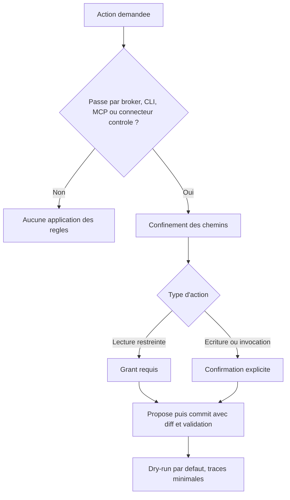

# Déployer BASE en organisation

Déployer BASE en organisation, c'est décider qui peut faire quoi avec vos assistants et garder la main sur les actions sensibles, sans céder votre savoir-faire à une plateforme. L'enjeu pour une équipe ou une DSI: garder le contrôle de ce que le framework applique vraiment, savoir le verrouiller et choisir un mode de déploiement à la mesure de vos exigences. BASE apporte deux choses qui complètent votre socle: un langage de l'expertise dans des fichiers que vous possédez, et une médiation honnête des actions sensibles, branchable sans forker le cœur. Mais ce n'est pas une plateforme de conformité: BASE ne remplace ni IAM, ni SSO, ni RBAC, ni DLP, ni SIEM, ni rétention réglementaire (voir [Sécurité et limites](../trust/securite-et-limites.md)).

## Ce qui est réellement appliqué

L'application des règles ne vaut que pour les actions qui passent par le broker, la CLI, le MCP ou un connecteur contrôlé. Là, BASE fournit: le confinement des chemins, le mode propose puis commit avec diff et validation, le dry-run par défaut des tools, des traces minimales et des points d'extension (validateurs, politique, ranker, auth) configurés via `base.config.{json,mjs}`. Le routeur, lui, choisit le workflow adapté à la demande et évite à l'utilisateur d'avoir à chercher le bon process: il n'applique pas les permissions.



## Exemple de configuration stricte

`base.config.mjs` est du code projet de confiance, chargé uniquement depuis la racine confinée du BASE (jamais depuis des données de ressources). Les mêmes descripteurs fonctionnent en `base.config.json`; le format `.mjs` permet en plus de passer des fonctions pour les cas avancés.

```js
// base.config.mjs : configuration stricte (équipe / organisation).
export default {
  // Enforcement médié : exige un grant pour les lectures restreintes,
  // et une confirmation explicite pour les écritures et invocations.
  policy: { type: "strict", grants: ["devis:nouveau-devis"] },

  // Validateurs d'organisation, appliqués par `base validate` et `base entretien`.
  validators: [
    { type: "requireSchemaVersion" },
    { type: "requireFields", fields: ["owner", "review_date"], whenScope: "team" },
    { type: "forbidSensitivity", level: "restricted" },
    { type: "piiScanner", patterns: ["\\b\\d{13,16}\\b"], severity: "error" },
    { type: "routability" },
  ],

  // Seuils de routage plus prudents, et repli vers le concierge sur abstention honnête.
  routing: {
    floor_score: 40,
    top2_margin: 0.15,
    max_candidates: 5,
    fallback: { agent: "concierge-base", process: "accueil" },
  },
};
```

Le fallback ci-dessus suppose que la racine déployée contient `concierge-base` et son process `accueil`. Si vous copiez seulement un assistant métier, pointez le fallback vers un accueil local équivalent, ou copiez aussi le concierge.

Pour le MCP, ajoutez un descripteur `auth` (jeton porteur ou `AuthProvider` maison): le serveur MCP refuse déjà toute exposition non-loopback sans authentification (voir [`mcp/`](../../mcp/)).

## Modes de déploiement

| Mode | Médiation | Pour qui |
| --- | --- | --- |
| Local, navigateur seul | Aucune (consignes suivies par le modèle) | Découverte, sans installation |
| Outil IA + dossier (par exemple GitHub Copilot, Antigravity, Claude Code ou Cowork, OpenCode, Kilo Code) | Faible (l'outil suit le routage) | Individu, première mise en place |
| CLI locale | Forte sur les actions médiées (propose/commit, dry-run) | Équipe, entretien d'un BASE |
| MCP authentifié | Lecture seule par défaut, écritures explicites, auth requise hors loopback | Intégration multi-clients |
| Politique stricte (`policy: { type: "strict" }`) | Grants de lecture et confirmations explicites sur les actions médiées | Organisation, gouvernance fine |

## Pour aller plus loin

- Garanties et hors-périmètre: [Sécurité et limites](../trust/securite-et-limites.md).
- Souveraineté et confiance (DSI, conformité): [Souveraineté et confiance](../trust/souverainete-et-confiance.md).
- Modèles locaux et suisses (Ollama, Infomaniak): [Modèles souverains et locaux](../guides/modeles-souverains.md).
- Contrat d'ingénierie et points d'extension: [`specs/current/README.md`](../../specs/current/README.md).
- Stabilité de la surface publique: [Versions et stabilité](../reference/versions-et-stabilite.md).
