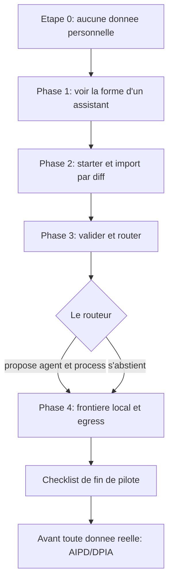

# Pilote en institution, 90 minutes, données non personnelles

Avant d'engager une institution sur un outil d'IA, vous voulez juger sur pièces, sans rien risquer: ce pilote vous laisse voir BASE de vos propres yeux, **sans aucune donnée personnelle de citoyen**, et décider en connaissance de cause s'il faut aller plus loin. Concrètement, c'est un **pilote borné dans le temps** (environ 90 minutes) qu'une administration peut mener sur des commandes réelles: non pas mettre un service en production, mais voir ce que BASE fait, ce qu'il refuse de faire sans vous et ce qui reste local. Cela suppose seulement de travailler sur des procédures internes non personnelles.

> **Note.** Cette page est **informative**, pas un avis juridique ni de conformité. Elle ne remplace ni votre analyse d'impact (AIPD/DPIA) ni votre politique de sécurité. Un pilote, même réussi, **n'établit pas** la conformité d'un futur traitement réel: il vous donne de quoi décider, en connaissance de cause, s'il faut aller plus loin.

## Ce que ce pilote établit, et ce qu'il n'établit pas

**Il établit:**

- que le routage par défaut tourne **en local** (lexical, zéro réseau) et peut **s'abstenir** plutôt que deviner;
- qu'une écriture est **proposée sous forme de diff** et n'a lieu qu'après votre validation;
- que `base validate` contrôle la cohérence de votre corpus;
- où se situe la **frontière** entre ce qui reste sur votre poste et ce qu'un appel à un modèle enverrait.

**Il n'établit pas:**

- la conformité d'un traitement réel (cela relève de votre AIPD/DPIA et de votre registre);
- la qualité ou l'exactitude des réponses d'un modèle (le modèle est votre choix, hors de BASE);
- l'intégration à votre IAM, SSO, RBAC, DLP, SIEM, ni vos règles de rétention ou d'archivage légal. BASE ne fournit aucun de ces composants (voir [Sécurité et limites](../trust/securite-et-limites.md)).

## Mécanisme et consigne: la distinction à garder en tête

Tout au long du pilote, distinguez deux choses:

- un **mécanisme** est appliqué par le médiateur (le broker): il a lieu que le modèle «veuille» ou non. Exemples: confinement des chemins et refus des liens symboliques qui sortent du périmètre (`tools/core/confine.mjs`), écritures **médiées et atomiques** après validation, tools en **dry-run par défaut**, contrôle d'égress **avant** l'appel à un modèle distant.
- une **consigne** est une instruction que le modèle suit (ou non): un ton, un format, un rappel de prudence.

Quand vous demandez «est-ce garanti?», la bonne réponse dépend toujours de ce mot: **mécanisme** (oui, appliqué) ou **consigne** (suivie, non garantie).

## Étape 0: aucune donnée personnelle dans le premier assistant

Avant toute commande, posez la règle du pilote, par écrit, pour l'équipe:

- **Aucune donnée personnelle de citoyen** n'entre dans ce pilote. Pas de noms, pas de dossiers, pas d'extraits de courriers réels.
- On travaille uniquement sur des **modèles et des procédures internes** non personnelles: un gabarit de lettre type, une procédure d'accueil, une checklist interne, une note de cadrage.
- Si un document candidat contient le moindre élément personnel, il est **hors pilote**.

Cette règle est une **consigne d'organisation**, pas un mécanisme: BASE ne sait pas, à votre place, qu'un texte contient des données personnelles. C'est à vous de filtrer en amont. BASE aide ensuite à garder la frontière visible (métadonnée `sensitivity`, contrôle d'égress), mais la décision d'entrée des contenus vous appartient.

Vue d'ensemble du déroulé du pilote:



## Phase 1: voir la forme d'un assistant (15 min)

Ouvrez l'exemple de l'office du tourisme de Veytaux pour voir, sans rien installer de nouveau, à quoi ressemble un assistant BASE: un agent, des process, des données, un template, des scénarios.

- Ouvrez le dossier `exemples/veytaux-tourisme/` dans un outil IA capable de lire vos fichiers (par exemple GitHub Copilot, Antigravity, Claude Code ou Cowork, OpenCode, Kilo Code), **ce dossier**, pas la racine du dépôt.
- Lisez `exemples/veytaux-tourisme/README.md`, puis parcourez l'agent et les deux process.
- Côté ligne de commande, depuis ce dossier, regardez comment une demande est routée:

  ```
  node .ai/base.mjs route "Quelles activités à faire cet après-midi ?" --root .
  ```

Objectif de la phase: reconnaître la **forme** (agent, process, données, template) que vous allez reproduire avec vos propres procédures internes. L'office de Veytaux est volontairement fictif et sans donnée personnelle.

## Phase 2: partir d'un starter et importer 1 à 2 procédures internes non personnelles (40 min)

Copiez un dossier de départ, puis faites entrer une ou deux de vos procédures internes **non personnelles**.

1. Copiez un starter dans un dossier de travail à vous, par exemple à partir de `exemples/starter-perso/`. Travaillez dans cette copie, jamais dans le dépôt d'origine.
2. Choisissez **une ou deux** procédures internes non personnelles (un gabarit de lettre type, une procédure d'accueil).
3. Importez-les via une **proposition montrée sous forme de diff**: rien n'est écrit sans vous. Le mécanisme est «propose puis commit».

   ```
   node .ai/base.mjs propose <chemin-cible> --from <votre-fichier> --root .
   ```

   La proposition vous montre le changement. **Tant que vous ne validez pas, aucun fichier n'est écrit.** Quand le diff vous convient, vous confirmez l'écriture médiée et atomique:

   ```
   node .ai/base.mjs commit <id-du-changement> --root . --confirmed
   ```

Ce que vous observez ici est un **mécanisme**: l'import passe par une étape de proposition, l'écriture est différée jusqu'à votre accord, puis appliquée de façon atomique. Les opérations médiées sont consignées localement dans le journal `.ai/trace` (opération, ressource, statut, durée), sans contenu métier par défaut.

## Phase 3: prouver que ça marche, valider et router (15 min)

Vérifiez la cohérence du corpus, puis routez deux ou trois demandes réalistes.

- Validez le corpus:

  ```
  node .ai/base.mjs validate --root .
  ```

  `base validate` contrôle la cohérence (frontmatter, schéma, références). C'est la même commande que la CI exécute (avec `npm audit`, dev exclus, seuil élevé).

- Routez quelques demandes correspondant à vos procédures importées:

  ```
  node .ai/base.mjs route "rediger une lettre type d'accuse de reception" --root .
  ```

  Notez deux comportements possibles, tous deux **mécanismes**:
  - le routeur propose l'agent et le process pertinents, **en local** (lexical, zéro réseau par défaut);
  - ou il **s'abstient** (hors périmètre, ambigu, clarification nécessaire) plutôt que de donner une fausse certitude. L'abstention est un résultat **voulu**, pas un échec.

> Pour aller plus loin, le dépôt fournit un jeu de routes attendues rejouables (`route-test`). Le contrat de tests est documenté dans [`specs/TESTING.md`](../../specs/TESTING.md).

## Phase 4: ce qui est resté local, ce qu'un appel modèle enverrait (20 min)

Faites le point, explicitement, sur la frontière des données.

- **Reste local sans aucun appel modèle:** le routage par défaut (lexical), `base validate`, l'import par diff, le journal `.ai/trace`. Le ranking sémantique avancé n'envoie du texte à un fournisseur d'embeddings **que si vous l'activez**, et une option locale (Ollama) existe (voir [Sécurité des données de routage](../trust/securite-donnees-routage.md)).
- **Ce qu'un appel à un modèle enverrait:** dès qu'un assistant fait appel à un modèle génératif, le contexte projeté part vers ce modèle. C'est **votre choix** de fournisseur et il vit **hors de BASE**.
- **Le garde-fou de BASE:** le contrôle d'**égress** vérifie, **avant** l'appel, qu'une ressource confidentielle ou une racine déclarée local-only **n'est pas** envoyée à un modèle distant. C'est un **mécanisme**, pas une consigne. Le MCP est en lecture seule par défaut (option jeton porteur), le Studio est en boucle locale uniquement, et le stockage des réglages garde des **noms** de variables d'environnement, pas des clés d'API en clair.

Pour comprendre cette frontière en détail, lisez la page de référence: [Périmètres et gouvernance d'égress](../tutoriel/equipe-2-perimetres-et-egress.md), complétée par [Protection des données](../trust/protection-des-donnees.md).

## Checklist de fin de pilote

- [ ] Règle Étape 0 posée par écrit: aucune donnée personnelle, procédures internes uniquement.
- [ ] Exemple de l'office du tourisme de Veytaux ouvert et route observée (Phase 1).
- [ ] Starter copié dans un dossier de travail, 1 à 2 procédures internes importées par diff, rien écrit sans validation (Phase 2).
- [ ] `base validate` passe; `base route` propose ou s'abstient comme attendu (Phase 3).
- [ ] Frontière local / appel modèle relue, contrôle d'égress compris (Phase 4).
- [ ] Distinction mécanisme / consigne claire pour l'équipe.
- [ ] Limites notées: BASE ne fournit ni IAM, SSO, RBAC, DLP, SIEM, rétention, archivage légal, ni garantie d'exactitude.

## Avant toute donnée réelle: l'AIPD/DPIA

Ce pilote s'arrête **avant** la moindre donnée personnelle réelle. Pour franchir cette étape, votre institution doit conduire son analyse d'impact (AIPD/DPIA) et tenir son registre des traitements. BASE fournit un **squelette réutilisable** à compléter, le [Modèle d'analyse d'impact DPIA](dpia-modele.md), mais il **ne réalise pas** l'analyse à votre place et ne constitue pas un avis juridique. Le cadrage institutionnel (classification, base légale, fournisseur de modèle autorisé, rétention) est détaillé, côté décisions, dans le [Kit administration et secteur public](kit-administration-secteur-public.md) et la page [Protection des données](../trust/protection-des-donnees.md).

Rappel: cette page est informative. La responsabilité de l'AIPD/DPIA et de la politique de sécurité reste celle de votre institution.

## Contact

Pour un échange institutionnel (évaluation, pilote, questions de conformité), contactez **AI Swiss** via [a-i.swiss](https://a-i.swiss).
