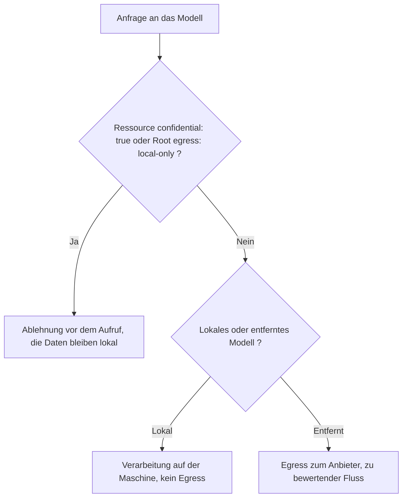

<!-- fr-synced: 7303fe6266734682aecc6efc5960aa2dfd50407e -->

# Vorlage fuer die Datenschutz-Folgenabschaetzung (DPIA)

Bevor Sie einen Assistenten in die Haende Ihrer Teams geben, muessen Sie gegenueber Ihrer Institution und Ihrem Datenschutzbeauftragten (DPO) begruenden koennen, was er mit den Daten tut. Dieses Geruest gibt Ihnen einen vertretbaren Rahmen fuer diese Analyse und trennt klar das, was BASE technisch garantiert, von dem, was in Ihrer Verantwortung bleibt: So wissen Sie genau, was Sie verpflichtet.

> **Informative Seite, keine Rechtsberatung.** Dieses Dokument ist ein wiederverwendbarer Ausgangspunkt. Es ersetzt keine Datenschutz-Folgenabschaetzung (DPIA im Sinne der DSGVO, AIPD im Sinne des nLPD/nFADP). Die eigentliche Analyse, ihre Validierung und ihre Aktualisierung obliegen Ihrer Institution und ihrem Datenschutzbeauftragten (DPO). BASE liefert weder IAM noch DLP noch SIEM noch die regulatorische Aufbewahrung (siehe [Sicherheit und Grenzen](../trust/securite-et-limites.md)).

## So verwenden Sie dieses Geruest

Kopieren Sie diese Struktur in Ihr Verzeichnis. Ersetzen Sie jede Markierung `[A COMPLETER]` durch die Elemente, die fuer Ihre Verarbeitung spezifisch sind. Die Struktur folgt einem mit nLPD/nFADP und DSGVO kompatiblen Rahmen, aber die Eignung fuer Ihren genauen Rechtsrahmen ist von Ihrem DPO zu pruefen.

Eine Unterscheidung zieht sich durch das gesamte Dokument, weil sie im Kern der Ehrlichkeit von BASE steht:

- **Mechanismus**: eine Regel, die vom Vermittler von BASE (dem Code) angewendet wird, also durchsetzbar und ueberpruefbar.
- **Consigne**: eine Anweisung, die vom Modell befolgt wird, also nuetzlich, aber nicht garantiert.

Eine Massnahme ist nur dann eine Garantie, wenn sie auf einem Mechanismus beruht. Rechnen Sie eine Consigne in Ihrer Risikoanalyse nicht als technische Kontrolle an.

## 1. Beschreibung der Verarbeitung

- **Bezeichnung der Verarbeitung:** [A COMPLETER]
- **Verantwortlicher der Verarbeitung:** [A COMPLETER]
- **Dienst oder Fachabteilung:** [A COMPLETER]
- **Funktionale Beschreibung:** [A COMPLETER] (zum Beispiel: Assistent zum Verfassen interner Schreiben, Strukturierung von Verfahren, Hilfe bei der Beantwortung von Anfragen).
- **Rolle von BASE:** BASE strukturiert das Fachwissen in Dateien, die Ihnen gehoeren, und vermittelt sensible Aktionen. BASE ist weder eine Agent-Runtime noch eine Orchestrierungs-Engine noch ein RAG-System noch eine Compliance-Plattform.
- **Rolle des Modells:** Die generative Ausfuehrung (das Modell) ist Ihre Wahl und lebt ausserhalb von BASE. Das Modell kann lokal (zum Beispiel ueber Ollama) oder entfernt (API) sein. Diese Wahl ist entscheidend fuer die Analyse (siehe Abschnitt 5).

## 2. Datenkategorien

BASE selbst speichert nur das, was Sie hineingeben:

- die **Ressourcendateien**, die Sie ablegen (das Fachwissen, in Markdown);
- ein **lokales Trace-Protokoll** (`.ai/trace`), das die vermittelten Vorgaenge aufzeichnet: Vorgang, Ressource, Status, Dauer, standardmaessig ohne Fachinhalt.

Das Standard-routing ist **100 % lokal** (lexikalisch, kein Netzwerk). Das erweiterte semantische routing sendet nur dann Text an einen Embeddings-Anbieter, wenn Sie es ausdruecklich aktivieren, und es existiert eine lokale Option (siehe [Sicherheit der routing-Daten](../trust/securite-donnees-routage.md)).

Fuer Ihre Verarbeitung auszufuellen:

- **Kategorien der verarbeiteten Daten:** [A COMPLETER] (interne Daten, personenbezogene Daten, im Sinne des Gesetzes sensible Daten usw.).
- **Betroffene Personen:** [A COMPLETER] (Mitarbeitende, Buergerinnen und Buerger, Kundschaft usw.).
- **Geschaetztes Volumen und Haeufigkeit:** [A COMPLETER].
- **Allfaellige sensible personenbezogene Daten:** [A COMPLETER]. Vorsichtige Empfehlung: keine sensiblen personenbezogenen Daten in einem ersten Assistenten.

## 3. Zwecke

- **Hauptzweck:** [A COMPLETER].
- **Nebenzwecke:** [A COMPLETER].
- **Minimierung:** [A COMPLETER] (begruenden, dass nur die fuer die Zwecke notwendigen Daten verarbeitet werden).
- **Begrenzung der Aufbewahrung:** siehe Abschnitt 7.

## 4. Rechtsgrundlage

Die Bestimmung der Rechtsgrundlage obliegt Ihrer Institution und ihrem DPO.

- **Gewaehlte Rechtsgrundlage:** [A COMPLETER] (zum Beispiel: Einwilligung, Vertragserfuellung, gesetzliche Verpflichtung, Aufgabe im oeffentlichen Interesse, berechtigtes Interesse, je nach anwendbarem Rahmen).
- **Massgeblicher Rechtsrahmen:** [A COMPLETER] (nLPD/nFADP, einschlaegiges kantonales oder kommunales Recht, DSGVO falls anwendbar).
- **Information der betroffenen Personen:** [A COMPLETER].

## 5. Datenfluesse und Grenze

Standardmaessig bleibt alles lokal. Der Punkt, der vorrangig zu analysieren ist, ist der **Egress**: der Aufruf des entfernten Modells, falls er stattfindet. Siehe das Tutorial [Perimeter und Egress-Governance](../tutoriel/equipe-2-perimetres-et-egress.md).

Von BASE angewendeter Mechanismus: eine als `confidential: true` markierte Ressource oder ein ganzes als `egress: local-only` markiertes Root **wird nicht an ein entferntes Modell gesendet**. Die Kontrolle erfolgt **vor** dem Aufruf, sodass die Daten die Maschine nicht verlassen; die Ablehnung wird angezeigt, niemals stillschweigend. Das ist ein Mechanismus, keine Consigne.

Vorbehalt: Die Unterscheidung lokal/entfernt beruht auf der deklarierten oder abgeleiteten Lokalitaet des Anbieters (`tools/core/model-settings.mjs`), die ein falsch konfigurierter Proxy vor einem entfernten Dienst verfaelschen koennte; es handelt sich also um eine ehrliche Kontrolle, nicht um einen absoluten Beweis.

Fuer Ihre Verarbeitung auszufuellen:

- **Kartierung der Fluesse:** [A COMPLETER] (wer gibt was ein, wo die Dateien gespeichert werden, welche Fluesse die Maschine verlassen).
- **Speicherort der Dateien:** [A COMPLETER].
- **Speicherort des Trace-Protokolls:** lokal, auf der Maschine, auf der BASE laeuft (`.ai/trace`).
- **Gewaehltes Modell:** [A COMPLETER] (lokal oder entfernt). Falls entfernt, beschreiben Sie den Netzwerkaufruf an den Anbieter als zu bewertenden Egress-Fluss.
- **Mit `confidential: true` markierte Daten / Roots auf `egress: local-only`:** [A COMPLETER].

## 6. Empfaenger und Auftragsverarbeiter

- **Interne Empfaenger:** [A COMPLETER].
- **Wichtigster zu bewertender Auftragsverarbeiter:** der Anbieter des gewaehlten entfernten Modells, sofern zutreffend. BASE bindet Sie an keinen Anbieter; wenn Sie ein lokales Modell ausfuehren, gibt es in dieser Hinsicht keine Uebermittlung an einen Dritten.
- **Zu pruefende Vertragsklauseln (falls entferntes Modell):** [A COMPLETER] (Datenlokalisierung, weitere Unterauftragsverarbeitung, Aufbewahrungsdauer aufseiten des Anbieters, Nutzung fuer das Training, Sicherheit).
- **Uebermittlungen ausserhalb des Landes / ausserhalb der anwendbaren Zone:** [A COMPLETER].
- **Gerichtsbarkeit des Hosters und extraterritoriale Exposition:** [A COMPLETER]. Der Ausfuehrungsort regelt nicht die Gerichtsbarkeit: ein Hoster, der einem auslaendischen Gesetz unterliegt, wie dem US-amerikanischen CLOUD Act, kann gezwungen werden, Daten herauszugeben, wo auch immer sie gespeichert sind, waehrend ein Schweizer Akteur nach Schweizer Recht zwingbar bleibt. Siehe [`souverainete-et-confiance.md`](../trust/souverainete-et-confiance.md).

Hinweis: BASE speichert in seinen Einstellungen **Namen** von Umgebungsvariablen, nicht API-keys im Klartext. Die tatsaechliche Verwaltung der Geheimnisse bleibt Ihre Sache.

## 7. Aufbewahrung und Loeschung

- **Aufbewahrungsdauer der Ressourcendateien:** [A COMPLETER] (durch Ihre Archivierungsrichtlinie festgelegt).
- **Aufbewahrungsdauer des Trace-Protokolls:** [A COMPLETER]. Das Protokoll `.ai/trace` ist lokal und kann gemaess Ihrer Richtlinie bereinigt werden. Beschreiben Sie das gewaehlte Bereinigungsverfahren.
- **Loeschverfahren / Recht auf Loeschung:** [A COMPLETER].

Erinnerung: BASE bietet keine automatische regulatorische Aufbewahrung oder gesetzliche Archivierung. Diese Pflichten obliegen Ihren Systemen und Ihren Verfahren.

## 8. Risiken und Massnahmen zur Risikominderung

Unterscheiden Sie fuer jedes Risiko, was durch einen **Mechanismus** von BASE abgedeckt ist, von dem, was einer **Consigne** oder Ihren eigenen Systemen obliegt.

| Risiko | Massnahme | Typ |
|---|---|---|
| Abfluss vertraulicher Daten an ein entferntes Modell | Egress-Ablehnung vor dem Aufruf (Ressource `confidential: true` oder Root `egress: local-only`) | Mechanismus |
| Schreiben ausserhalb des erlaubten Perimeters | Pfad-Eingrenzung und Ablehnung von Ausbruechen ueber symbolische Links (`tools/core/confine.mjs`) | Mechanismus |
| Nicht validierte Aenderung einer Datei | Disziplin schlaegt vor und committet dann; vermittelte und atomare Schreibvorgaenge; ein Diff wird vor dem Schreiben angezeigt | Mechanismus |
| Unbeabsichtigte Ausfuehrung einer Aktion | Tools standardmaessig im Dry-Run | Mechanismus |
| Vom Router erfundene Antwort | Enthaltung statt falscher Gewissheit (`out_of_scope`, `ambiguous`, `needs_clarification`) | Mechanismus |
| Unkontrollierter Zugriff auf den MCP-Server | MCP HTTP standardmaessig schreibgeschuetzt, Option eines Bearer-Tokens | Mechanismus |
| Netzwerkexposition von Studio | Studio nur auf Loopback | Mechanismus |
| Fehlende Nachvollziehbarkeit der Aktionen | Lokales Protokoll der vermittelten Vorgaenge (`.ai/trace`) | Mechanismus |
| Eingabe sensibler Daten in einen Assistenten | Klassifizierung der Ressourcen, Handhabungs-Consignes | Consigne / Organisation |
| Genauigkeit der Ausgaben des Modells | Menschliche Validierung (vorschlagen, dann committen); Gegenlesen | Consigne / Organisation |
| Authentifizierung, RBAC, DLP, SIEM | Ausserhalb von BASE: durch Ihre Systeme abzudecken | Ausserhalb des Perimeters |

Zusaetzlich zu dokumentierende Massnahmen: [A COMPLETER].

## 9. Restrisiko

- **Bewertung des Restrisikos nach den Massnahmen:** [A COMPLETER] (gering / mittel / hoch, mit Begruendung).
- **Nicht von BASE abgedeckte Risiken:** [A COMPLETER] (zum Beispiel: Authentifizierung, Verhinderung von Datenabfluss im Sinne von DLP, zentralisierte Protokollierung, regulatorische Aufbewahrung).
- **Entscheidung:** [A COMPLETER] (Verarbeitung im jetzigen Zustand akzeptabel, unter Bedingungen, oder zu ueberpruefen).

## 10. Validierung

- **Analyse verfasst von:** [A COMPLETER], am [A COMPLETER].
- **Stellungnahme des Datenschutzbeauftragten (DPO):** [A COMPLETER].
- **Konsultation der Aufsichtsbehoerde, falls erforderlich:** [A COMPLETER].
- **Genehmigung des Verantwortlichen der Verarbeitung:** [A COMPLETER], am [A COMPLETER].
- **Vorgesehenes Revisionsdatum:** [A COMPLETER].

---

Der DPO Ihrer Institution ist Eigentuemer der eigentlichen DPIA. Dieses Geruest erleichtert lediglich ihre Erstellung. Fuer das oeffentliche Bedrohungsmodell und die Grenzen des lokalen Kerns siehe [Sicherheit und Grenzen](../trust/securite-et-limites.md) und [Souveraenitaet und Vertrauen](../trust/souverainete-et-confiance.md).
