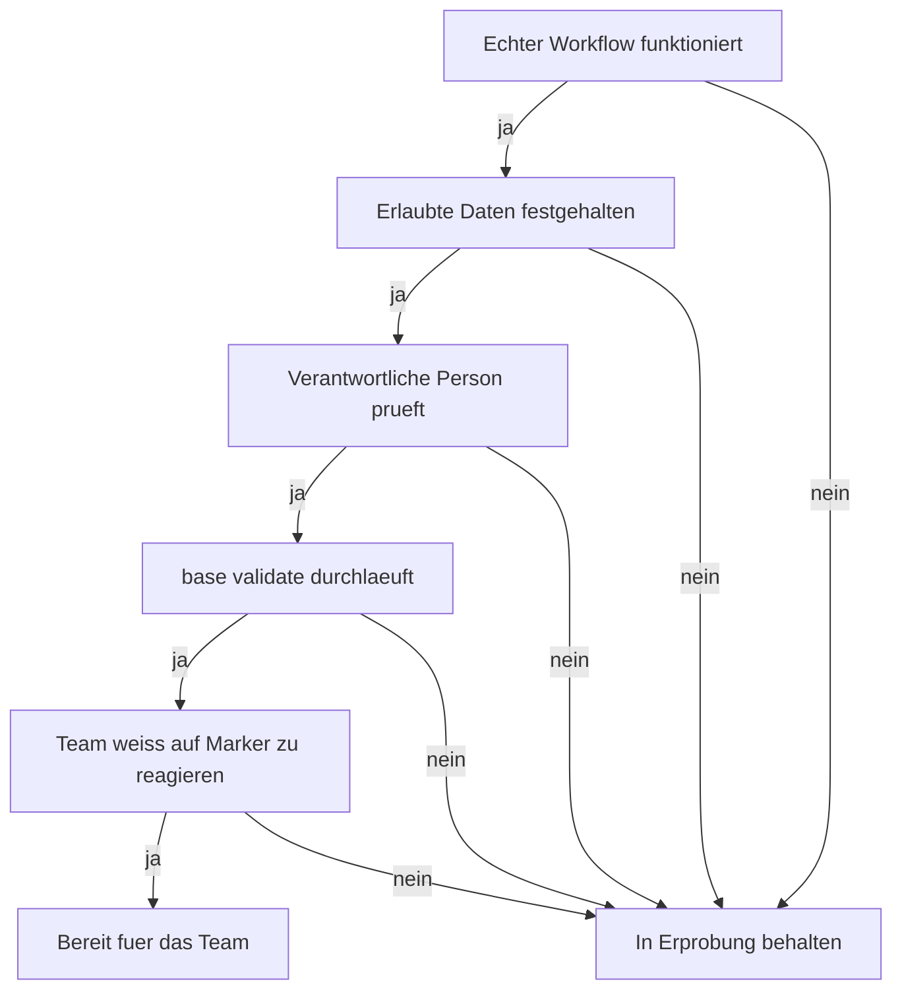

<!-- fr-synced: 1d39f832c6d003d277090020b9bf68b30b09fe48 -->

# Mit BASE in einem Schweizer KMU starten

Ein kleines Schweizer Team mit KI arbeiten lassen, ohne aus der Spur zu geraten oder eine schwerfaellige Plattform auszurollen: darum geht es hier. Dieses Kit liefert das praktikable Minimum, um sauber mit BASE zu starten und eine erste, kontrollierte Nutzung abzustecken. Es ersetzt weder eine Rechtsberatung noch eine Sicherheitsrichtlinie noch eine Dokumenten-Governance.

## 1. Einen ersten Workflow waehlen

Beginnen Sie mit einer wiederholbaren, sichtbaren und risikoarmen Aufgabe:

- eine Offerte vorbereiten;
- einen Newsletter verfassen;
- ein Gespraech vorbereiten;
- ein Projekt strukturieren;
- eine Support-Anfrage bearbeiten.

Vermeiden Sie als ersten Anwendungsfall rechtliche, sensible HR-bezogene, medizinische, regulierte finanzielle oder unumkehrbare Entscheidungen.

## 2. Die erlaubten Daten festlegen

Bevor ein KI-Werkzeug genutzt wird, schreibt das Team eine einfache Regel:

```text
On peut entrer: informations publiques, exemples fictifs, modèles internes non sensibles, données client nécessaires à la tâche et validées pour cet usage.
On n'entre pas: secrets, mots de passe, données médicales, données RH sensibles, données client non nécessaires, documents confidentiels sans accord ou environnement adapté.
```

BASE bewahrt die Dateien lokal auf, aber das genutzte KI-Werkzeug kann den Inhalt der Konversation gemaess seinen eigenen Bedingungen verarbeiten. Fuer die nLPD, die DSGVO oder branchenspezifische Pflichten bleibt die Organisation verantwortlich fuer die Verarbeitung, den gewaehlten Anbieter und die Zugriffsrechte.

## 3. Die Verantwortlichkeiten benennen

Legen Sie fuer jeden geteilten Assistenten fest:

- wer die fachlichen Dateien aktuell haelt;
- wer die Ausgaben vor dem externen Versand prueft;
- wer Preise, Konditionen, Vorlagen und Regeln aendern darf;
- wer den monatlichen Unterhalt startet;
- wer entscheidet, wenn der Assistent eine Unsicherheit meldet.

Eine gute Regel: die KI schlaegt vor, die verantwortliche Person unterschreibt.

## 4. Einfach versionieren

Fuer ein kleines Team ist Git ideal, sofern es beherrscht wird. Andernfalls starten Sie einfacher:

- bewahren Sie die Dateien in einem kontrollierten geteilten Ordner auf;
- datieren Sie wichtige Aenderungen in einem Journal;
- aendern Sie kritische Vorlagen nicht ohne Gegenlesen;
- bewahren Sie vor groesseren Aenderungen eine Kopie auf;
- fuehren Sie `base validate` aus, bevor Sie eine neue Version teilen.

Wenn das Team waechst, wechseln Sie zu Git, zu Aenderungspruefungen und zu formalisierten Zugriffsrechten.

## 5. Das monatliche Ritual einrichten

Einmal im Monat, oder vor jedem wichtigen Teilen, fuehren Sie diese drei Befehle aus. Sie laufen ueber ein Terminal und setzen voraus, dass Node installiert ist (wie bei der Installation); wenn niemand im Team mit dem Terminal vertraut ist, uebergeben Sie dieses Ritual der Person, die BASE installiert hat, oder bitten Sie Ihren KI-Assistenten, sie fuer Sie auszufuehren.

```bash
base validate --root <dossier>
base entretien --root <dossier>
base route-test --root <dossier>
```

Pruefen Sie dann im Team:

- die Markierungen `[A VALIDER]`, `[A COMPLETER]`, `[ATTENTION]`, `[DECISION]`. Der Bericht meldet jene, die altern: wenn Ihre Markierungen monatelang offen bleiben, ist Ihre Validierung dekorativ geworden;
- die defekten Links;
- die fehlenden Beschreibungen;
- die veralteten Daten;
- die Workflows, die nicht mehr der tatsaechlichen Praxis entsprechen;
- die persoenlichen Ressourcen, die ins Team hochgestuft werden sollten.

## 6. Die Grenzen sichtbar halten

BASE hilft einem KMU, die Arbeit mit KI zu strukturieren. Allein liefert es nicht:

- IAM, SSO oder RBAC;
- DLP;
- SIEM;
- rechtliche Archivierung;
- regulatorische Aufbewahrung;
- zentralisierte Verwaltung von Geheimnissen;
- eine Garantie fuer die Richtigkeit der Antworten des Modells.

Wenn diese Beduerfnisse auftauchen, behalten Sie BASE als Strukturierungsschicht und ergaenzen Sie die technischen Kontrollen drumherum.

## 7. Entscheidungsregel

Eine BASE-Nutzung ist bereit fuer das Team, wenn:

1. ein erster echter Workflow funktioniert;
2. die erlaubten Daten schriftlich festgehalten sind;
3. eine verantwortliche Person die Ausgaben prueft;
4. `base validate` durchlaeuft;
5. das Team weiss, was zu tun ist, wenn der Assistent `[A VALIDER]` oder `[ATTENTION]` markiert.



Wenn einer dieser Punkte fehlt, behalten Sie die Nutzung im Versuchsstadium.
