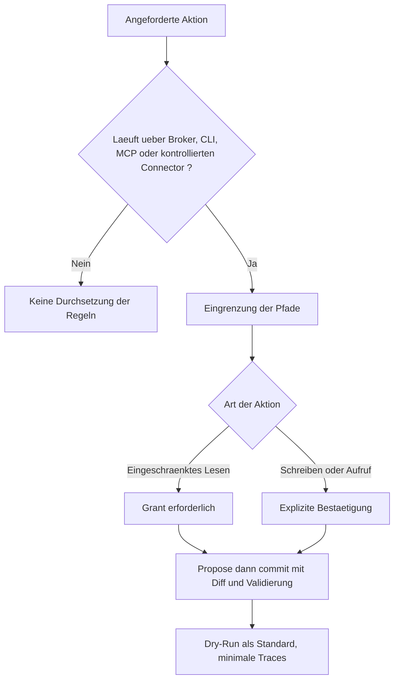

<!-- fr-synced: 875227e79f92bee9f1a6bea6ec0140894b3f83b8 -->

# BASE in einer Organisation bereitstellen

BASE in einer Organisation bereitzustellen bedeutet, zu entscheiden, wer was mit Ihren Assistenten tun darf, und die Kontrolle über sensible Aktionen zu behalten, ohne Ihr Know-how an eine Plattform abzugeben. Die Herausforderung für ein Team oder eine IT-Abteilung: die Kontrolle darüber behalten, was das Framework tatsächlich durchsetzt, wissen, wie man es absichert, und einen Bereitstellungsmodus wählen, der Ihren Anforderungen entspricht. BASE bringt zwei Dinge mit, die Ihr bestehendes Fundament ergänzen: eine Sprache für die Expertise in Dateien, die Ihnen gehören, und eine ehrliche Vermittlung sensibler Aktionen, einsteckbar ohne den Kern zu forken. Aber es ist keine Compliance-Plattform: BASE ersetzt weder IAM noch SSO, RBAC, DLP, SIEM oder die regulatorische Aufbewahrung (siehe [Sicherheit und Grenzen](../trust/securite-et-limites.md)).

## Was tatsächlich durchgesetzt wird

Die Durchsetzung der Regeln gilt nur für Aktionen, die über den Broker, die CLI, das MCP oder einen kontrollierten Connector laufen. Dort liefert BASE: die Eingrenzung der Pfade, den Modus propose und anschliessend commit mit Diff und Validierung, den Dry-Run als Standard für Tools, minimale Traces und Erweiterungspunkte (Validatoren, Policy, Ranker, Auth), die über `base.config.{json,mjs}` konfiguriert werden. Das routing wählt seinerseits den passenden Workflow für die Anfrage und erspart dem Nutzer die Suche nach dem richtigen Prozess: es setzt keine Berechtigungen durch.



## Beispiel einer strikten Konfiguration

`base.config.mjs` ist vertrauenswürdiger Projektcode, der ausschliesslich aus der eingegrenzten Wurzel der BASE geladen wird (niemals aus Ressourcendaten). Dieselben Deskriptoren funktionieren in `base.config.json`; das Format `.mjs` erlaubt zusätzlich, Funktionen für fortgeschrittene Fälle zu übergeben.

```js
// base.config.mjs : configuration stricte (équipe / organisation).
export default {
  // Enforcement médié : exige un grant pour les lectures restreintes,
  // et une confirmation explicite pour les écritures et invocations.
  policy: { type: "strict", grants: ["devis:nouveau-devis"] },

  // Validateurs d'organisation, appliqués par `base validate` et `base entretien`.
  validators: [
    { type: "requireSchemaVersion" },
    { type: "requireFields", fields: ["owner", "review_date"], whenScope: "team" },
    { type: "forbidSensitivity", level: "restricted" },
    { type: "piiScanner", patterns: ["\\b\\d{13,16}\\b"], severity: "error" },
    { type: "routability" },
  ],

  // Seuils de routage plus prudents, et repli vers le concierge sur abstention honnête.
  routing: {
    floor_score: 40,
    top2_margin: 0.15,
    max_candidates: 5,
    fallback: { agent: "concierge-base", process: "accueil" },
  },
};
```

Der obige Fallback setzt voraus, dass die bereitgestellte Wurzel `concierge-base` und dessen Prozess `accueil` enthält. Wenn Sie nur einen Fachassistenten kopieren, richten Sie den Fallback auf einen gleichwertigen lokalen Einstiegspunkt aus, oder kopieren Sie auch den Concierge.

Fügen Sie für das MCP einen `auth`-Deskriptor hinzu (Bearer-Token oder ein selbst entwickelter `AuthProvider`): der MCP-Server verweigert bereits jede Nicht-Loopback-Exposition ohne Authentifizierung (siehe [`mcp/`](../../mcp/)).

## Bereitstellungsmodi

| Modus | Vermittlung | Für wen |
| --- | --- | --- |
| Lokal, nur Browser | Keine (vom Modell befolgte Vorgaben) | Erkundung, ohne Installation |
| KI-Tool + Ordner (zum Beispiel GitHub Copilot, Antigravity, Claude Code oder Cowork, OpenCode, Kilo Code) | Schwach (das Tool folgt dem routing) | Einzelperson, erste Einrichtung |
| Lokale CLI | Stark bei vermittelten Aktionen (propose/commit, Dry-Run) | Team, Pflege einer BASE |
| Authentifiziertes MCP | Standardmässig nur Lesen, explizite Schreibvorgänge, Auth ausserhalb von Loopback erforderlich | Multi-Client-Integration |
| Strikte Policy (`policy: { type: "strict" }`) | Lese-Grants und explizite Bestätigungen bei vermittelten Aktionen | Organisation, feingranulare Governance |

## Weiterführend

- Garantien und ausserhalb des Geltungsbereichs: [Sicherheit und Grenzen](../trust/securite-et-limites.md).
- Souveränität und Vertrauen (IT-Abteilungen, Compliance): [Souveränität und Vertrauen](../trust/souverainete-et-confiance.md).
- Lokale und Schweizer Modelle (Ollama, Infomaniak): [Souveräne und lokale Modelle](../guides/modeles-souverains.md).
- Engineering-Vertrag und Erweiterungspunkte: [`specs/current/README.md`](../../specs/current/README.md).
- Stabilität der öffentlichen Oberfläche: [Versionen und Stabilität](../reference/versions-et-stabilite.md).
