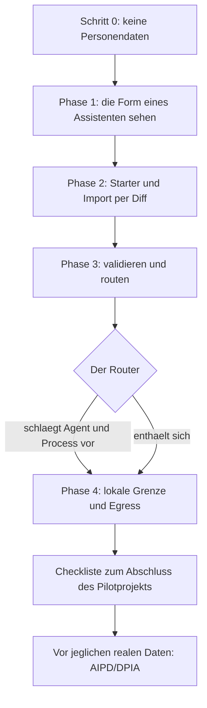

<!-- fr-synced: 05e7b530b270929c91cdca4e4b11fde9564a9a10 -->

# Pilotprojekt in einer Institution, 90 Minuten, keine Personendaten

Bevor Sie eine Institution auf ein KI-Werkzeug festlegen, möchten Sie sich anhand konkreter Belege ein Urteil bilden, ohne etwas zu riskieren: Dieses Pilotprojekt lässt Sie BASE mit eigenen Augen sehen, **ganz ohne Personendaten von Bürgerinnen und Bürgern**, und in voller Kenntnis der Sachlage entscheiden, ob Sie weitergehen wollen. Konkret handelt es sich um ein **zeitlich begrenztes Pilotprojekt** (etwa 90 Minuten), das eine Verwaltung anhand realer Befehle durchführen kann: nicht einen Dienst in Produktion bringen, sondern sehen, was BASE tut, was es ohne Sie verweigert und was lokal bleibt. Das setzt nur voraus, dass Sie an internen, nicht personenbezogenen Abläufen arbeiten.

> **Hinweis.** Diese Seite ist **informativ**, sie ist weder eine Rechts- noch eine Compliance-Beratung. Sie ersetzt weder Ihre Datenschutz-Folgenabschätzung (AIPD/DPIA) noch Ihre Sicherheitsrichtlinie. Ein Pilotprojekt, selbst ein erfolgreiches, **belegt nicht** die Konformität einer künftigen realen Verarbeitung: Es gibt Ihnen die Grundlage, um in voller Kenntnis der Sachlage zu entscheiden, ob Sie weitergehen.

## Was dieses Pilotprojekt belegt und was nicht

**Es belegt:**

- dass das Standard-Routing **lokal** läuft (lexikalisch, kein Netzwerk) und sich **enthalten** kann, statt zu raten;
- dass ein Schreibvorgang **als Diff vorgeschlagen** wird und erst nach Ihrer Bestätigung erfolgt;
- dass `base validate` die Kohärenz Ihres Korpus prüft;
- wo die **Grenze** zwischen dem, was auf Ihrem Rechner bleibt, und dem, was ein Modellaufruf senden würde, verläuft.

**Es belegt nicht:**

- die Konformität einer realen Verarbeitung (das obliegt Ihrer AIPD/DPIA und Ihrem Verzeichnis);
- die Qualität oder Richtigkeit der Antworten eines Modells (das Modell ist Ihre Wahl, ausserhalb von BASE);
- die Integration in Ihr IAM, SSO, RBAC, DLP, SIEM oder Ihre Aufbewahrungs- oder gesetzlichen Archivierungsregeln. BASE liefert keine dieser Komponenten (siehe [Sicherheit und Grenzen](../trust/securite-et-limites.md)).

## Mechanismus und Vorgabe: die Unterscheidung, die man im Kopf behalten muss

Unterscheiden Sie während des gesamten Pilotprojekts zwei Dinge:

- ein **Mechanismus** wird vom Vermittler (dem Broker) durchgesetzt: Er greift, ob das Modell es «will» oder nicht. Beispiele: Eingrenzung der Pfade und Ablehnung symbolischer Links, die aus dem Perimeter hinausführen (`tools/core/confine.mjs`), **vermittelte und atomare** Schreibvorgänge nach Validierung, Tools standardmässig im **Dry-Run**, Egress-Kontrolle **vor** dem Aufruf eines entfernten Modells.
- eine **Vorgabe** ist eine Anweisung, der das Modell folgt (oder nicht): ein Tonfall, ein Format, eine Mahnung zur Vorsicht.

Wenn Sie fragen «ist das garantiert?», hängt die richtige Antwort immer von diesem Wort ab: **Mechanismus** (ja, durchgesetzt) oder **Vorgabe** (befolgt, nicht garantiert).

## Schritt 0: keine Personendaten im ersten Assistenten

Legen Sie vor jedem Befehl die Regel des Pilotprojekts schriftlich für das Team fest:

- **Keine Personendaten von Bürgerinnen und Bürgern** gelangen in dieses Pilotprojekt. Keine Namen, keine Akten, keine Auszüge aus echtem Schriftverkehr.
- Es wird ausschliesslich an **internen, nicht personenbezogenen Vorlagen und Abläufen** gearbeitet: eine Musterbriefvorlage, ein Empfangsablauf, eine interne Checkliste, eine Rahmennotiz.
- Enthält ein Kandidatendokument auch nur das geringste personenbezogene Element, ist es **ausserhalb des Pilotprojekts**.

Diese Regel ist eine **organisatorische Vorgabe**, kein Mechanismus: BASE weiss nicht an Ihrer Stelle, dass ein Text Personendaten enthält. Es liegt an Ihnen, im Vorfeld zu filtern. BASE hilft anschliessend, die Grenze sichtbar zu halten (Metadatum `sensitivity`, Egress-Kontrolle), aber die Entscheidung, welche Inhalte hineingelangen, liegt bei Ihnen.

Überblick über den Ablauf des Pilotprojekts:



## Phase 1: die Form eines Assistenten sehen (15 Min.)

Öffnen Sie das Beispiel des Tourismusbüros von Veytaux, um ohne Neuinstallation zu sehen, wie ein BASE-Assistent aussieht: ein Agent, Process-Abläufe, Daten, ein Template, Szenarien.

- Öffnen Sie den Ordner `exemples/veytaux-tourisme/` in einem KI-Werkzeug, das Ihre Dateien lesen kann (zum Beispiel GitHub Copilot, Antigravity, Claude Code oder Cowork, OpenCode, Kilo Code), **diesen Ordner**, nicht die Wurzel des Repositorys.
- Lesen Sie `exemples/veytaux-tourisme/README.md` und gehen Sie dann den Agent und die beiden Process-Abläufe durch.
- Schauen Sie auf der Kommandozeile aus diesem Ordner heraus, wie eine Anfrage geroutet wird:

  ```
  node .ai/base.mjs route "Quelles activités à faire cet après-midi ?" --root .
  ```

Ziel der Phase: die **Form** (Agent, Process, Daten, Template) erkennen, die Sie mit Ihren eigenen internen Abläufen nachbilden werden. Das Büro von Veytaux ist bewusst fiktiv und enthält keine Personendaten.

## Phase 2: von einem Starter ausgehen und 1 bis 2 interne, nicht personenbezogene Abläufe importieren (40 Min.)

Kopieren Sie einen Ausgangsordner und bringen Sie dann einen oder zwei Ihrer internen, **nicht personenbezogenen** Abläufe ein.

1. Kopieren Sie einen Starter in einen eigenen Arbeitsordner, zum Beispiel aus `exemples/starter-perso/`. Arbeiten Sie in dieser Kopie, niemals im ursprünglichen Repository.
2. Wählen Sie **einen oder zwei** interne, nicht personenbezogene Abläufe (eine Musterbriefvorlage, einen Empfangsablauf).
3. Importieren Sie sie über einen **als Diff gezeigten Vorschlag**: Nichts wird ohne Sie geschrieben. Der Mechanismus lautet «vorschlagen, dann committen».

   ```
   node .ai/base.mjs propose <chemin-cible> --from <votre-fichier> --root .
   ```

   Der Vorschlag zeigt Ihnen die Änderung. **Solange Sie nicht bestätigen, wird keine Datei geschrieben.** Wenn Ihnen das Diff zusagt, bestätigen Sie den vermittelten, atomaren Schreibvorgang:

   ```
   node .ai/base.mjs commit <id-du-changement> --root . --confirmed
   ```

Was Sie hier beobachten, ist ein **Mechanismus**: Der Import durchläuft einen Vorschlagsschritt, der Schreibvorgang wird bis zu Ihrer Zustimmung aufgeschoben und anschliessend atomar angewendet. Vermittelte Operationen werden lokal im Journal `.ai/trace` protokolliert (Operation, Ressource, Status, Dauer), standardmässig ohne Fachinhalt.

## Phase 3: beweisen, dass es funktioniert, validieren und routen (15 Min.)

Prüfen Sie die Kohärenz des Korpus und routen Sie dann zwei oder drei realistische Anfragen.

- Validieren Sie das Korpus:

  ```
  node .ai/base.mjs validate --root .
  ```

  `base validate` prüft die Kohärenz (Frontmatter, Schema, Referenzen). Es ist derselbe Befehl, den die CI ausführt (mit `npm audit`, Dev ausgeschlossen, hoher Schwellenwert).

- Routen Sie einige Anfragen, die zu Ihren importierten Abläufen passen:

  ```
  node .ai/base.mjs route "rediger une lettre type d'accuse de reception" --root .
  ```

  Beachten Sie zwei mögliche Verhaltensweisen, beide **Mechanismen**:
  - der Router schlägt den passenden Agent und Process vor, **lokal** (lexikalisch, standardmässig kein Netzwerk);
  - oder er **enthält sich** (ausserhalb des Perimeters, mehrdeutig, Klärung nötig), statt eine falsche Gewissheit zu geben. Die Enthaltung ist ein **gewolltes** Ergebnis, kein Fehlschlag.

> Um weiterzugehen, stellt das Repository einen wiederabspielbaren Satz erwarteter Routen bereit (`route-test`). Der Testvertrag ist in [`specs/TESTING.md`](../../specs/TESTING.md) dokumentiert.

## Phase 4: was lokal geblieben ist, was ein Modellaufruf senden würde (20 Min.)

Machen Sie sich explizit ein Bild von der Datengrenze.

- **Bleibt lokal, ganz ohne Modellaufruf:** das Standard-Routing (lexikalisch), `base validate`, der Import per Diff, das Journal `.ai/trace`. Das fortgeschrittene semantische Ranking sendet **nur, wenn Sie es aktivieren**, Text an einen Embeddings-Anbieter, und es gibt eine lokale Option (Ollama) (siehe [Sicherheit der Routing-Daten](../trust/securite-donnees-routage.md)).
- **Was ein Modellaufruf senden würde:** Sobald ein Assistent ein generatives Modell aufruft, geht der projizierte Kontext an dieses Modell. Das ist **Ihre Wahl** des Anbieters und sie lebt **ausserhalb von BASE**.
- **Das Schutzgeländer von BASE:** Die **Egress**-Kontrolle prüft **vor** dem Aufruf, dass eine vertrauliche Ressource oder eine als local-only deklarierte Wurzel **nicht** an ein entferntes Modell gesendet wird. Das ist ein **Mechanismus**, keine Vorgabe. Das MCP ist standardmässig schreibgeschützt (Option Bearer-Token), das Studio läuft nur in einer lokalen Schleife, und der Einstellungsspeicher bewahrt **Namen** von Umgebungsvariablen auf, keine API-Keys im Klartext.

Um diese Grenze im Detail zu verstehen, lesen Sie die Referenzseite: [Perimeter und Egress-Governance](../tutoriel/equipe-2-perimetres-et-egress.md), ergänzt durch [Datenschutz](../trust/protection-des-donnees.md).

## Checkliste zum Abschluss des Pilotprojekts

- [ ] Regel aus Schritt 0 schriftlich festgehalten: keine Personendaten, nur interne Abläufe.
- [ ] Beispiel des Tourismusbüros von Veytaux geöffnet und Routing beobachtet (Phase 1).
- [ ] Starter in einen Arbeitsordner kopiert, 1 bis 2 interne Abläufe per Diff importiert, nichts ohne Validierung geschrieben (Phase 2).
- [ ] `base validate` läuft durch; `base route` schlägt vor oder enthält sich wie erwartet (Phase 3).
- [ ] Grenze lokal / Modellaufruf erneut durchgegangen, Egress-Kontrolle verstanden (Phase 4).
- [ ] Unterscheidung Mechanismus / Vorgabe für das Team klar.
- [ ] Grenzen notiert: BASE liefert weder IAM, SSO, RBAC, DLP, SIEM, Aufbewahrung, gesetzliche Archivierung noch eine Richtigkeitsgarantie.

## Vor jeglichen realen Daten: die AIPD/DPIA

Dieses Pilotprojekt endet **vor** der geringsten realen Personendaten. Um diesen Schritt zu gehen, muss Ihre Institution ihre Datenschutz-Folgenabschätzung (AIPD/DPIA) durchführen und ihr Verarbeitungsverzeichnis führen. BASE stellt ein **wiederverwendbares Gerüst** zum Ausfüllen bereit, die [DPIA-Vorlage zur Folgenabschätzung](dpia-modele.md), aber es **führt** die Analyse **nicht** für Sie durch und stellt keine Rechtsberatung dar. Die institutionelle Rahmensetzung (Klassifizierung, Rechtsgrundlage, zugelassener Modellanbieter, Aufbewahrung) wird auf der Entscheidungsseite im [Kit für Verwaltung und öffentlichen Sektor](kit-administration-secteur-public.md) und auf der Seite [Datenschutz](../trust/protection-des-donnees.md) ausführlich behandelt.

Erinnerung: Diese Seite ist informativ. Die Verantwortung für die AIPD/DPIA und die Sicherheitsrichtlinie bleibt bei Ihrer Institution.

## Kontakt

Für einen institutionellen Austausch (Evaluation, Pilotprojekt, Fragen zur Konformität) kontaktieren Sie **AI Swiss** über [a-i.swiss](https://a-i.swiss).
