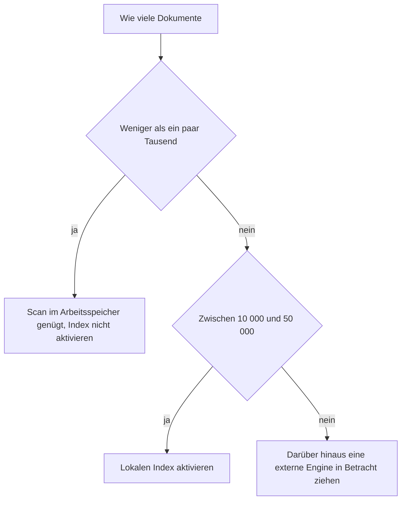

<!-- fr-synced: cc8b7a7584246944c3f41d7c8428bc5d99bf0df1 -->

# Wissen, wann der lokale Index aktiviert werden soll (Benchmarks)

Wenn Sie ein BASE-Repository betreiben und unsicher sind, ob Sie den lokalen Index aktivieren sollen, liefert Ihnen diese Seite reproduzierbare Zahlen für die Entscheidung. Sie sehen, ab wie vielen Dokumenten der Scan im Arbeitsspeicher nicht mehr ausreicht, was der Index dann bringt und was er kostet.

## Reproduzieren

```bash
node packages/base-index-local/bin/base-index-local.mjs bench --sizes 100,1000,10000,50000
# oder
npm run bench:index
```

Synthetisches Korpus (Agents + Prozesse, 20 Prozesse pro Agent), Median aus 20 Abfragen pro Grösse. Build im kalten Zustand; Suche gemessen im kalten Zustand (Vokabular wird bei jeder Abfrage gescannt) und im warmen Zustand (Vokabular im Cache auf dem Index-Objekt).

## Ergebnisse (portabel, Node 24)

| Dokumente | Build | Suche (kalt) | Suche (warm) |
|---:|---:|---:|---:|
| 105 | 9 ms | 0,01 ms | 0 ms |
| 1 050 | 10 ms | 0,03 ms | 0,01 ms |
| 10 500 | 83 ms | 0,65 ms | 0,13 ms |
| 52 500 | 394 ms | 5,3 ms | 0,9 ms |

Die Zahlen variieren je nach Maschine: Führen Sie `bench` erneut aus, um Ihre eigenen zu messen. In der CI wird kein aggressiver Schwellenwert erzwungen: Ein *Smoke*-Test prüft nur, dass der Bericht erstellt wird, nicht dass er eine fragile Zahl erreicht.

## Interpretation



- **Bis zu einigen Tausend Dokumenten** ist der Scan des Kerns im Arbeitsspeicher bereits sofort verfügbar: Der Index bringt nichts Beobachtbares. Aktivieren Sie ihn nicht.
- **Bei 10 000 bis 50 000** bleibt der Build unter einer Sekunde und die warme Suche unter einer Millisekunde: Der Index macht bequem, was ein wiederholter Scan kostspielig machen würde.
- **Darüber hinaus** siehe [Die Skalierung verstehen](../learn/comprendre-echelle.md): Eine externe Engine wird legitim, hinter derselben Form Kandidaten -> Entscheidung.

## Mit und ohne Embeddings

Die obigen Zahlen sind **lexikalisch** (keine Abhängigkeiten). Vorberechnete Embeddings verursachen Kosten beim Build (ein Anbieteraufruf pro Dokument, in Stapeln gruppiert) und einen gespeicherten Vektor pro Dokument; bei der Abfrage wird nur die Abfrage selbst eingebettet. Dieser Teil läuft zur Nutzungszeit und hängt vom Modell oder Anbieter ab; er fliesst nicht in das deterministische Frische-Gate des Index ein.
