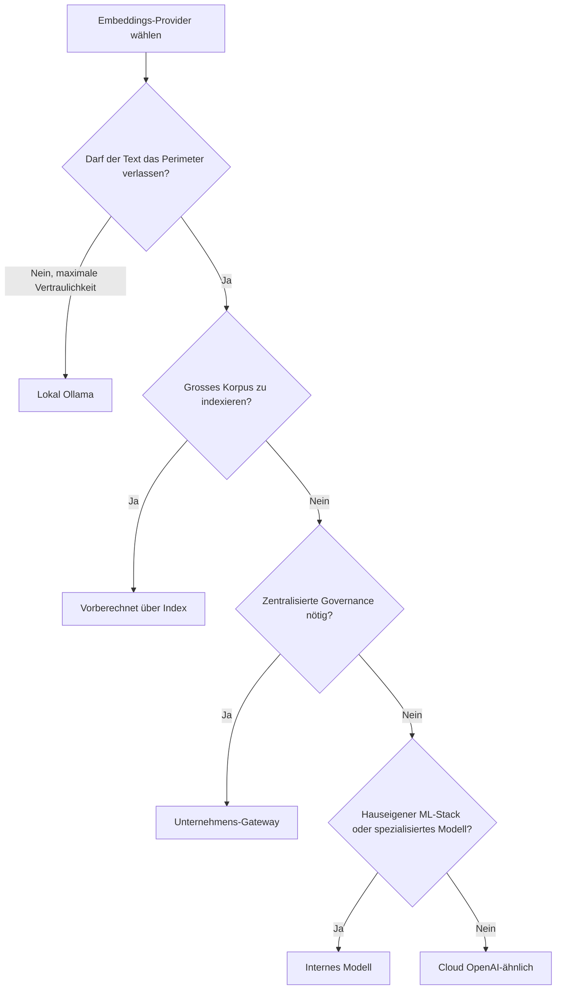

<!-- fr-synced: f1811e6c781b84473f80663efc3332688f47619f -->

# Den eigenen Embeddings-Provider wählen

Diese Seite hilft allen, die BASE in Produktion bringen, zu entscheiden, woher ihre Embeddings stammen, je nach ihren Anforderungen an Vertraulichkeit, Kosten und Governance. Text zu embedden ist eine explizite Entscheidung: Sie übergeben ein `embed` an `createSemanticRanker`, und BASE schreibt Ihnen **keines** vor.

## Die Optionen

| Option | Wie | Wann |
|---|---|---|
| **Lokal (Ollama)** | `createOllamaEmbedder()`, alles bleibt auf `localhost` | maximale Vertraulichkeit, offline, Demos, Einzelarbeitsplätze |
| **Cloud (OpenAI-ähnlich)** | `createOpenAICompatibleEmbedder({ model })` | hohe Qualität, keine Infrastruktur zu verwalten, Daten können das System verlassen |
| **Unternehmens-Gateway** | `createOpenAICompatibleEmbedder({ baseUrl })` zu einem internen Proxy | grosse Organisation: Auth, Protokollierung, DLP auf Proxy-Ebene |
| **Internes Modell** | ein beliebiges `embed: async (t) => meinModell.embed(t)` | hauseigener ML-Stack, Souveränität, spezialisiertes Modell |
| **Vorberechnet (Index)** | `getResourceEmbedding` bereitgestellt durch `vectorFor(index, resource)` aus `@ai-swiss/base-index-local` | grosses Korpus; der Ressourcentext wird zur Abfragezeit nicht übertragen |

BASE stellt bewusst **keinen** Helfer für den «besten Provider» bereit: eine technische Präferenz im Kern festzuschreiben käme einer Entscheidung an Ihrer Stelle gleich.

## Die Kriterien

- **Vertraulichkeit.** Verlässt der Text Ihr Perimeter? Lokal und internes Gateway behalten ihn; öffentliche Cloud sendet ihn hinaus. Siehe [Sicherheit & Daten](../trust/securite-donnees-routage.md).
- **Kosten.** Cloud = Kosten pro Token; lokal = Hardwarekosten; vorberechnet = beim Build amortisierte Kosten.
- **Latenz.** Lokal hängt von Ihrer Maschine ab; Cloud von der Netzwerkverbindung; vorberechnet ist zur Abfragezeit nahezu null (nur die Abfrage wird embeddet).
- **Qualität.** Grosse Cloud-Modelle führen oft; ein gutes lokales Modell genügt häufig für das Routing (der `route_text` ist kurz und trennscharf).
- **Governance.** Ein Gateway bietet einen einzigen Punkt für Auth, bereinigte Protokollierung, Aufbewahrung und Compliance, ohne den BASE-Kern zu berühren.

## Robustheit, unabhängig von der Wahl

Alle Provider des Pakets erben dieselben Garantien: `timeoutMs`, `AbortSignal` (`ctx.signal`), begrenzte Retries nur bei transienten Fehlern, Backoff mit Jitter, typisierte Fehler (`.code`). Ein falscher Key schlägt schnell fehl (`semantic.auth`, nie wiederholt); ein Netzwerkausfall wird wiederholt (`semantic.network`).

## Reduzieren, was gesendet wird

- **Berechnen Sie** die Ressourcenvektoren über einen Index **vor**: nur die Abfrage wird live gesendet.
- **Beschränken Sie `textOf`** auf das strikt Nützliche (oft genügt `route_text`).
- **Gehen Sie über einen internen Proxy**, um zu vermeiden, einen öffentlichen Endpunkt direkt freizulegen.

Vollständige Details: [Sicherheit & Daten des Routings](../trust/securite-donnees-routage.md).
