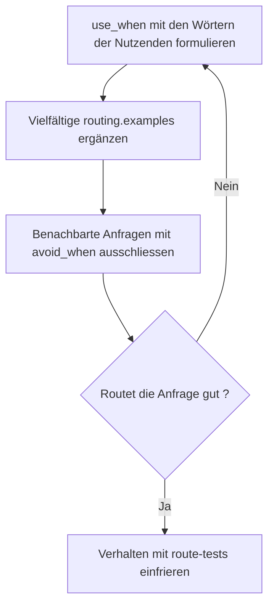

<!-- fr-synced: 8ea40981db54eae95e0b6ee6811e2a7dd8b35d37 -->

# Für den Router schreiben

Wenn eine Anfrage wie «Erstelle eine Offerte für die Dupont AG» nicht den richtigen Process erreicht, bleibt Ihr Assistent stumm oder antwortet daneben: Es ist die Formulierung Ihrer Dateien, die entscheidet. Dieser Leitfaden richtet sich an Erstellerinnen und Ersteller von Assistenten. Er erklärt, wie der Router Ihre Dateien liest, wie Sie für ihn schreiben und wie Sie prüfen, ob Ihre Anfragen am richtigen Ort ankommen. Es sind keine technischen Kenntnisse erforderlich, ausser einem Terminalbefehl zum Testen.



## Wie der Router Ihre Dateien liest

Der Router versteht nicht die Bedeutung Ihres Textes: Er **vergleicht Wörter**. Für jeden Process baut er einen Routing-Text aus dem `use_when` (das stärkste Signal), ergänzt durch die `routing.examples`; andernfalls greift er auf die Beschreibung, dann den Titel und schliesslich die Schlüsselwörter zurück. Eine Anfrage routet gut, wenn ihre Wörter sich mit diesem Text überschneiden. In der Praxis sollte Ihr `use_when` vor allem **die Wörter enthalten, die Ihre Nutzenden verwenden würden**, und nicht eine elegante Formulierung.

## Ein gutes `use_when` formulieren

Schreiben Sie das `use_when` aus der Sicht der Nutzenden, nicht aus Ihrer eigenen. Internes Fachjargon («Verwaltung des Verkaufszyklus») routet nichts, wenn es niemand eintippt; konkrete Wörter («Offerte», «Preis», «Angebot») routen.

Vorher, ein schwaches `use_when`:

```yaml
use_when: Gestion des propositions commerciales et du cycle de vente.
```

Nachher, ein starkes `use_when`:

```yaml
use_when: Quand un client demande un devis, un prix ou une offre chiffrée.
routing:
  examples:
    - Prépare un devis pour Dupont SA, 3 jours de conseil
    - Combien ça coûterait pour ce projet ?
    - Il me faut une offre avant vendredi
  avoid_when:
    - Relancer une facture impayée.
```

## Vielfältige Beispiele geben

Die `routing.examples` sind echte Formulierungen von Nutzenden. Geben Sie mindestens drei für dieselbe Absicht an, mit unterschiedlichen Wörtern: eine direkte Formulierung, eine Frage, dann eine unter Zeitdruck geäusserte Anfrage. Der Router findet die Absicht dann häufiger wieder, auch wenn die Anfrage die Wörter eines Beispiels statt Ihrer eigenen aufgreift.

## Benachbarte Anfragen ausschliessen

`routing.avoid_when` listet die Gegenbeispiele auf: ähnliche Anfragen, die woandershin gehen sollen. Wenn «eine Rechnung anmahnen» zu einem anderen Process gehört, hebt die Deklaration hier den Score des falschen Kandidaten auf, statt zwei Processes um die Anfrage streiten zu lassen.

## Prüfen, ob es routet

```bash
node tools/base.mjs route "il me faut une offre pour un client" --root <dossier>
```

Lesen Sie das Ergebnis: den gewählten Process, den Score und die Gründe (`route:<terme>` zeigt an, welche Wörter gematcht haben). Wenn der Router sich enthält oder zögert, sagen die Gründe warum: meist ist es ein Wort, das in Ihrem `use_when` oder Ihren Beispielen fehlt. Fügen Sie `--json` für das vollständige Detail hinzu.

## Das Verhalten einfrieren

Sobald die Routen korrekt sind, deklarieren Sie sie in `.ai/routing/route-tests.json`: Jeder Eintrag gibt eine Anfrage und die erwartete Route an. Dann:

```bash
node tools/base.mjs route-test --root <dossier>
```

Der Befehl spielt alle Routen erneut ab und schlägt fehl, wenn eine davon bricht. Ihre wichtigen Routen sind gegen Regressionen geschützt, auch wenn der Assistent wächst.

## Eine ehrliche Grenze

Der standardmässige lexikalische Router ist rudimentär, aber wirksam, und er bleibt empfindlich gegenüber der Formulierung: fehlende Wörter entsprechen nichts, selbst wenn die Bedeutung nahe ist. Das ist der Preis der Erklärbarkeit: Jeder Score wird durch nachvollziehbare, inspizierbare Gründe gerechtfertigt, ohne Netzwerk und ohne Abhängigkeit. Er ist zudem durch Adapter erweiterbar. Für schwierige Korpora (viele ähnliche Processes, sehr vielfältiges Vokabular) gibt es einen optionalen semantischen Ranker: siehe den [Quickstart semantisches Routing](routage-semantique-quickstart.md).

---

BASE ist ein Framework von [AI Swiss](https://a-i.swiss). Anwendungsfall in Partnerschaft mit [Innovaud](https://innovaud.ch).
