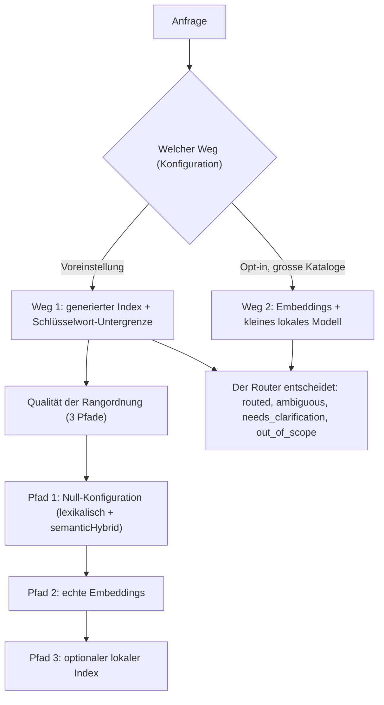

<!-- fr-synced: a57a9c3ec1fbbf766b4471bdc4eecfa4258e080f -->

# Semantisches Routing einrichten, von der Null-Konfiguration zu echten Embeddings

Sobald Sie BASE installieren, sollen Anfragen den richtigen Agent und den richtigen Process ohne
anfängliche Konfiguration erreichen und danach an Qualität gewinnen, sobald der Bedarf entsteht: genau das
stellen Sie hier ein. BASE routet eine Anfrage oder verzichtet ehrlich, wenn nichts passt.

BASE routet auf **zwei Arten, die durch die Konfiguration gewählt werden**. Der **Weg 1** ist die
Voreinstellung: Der Assistent liest den generierten Index und wählt, mit einer deterministischen
Schlüsselwort-Untergrenze als Offline-Auffangnetz. Der **Weg 2** ist optional, für grosse Kataloge:
Embeddings holen einige Kandidaten und ein kleines lokales Modell verfeinert sie (es wählt oder fragt nach
einer Präzisierung); siehe [Weg 2, das Routing über Embeddings](voie-2-routage-embeddings.md). Diese Seite
beschreibt den Weg 1 und, innerhalb davon, die **Qualität der Rangordnung** der Kandidaten: Ein Ranker
ordnet, aber der Router ist es, der entscheidet. Sie durchlaufen drei Pfade, vom einfachsten bis zum
robustesten; beginnen Sie mit dem ersten und gehen Sie nur weiter, wenn Sie es brauchen.



Das BASE-Routing wählt den primären Workflow, nicht alle möglichen Ressourcen. Die vollständige Kette
lautet so: einen Agent wählen, zu einem Process routen und dann die Kompetenzen, Tools, Templates,
Dokumente oder Daten öffnen, die dieser Process braucht. Für die vollständige Doktrin siehe
[`docs/reference/routage-process-et-ressources.md`](../reference/routage-process-et-ressources.md).

## Den richtigen Agent erreichen (zuerst das Einfachste)

Vor der *Qualität* der Rangordnung (die "Pfade" weiter unten) folgt hier, wie der Assistent zum richtigen
Agent gelangt, vom Manuellsten bis zum Automatischsten:

- **Manuell, null Tools.** Wenn Sie wissen, welchen Agent Sie wollen, zeigen Sie direkt auf seine
  `AGENT.md`: Das ist die einzige Datei, die geladen werden muss. "Lies
  `exemples/assistant-devis/.ai/agents/assistant-devis/AGENT.md`" genügt (Pfad relativ zum Repository; in
  einem Assistenten-Projekt ist es einfach `.ai/agents/<agent>/AGENT.md`). Kein Routing, keine Installation.
- **CLI.** `base route "<anfrage>" --root <projekt>` wählt den Agent → Process deterministisch und
  verzichtet ehrlich, wenn nichts passt. Derselbe Router, über das Terminal.
- **MCP.** Das Tool `route_request` stellt denselben Router einem KI-Tool zur Verfügung, das Ihre Dateien
  lesen kann (zum Beispiel GitHub Copilot, Antigravity, Claude Code oder Cowork, OpenCode, Kilo Code). Um
  es anzubinden, folgen Sie dem Process `activer-routage`.

Das Routing (CLI/MCP), standardmässig deterministisch, hilft vor allem, wenn mehrere Processes oder Agents
antworten könnten oder wenn Sie Garantien wollen (getesteter Verzicht, Fixtures). Es erspart der Benutzerin
die Mühe, den richtigen Process zu suchen. Sobald ein Embedding-Ranker ins Spiel kommt, hängt die
Rangordnung vom gewählten Provider ab; die Status und die Fixtures hingegen ändern sich nicht. Für einen
einzelnen einfachen Assistenten genügt das manuelle Laden.

Die drei "Pfade" weiter unten behandeln eine andere Frage: die Qualität der Rangordnung der Kandidaten
innerhalb von Weg 1, vom lexikalischen Null-Config bis zu echten Embeddings. (Nicht zu verwechseln mit
Weg 2, der ein anderer Routing-Weg ist, kein Ranker.)

## Pfad 1: Null-Konfiguration

Schreiben Sie Agents und Processes in Markdown, mit einem `use_when` pro Process. BASE routet mit seinem
abhängigkeitsfreien Kern: lexikalisch + `semanticHybridRanker` (Token-Überschneidung, Aliase über
Token-Teilmengen, unscharfe Ähnlichkeit), strukturierter Verzicht, Routing-Fixtures, MCP.

```bash
node tools/base.mjs route "le client conteste sa facture" --root exemples/routage-pme
node tools/base.mjs route-test --root exemples/routage-pme   # rejoue les routes attendues
```

Ideal für eine einzelne Person, ein kleines Team, eine Demo, ein erstes Deployment. Siehe das Beispiel
[`exemples/routage-pme`](../../exemples/routage-pme/README.md).

### Ohne Abhängigkeit verstärken: `semanticHybrid`

Deklarieren Sie in `base.config.json` Aliase (geschäftliche Synonyme), weiterhin ohne Abhängigkeit:

```json
{
  "rankers": [
    { "type": "semanticHybrid", "aliases": { "proposition": ["offre commerciale", "devis"] } }
  ]
}
```

Die Regel ist einfach: Verwenden Sie `base.config.json` für deklarative Optionen (`semanticHybrid`,
Schwellenwerte, Validatoren) und `base.config.mjs`, wenn Sie Code importieren müssen, zum Beispiel einen
Embedding-Provider. Wenn beide vorhanden sind, bevorzugt BASE das deklarative JSON; behalten Sie also ein
einziges Format pro Projekt bei, wenn Sie echte Embeddings aktivieren.

## Pfad 2: echte Embeddings

Installieren Sie `@ai-swiss/base-ranker-semantic`, wählen Sie einen Provider, fügen Sie einen Ranker in
`base.config.mjs` hinzu (ausführbare Konfiguration, denn ein Ranker ist Code). Der Kern erhält keine
Modell- oder Cloud-Abhängigkeit.

```bash
npm install @ai-swiss/base-ranker-semantic
```

Im BASE-Monorepo lebt das Package, um lokal beizutragen, in `packages/base-ranker-semantic/`.

```js
// base.config.mjs : endpoint OpenAI-compatible (OpenAI, Azure-like, gateway interne)
import { createOpenAICompatibleEmbedder, createSemanticRanker } from "@ai-swiss/base-ranker-semantic";

const embed = createOpenAICompatibleEmbedder({
  model: "text-embedding-3-small",
  // baseUrl: "https://gateway.interne/v1",  // un gateway d'entreprise
  timeoutMs: 10_000,
  retries: 2,
});

export default { rankers: [createSemanticRanker({ embed, minSimilarity: 0.25 })] };
```

```js
// base.config.mjs : Ollama, tout reste en local
import { createOllamaEmbedder, createSemanticRanker } from "@ai-swiss/base-ranker-semantic";
export default { rankers: [createSemanticRanker({ embed: createOllamaEmbedder() })] };
```

```js
// base.config.mjs : n'importe quel provider, ou des vecteurs pré-calculés (aucun texte ressource envoyé)
import { createSemanticRanker } from "@ai-swiss/base-ranker-semantic";
import { vectorFor } from "@ai-swiss/base-index-local";
export default {
  rankers: [createSemanticRanker({
    embed: async (textOrTexts, ctx) => monModele.embed(textOrTexts, { signal: ctx?.signal }),
    getResourceEmbedding: (r) => vectorFor(index, r),
  })],
};
```

Das Package ist bei Provider-Aufrufen standardmässig robust: Es behandelt Timeouts, das `AbortSignal`,
begrenzte Retries (nur transiente) und typisierte Fehler. Um viele gleichzeitige Aufrufe zu bündeln,
umhüllen Sie den Provider mit `createBatchingEmbedder`. Details:
[`packages/base-ranker-semantic/README.md`](../../packages/base-ranker-semantic/README.md) und
[die Provider-Seite](choisir-provider-embeddings.md).

## Pfad 3: optionaler lokaler Index

Wenn der Korpus gross wird, leiten Sie mit `@ai-swiss/base-index-local` einen löschbaren lokalen Index ab.
Das Benutzermodell bleibt gleich, ohne von Hand zu pflegenden Katalog, und die Standard-Routing-Status
bewegen sich nicht. Siehe [Die Skalierung verstehen](../learn/comprendre-echelle.md).

## Die Fixtures starten

`.ai/routing/route-tests.json` listet Anfragen und die erwartete Route auf (Status, Agent, Process). Das
ist ein Regressionstest, keine akademische Leistungsmessung:

```bash
node tools/base.mjs route-test --root <projet>          # sortie lisible, exit ≠ 0 si une route casse
```

## Die Score-Gründe lesen

`route --json` macht jede Score-Komponente explizit, mit nachvollziehbaren Gründen statt eines undurchsichtigen
Vertrauenswerts.

```bash
node tools/base.mjs route "panne au login" --root exemples/routage-pme --json
```

| Grund | Bedeutet |
|---|---|
| `route:<terme>` | der Begriff hat den `route_text` getroffen (stärkstes Routing-Signal) |
| `route_text:use_when` | der `route_text` stammt aus dem `use_when` (gewolltes Signal); `:title`/`:path` = schwaches Signal |
| `route_avoid:<terme>` | ein `routing.avoid_when` hat getroffen: der Score wird **annulliert** (Gegenbeispiel) |
| `semantic:alias:*`, `semantic:fuzzy:*` | Beitrag des abhängigkeitsfreien `semanticHybridRanker` |
| `semantic:embedding:<sim>` | Kosinus-Ähnlichkeit echter Embeddings (semantisches Package) |

Der Status (`routed | ambiguous | needs_clarification | out_of_scope`) und sein `reason_code` sagen, *warum*
BASE entschieden hat oder warum es lieber nachgefragt hat.
