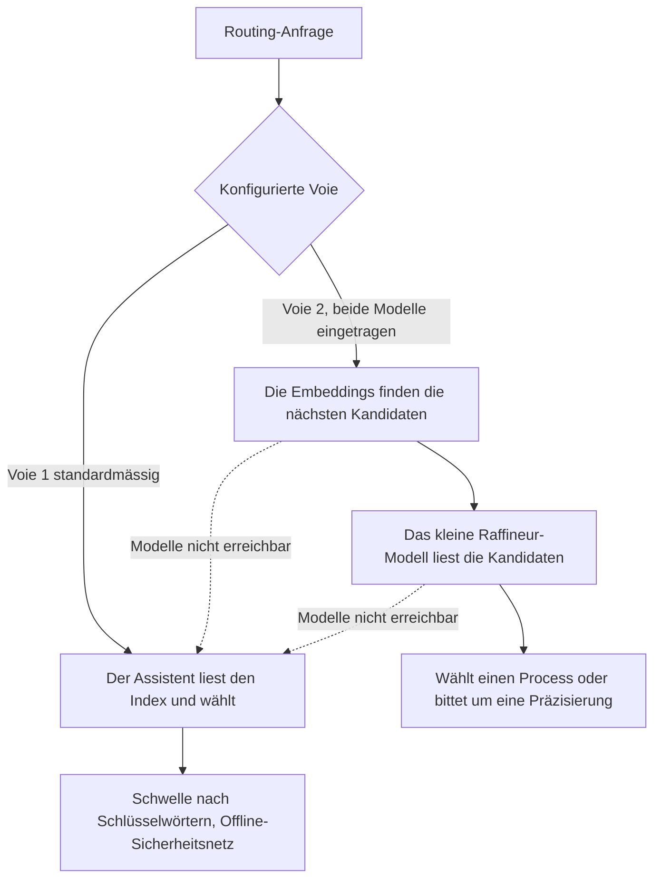

<!-- fr-synced: d582ba5e1b080529a75ebb6cbf80f42cfe706bb5 -->

# Voie 2, das Routing über Embeddings (optional, für die Skalierung)

BASE routet auf zwei Arten, und Sie wählen über die Konfiguration. Voie 1 ist die Standardeinstellung und
reicht für die meisten BASE aus. Voie 2 ist ein Komfort für grosse Kataloge. Sie brauchen sie nur, wenn Sie
sich dafür entschieden haben.

## Die zwei Voies, in je einem Satz

- **Voie 1 (Standard, bereits aktiv).** Der Assistent liest den generierten Index und wählt; eine
  deterministische Schwelle nach Schlüsselwörtern dient als Offline-Sicherheitsnetz. Kein Modell, nichts zu
  installieren.
- **Voie 2 (optional).** Die Embeddings finden die wenigen Kandidaten, die der Anfrage am nächsten sind, dann
  liest ein kleines Modell sie und entscheidet (es wählt aus oder bittet um eine Präzisierung). Lokal.

Die beiden Voies sind unabhängig: Voie 2 ist keine Ebene über Voie 1, sie ist eine andere Voie, die die
Konfiguration auswählt.

## Brauchen Sie sie?

Seien Sie ehrlich mit sich selbst, bevor Sie irgendetwas installieren.

- **Kleines oder mittleres BASE** (einige Agents, einige Dutzend Process): **Voie 1 reicht**. Voie 2 würde
  nichts bringen und würde eine zu pflegende Installation hinzufügen.
- **Grosses BASE** (viele Process oder ein Routing, das zögert, weil die Liste lang ist, um sie nach
  Schlüsselwörtern zu unterscheiden): Voie 2 verfeinert die Wahl. Hier verdient sie ihren Platz.

## Die Installation ist im Wesentlichen «einfach Ollama»

Das Versprechen ist einfach. Hier ist, was zu tun ist:

1. **Ollama** installieren (die Anwendung, die Modelle lokal laufen lässt).
2. **Zwei Modelle** herunterladen: ein Embedding-Modell und ein kleines Raffineur-Modell.
3. Beide auf der Seite **Einstellungen** des Studios eintragen, Abschnitt «Routing / Voie 2» (oder direkt in
   der Konfigurationsdatei).

**Lokal, souverän, ohne Cloud, ohne API-Key.** Alles bleibt auf Ihrer Maschine. Ein gehosteter, mit OpenAI
kompatibler Anbieter bleibt möglich für alle, die es wollen, aber die Standard-Erzählung ist *Ollama allein*.

Voie 2 aktiviert sich nur, wenn **beide** Modelle eingetragen sind. Ein einzelnes bewirkt nichts, und BASE
bleibt auf Voie 1. Und wenn ein Modell nicht mehr erreichbar ist, fällt BASE automatisch auf Voie 1 zurück:
nie eine Blockade, nie ein Schweigen.

## Welche Modelle wählen? (Sie sind frei)

BASE schreibt Ihnen kein Modell vor. **Illustrativ und nicht vorschreibend** geben zwei leichte lokale
Modelle eine gute Demonstration ab: `qwen3-embedding:0.6b` für das Embedding (mehrsprachig, nützlich, weil
BASE französischsprachig ist) und `qwen3:4b` für den Raffineur (kleines Instruct-Modell). Das sind Beispiele,
keine feste Empfehlung: wählen Sie Ihre eigenen, wenn Sie es vorziehen (zum Beispiel ein Embedding mit langem
Kontext oder einen Raffineur aus einer anderen Familie).

Das Ökosystem bewegt sich schnell. Statt Versionen auswendig zu lernen, **konsultieren Sie die aktuell
empfohlenen Modelle** in der Dokumentation von Ollama und prüfen Sie das genaue Tag beim Herunterladen. Für
die Kriterien zur Wahl eines Embedding-Anbieters (lokal, Cloud, Gateway, intern) siehe
[Den Embedding-Provider wählen](choisir-provider-embeddings.md). Um Modelle souverän laufen zu lassen, siehe
[Souveräne Modelle](modeles-souverains.md).

Suchen Sie nicht den «besten» kleinen Raffineur über Prozentpunkte. Was die Routing-Eval ehrlich misst, ist
ein **Struktursignal** (lassen die Embeddings den richtigen Kandidaten aufsteigen?), nicht die Leistung eines
Modells: die endgültige Wahl, oder die Bitte um Präzisierung, liegt bei **Ihrer eigenen KI**, weit stärker als
jedes kleine lokale Modell. Der lokale Raffineur ist nur ein Sicherheitsnetz bei der Skalierung, ohne
geöffnetes Studio. Es ist also zwecklos, Ihre Prompts oder Ihre Struktur anzupassen, um den Score eines
kleinen Modells aufzublähen.

## Sich Schritt für Schritt begleiten lassen

Am einfachsten ist es, Ihren Assistenten zu bitten: **«aktiviere Voie 2»**. Der Process `activer-voie2`
führt Sie der Reihe nach: prüfen, ob der Bedarf real ist, Ollama anhand seiner aktuellen offiziellen
Dokumentation installieren, die zwei Modelle wählen und herunterladen, dann in den Einstellungen eintragen.
Er zeigt jeden Befehl, bevor er ihn ausführt, und legt keine Version fest.

## Wo die Einstellungen leben

Im Studio zeigt der Abschnitt «Routing / Voie 2» der Einstellungen die zwei Modelle und die Anzahl der
Kandidaten, die der Raffineur sieht (eine Anzahl, keine zu justierende Schwelle; der Standardwert passt).
Ohne Studio leben dieselben Werte im Block `routing` der Datei `.ai/studio.settings.json`
(`embedding_model`, `refiner_model` und optionales `k`). Die Alles-oder-nichts-Regel wird beim Schreiben
validiert: beide Modelle, oder keines.

Für die umfassendere Einrichtung des Routings (Zero-Config, Embedding-Ranker, Lesen der Scores) siehe
[Das semantische Routing einrichten](routage-semantique-quickstart.md).
