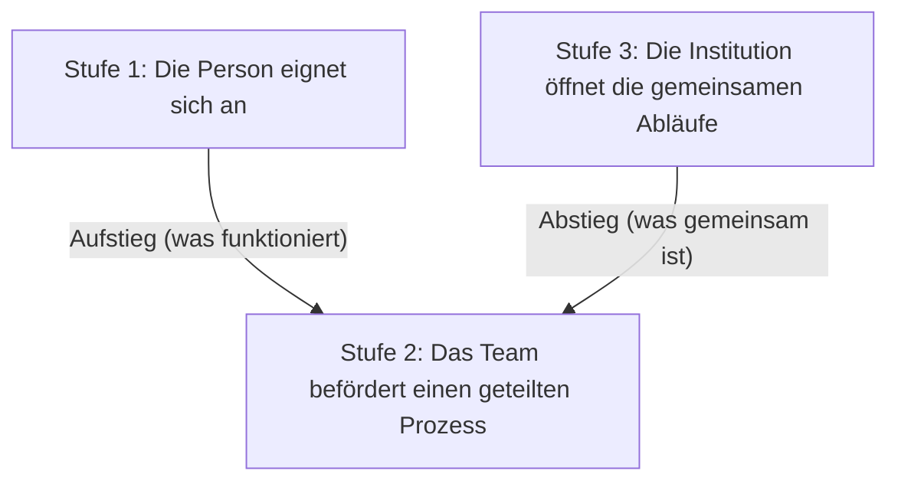

<!-- fr-synced: 816663bbe9448c3c454909e9731a6db8ed8f8267 -->

# Die Einführung in einer Organisation

KI lässt sich in einer Organisation nicht wie eine Software installieren: per Dekret, auf einen Schlag, für alle. Eine Organisation kann jedes technische Kästchen abhaken und sechs Monate später dennoch nur eine Handvoll isolierter Anwendungen vorfinden, die niemand teilt. Eine tragfähige Einführung beruht auf zwei gegenläufigen Bewegungen und auf deren Begegnung. Von unten eignen sich Menschen den Dialog mit der KI an und strukturieren ihre Arbeit auf ihre eigene Weise. Von oben stellt die Organisation, KI-gestützt, jene wenigen Abläufe bereit, die alle blockieren. Der erste Motor lässt nach oben steigen, was funktioniert; der zweite lässt nach unten sinken, was gemeinsam ist.

Die Einführung liest sich auf drei Stufen: die Person, die sich aneignet, das Team, das eine bewährte Anwendung zu einem geteilten Prozess befördert, die Institution, die jene Abläufe öffnet, denen alle ausgesetzt sind. Jede Stufe hat ihre Geste, ihr Ritual und ihre Governance. Die verlinkten Seiten beschreiben die Gesten: die individuellen Praktiken in [Das Mitdenken in der Praxis](./pratiques-co-pensee.md), das Leben einer Expertise nach ihrer Beförderung in [Eine Expertise nach dem Einsatz am Leben halten](./cycle-de-vie-expertise.md), die Voraussetzungen für den Start in den Kits [Schweizer KMU](../audiences/kit-demarrage-pme-suisse.md) und [Organisation](../audiences/kit-enterprise.md).

## Das andere Extrem und was es einschliesst

Angesichts der KI wählen viele Organisationen das gegenteilige Extrem: eine grosse zentrale Plattform, ein von oben ausgerollter Bestand an Lizenzen, ein Katalog vorgeschriebener Werkzeuge, Produktivitäts-Dashboards, eine Einheit, die alles steuert. Das ist beruhigend, manchmal schnell wirksam, und es bringt echte Gewinne. Der Preis zeigt sich später: Die Methode landet eingeschlossen in der Plattform und im Anbieter, und die Art, mit KI zu arbeiten, wird als etwas behandelt, das im Zentrum industrialisiert werden soll, nicht als etwas, das jede Person versteht und besitzt. An dem Tag, an dem sich das Werkzeug ändert, oder der Vertrag, oder der Anbieter, bleiben Dashboards und wenig übertragbare Expertise.

BASE geht den anderen Weg, und genau darum geht es auf dieser Seite: die Einführung von den Menschen her wachsen lassen, das Know-how in Dateien behalten, die Sie besitzen, von oben nur das industrialisieren, was es wenig verdient. Die beiden schliessen sich nicht immer aus, aber sie verorten den Wert nicht am selben Ort: in der Plattform auf der einen Seite, in der besessenen Verknüpfung auf der anderen.

## Die Rolle der IT: Zugang, Schicht und Werkzeuge

Vor jeder Stufe legt die IT das Fundament: Drei Entscheidungen bestimmen es.

Die erste ist der **autorisierte Zugang** zu einem oder mehreren Modellen. Die Wahl wird auf der Nutzen-Risiko-Waage abgewogen, die der Organisation eigen ist: was die Modelle an Gewinn bringen, gegen das, was sie an Vertraulichkeit, an Datensouveränität, an interner und kundenseitiger Wahrnehmung aussetzen. Sie ist Sache der Leitung und der Compliance, nicht der Person, die das Werkzeug am nächsten Tag öffnet. Die souveränen und lokalen Modelle kommen hier in die Waage (siehe [Souveräne und lokale Modelle](../guides/modeles-souverains.md)), ebenso der rechtliche Rahmen der Organisation, revDSG, DSGVO, branchenspezifische Pflichten, in Erinnerung gerufen im [Schweizer KMU-Kit](../audiences/kit-demarrage-pme-suisse.md).

Die zweite ist die **leichte Schicht**, die darübergelegt wird: ein oder mehrere Werkzeuge, je nach dem, was bei Ihnen machbar ist, die mindestens die Fähigkeit geben, Dateien zu lesen und zu schreiben. Das ist die Schwelle. Darunter bleibt die KI ein Dialogfenster ohne Gedächtnis; darüber strukturiert jede Person ihre Interaktionen frei, behält ihre Fachdateien zur Hand und lässt eine Praxis wachsen, statt Prompts zu wiederholen. Die Einsatzformen dieser Schicht werden im [Organisations-Kit](../audiences/kit-enterprise.md) beschrieben.

Die dritte, die am häufigsten vernachlässigte, sind die **richtigen Werkzeuge**. Ein generatives Modell kann allein weder eine fachliche Kennzahl berechnen noch die richtige Tabelle einer Datenbank abfragen noch einen Vorhersagedienst aufrufen: Diese Fähigkeiten kommen nicht mit dem Zugang zum Modell. Man muss sie ihm als Werkzeuge bereitstellen, die es an Ihrer Stelle auslöst und dann im Gespräch nutzt: ein deterministischer Algorithmus, eine Abfrage an die richtigen Tabellen, ein API-Aufruf, die jemand geschrieben hat. Das ist der Kern der Rolle der IT, über den Zugang und die Schicht hinaus: die Abläufe ausrüsten, die danach verlangen, und zuallererst verstehen, welche Berechnung nötig ist.

Daher ein häufiges und kostspieliges Missverständnis: zu glauben, es genüge, seine Datenbank zu bereinigen und an die KI anzuschliessen. Eine Datenbank bereinigen und mit einem Modell verbinden gibt Zugang zur Information, nicht zur *relevanten* Information. Man sagt einem Modell nicht "komm mit meiner Datenbank zurecht und zieh Insights daraus": Für eine Kennzahl muss man im Vorfeld festgelegt haben, welche Tabellen zu verknüpfen und welche Berechnung durchzuführen sind, und diese Berechnung dann einem Algorithmus anvertrauen. Diese Analyse lässt sich gut mit der KI durchführen, aber sie muss durchgeführt werden: Den richtigen Algorithmus zu finden hat einen Preis, selbst mit den leistungsstärksten Modellen. Im Grunde ist keine Berechnung gratis, weder in der Komplexitätstheorie noch in der Physik.

Der gängige Fehler ist, auf die perfekte Ausrüstung zu warten, bevor man den Zugang öffnet. Die Praxis geht dem Werkzeug voraus: Geben Sie die Schwelle, lassen Sie die Aneignung ihre Arbeit tun, und rüsten Sie die Abläufe aus, sobald sie sich zeigen.

## Stufe 1: Die Person eignet sich an

Der erste Motor der Einführung, und der wichtigste, ist die persönliche Aneignung. Jede Person strukturiert den Mensch-KI-Dialog auf ihre Weise, an ihren eigenen Aufgaben, in ihrem eigenen Tempo, und es ist diese Vielfalt, die den Unterschied macht, kein zu normalisierender Mangel. Eine Organisation, die von Anfang an den einheitlichen Prozess sucht, erstickt den Motor, bevor er anspringt. Hier entsteht der Prüfinstinkt, jener, ohne den später kein gestützter Ablauf ernsthaft gegengelesen wird.

**Die Geste.** Eine Person nimmt eine Aufgabe, die sie kennt, geht sie mit der KI an und behält das Steuer: Sie prüft gegen ihre Realität, kennzeichnet ihre Annahmen, iteriert, statt den perfekten Prompt zu suchen. [Das Mitdenken in der Praxis](./pratiques-co-pensee.md) beschreibt diese Schleife und die fünf Praktiken, die sie leicht machen; nichts hier zu wiederholen, ausser der Feststellung, dass eine ganze Organisation zuerst auf Einzelnen ruht, die sie tragen.

**Das Ritual.** Auf dieser Stufe ist es persönlich: festhalten, was funktioniert hat. Eine Interaktion, die gut gelaufen ist, wird notiert, wieder aufgegriffen, verfeinert. So setzt sich eine Praxis zu etwas Übertragbarem ab, der ersten Kandidatin für den Aufstieg.

**Die Governance.** Minimal und auf die Daten bezogen, nicht auf die Methode. Die Person weiss, was sie in das Werkzeug eingeben darf und was sie nicht eingibt: Die Regel der autorisierten Daten aus dem [Schweizer KMU-Kit](../audiences/kit-demarrage-pme-suisse.md) genügt. Die Freiheit zu strukturieren bleibt vollständig, das ist das Ziel.

## Stufe 2: Das Team befördert einen Prozess

Eine individuelle Praxis, die individuell bleibt, geht mit der Person verloren. Die zweite Stufe lässt aufsteigen, was funktioniert: Das ist die Bedingung dafür, dass eine gute Interaktion zu einem kollektiven Gut wird statt zu einem wiederholten Glücksfall. Die Information muss nach oben gelangen.

**Die Geste.** Aufsteigen lassen, dann befördern. Die versiertesten Personen, die Power-User, teilen ihre interessanten Interaktionen: nicht "KI ist gut", sondern "so habe ich dieses Ergebnis erzielt, bei dieser Aufgabe, mit dieser Rahmung". Die besten werden zu einem **Teamprozess** befördert. Eine Beförderung ist kein Zusammenlegen von Dateien, sie ist ein Statuswechsel: ein lesbares Markdown, das jede Person aufgreift, und kein Rezept, das in einem Messenger lebt.

**Das Ritual.** Ein regelmässiger Termin, jede Woche oder alle zwei Wochen, an dem diese Interaktionen aufsteigen und besprochen werden und an dem das Team entscheidet, was eine Beförderung verdient. Zu früh befördern friert eine noch unscharfe Intuition ein; zu spät lässt die Organisation neu erfinden, was eine Person bereits weiss. Das monatliche Wartungsritual aus dem [Schweizer KMU-Kit](../audiences/kit-demarrage-pme-suisse.md) ist dessen ausgerüstete Fassung: Es erfasst die persönlichen Ressourcen, die zu befördern sind, die Marker, die altern, die Workflows, die nicht mehr zur Praxis passen.

**Die Governance.** Ein beförderter Prozess hört auf, herrenlos zu sein. Er erhält eine verantwortliche Person, meist seinen ursprünglichen Eigentümer, die ihn weiterentwickelt; und eine Versionierung, die seine Änderungen sichtbar und diskutierbar macht. Die Regel gilt: Die KI schlägt vor, die verantwortliche Person unterschreibt. Hier beginnt wirklich der [Lebenszyklus einer Expertise](./cycle-de-vie-expertise.md): Eine Anwendung, die entgleist, wird in einem Satz festgehalten, und ein beförderter Prozess wird korrigiert, statt im Stillen zu verrotten.

## Stufe 3: Die Institution öffnet von oben

Die ersten beiden Stufen steigen vom Feld auf. Die dritte sinkt herab. Manche Abläufe hängen nicht von der Aneignung ab: ein Beschaffungsantrag, das Onboarding einer neuen Mitarbeiterin, eine Konformitätsprüfung, die alle fürchten. Sie blockieren jede Person auf dieselbe Weise, und darauf zu warten, dass ein Power-User sie von unten löst, wäre kollektive Zeitverschwendung. Die Institution identifiziert sie und stellt sie als **KI-gestützte Abläufe** bereit.

**Die Geste.** Einen Ablauf bereitstellen, auf der richtigen Stufe der Unterstützung. Wenn sich das Ergebnis automatisch prüft, durch einen eigens dafür bestimmten Algorithmus, der die Garantie gibt, die ein Modell allein nicht geben kann, kann der Ablauf vollständig automatisch werden. Meist behält er das richtige Mass an Reibung in der Mensch-KI-Interaktion: genug, damit eine Person für das Ergebnis verantwortlich bleibt, nicht zu viel, um nicht die Blockade zu reproduzieren, die man beheben wollte. Das richtige Mass an Reibung ist das Thema, nicht die maximale Automatisierung.

**Das Ritual.** Die Evaluation im Massstab. Die institutionalisierten Abläufe sind jene, die man unter Beobachtung hält: Ein Harness evaluiert sie auf der realen Oberfläche, ein unabhängiger Richter bewertet, und was sich verschlechtert, wird gemeldet. Der [Lebenszyklus einer Expertise](./cycle-de-vie-expertise.md) beschreibt diese Vorrichtung, die ihren vollen Wert genau dann entfaltet, wenn einige Prozesse befördert und institutionalisiert sind.

**Die Governance.** Hier wird sie formell. Die Institution wendet an, was die ersten beiden Stufen nicht tragen: Zugriffsrechte, Klassifizierung, Audit, Aufbewahrung, Konformitätsprüfung. BASE bietet eine ehrliche Vermittlung sensibler Aktionen, Einschliessung, Schreib-Gate, Governance jeder Ausgabe an ein Modell, anschliessbar, ohne das Know-how preiszugeben, aber es ersetzt weder IAM noch SSO noch RBAC noch DLP noch SIEM. Das [Organisations-Kit](../audiences/kit-enterprise.md) beschreibt im Detail die strikte Konfiguration und die Einsatzformen, die diese Abläufe verbindlich machen.

## Dort, wo sich die beiden Motoren begegnen

Die beiden Motoren funktionieren nicht der eine ohne den anderen. Von unten bringt die Aneignung Praktiken hervor, die niemand im Voraus diktiert hätte; ohne sie bleiben die institutionalisierten Abläufe Hüllen, die sich niemand aneignet. Von oben heben die gestützten Abläufe die gemeinsamen Blockaden auf und geben einen Rahmen; ohne sie bleibt die Aneignung ein Archipel persönlicher Anwendungen, das nie Organisation wird.

Sie begegnen sich auf der Stufe des Teams. Dort wird eine individuelle Praxis zu einem geteilten Prozess, und dort sinkt ein institutionalisierter Ablauf wieder herab, um an der realen Arbeit erprobt zu werden.

Der Abstieg verlangt eine Disziplin, die der Aufstieg nicht fordert: Eine persönliche Praxis verpflichtet nur ihren Urheber; ein institutioneller Ablauf verpflichtet alle, die sich auf ihn verlassen. Wenige Abläufe sinken herab, und die, die herabsinken, bleiben unter Beobachtung. Eine auf einem gemeinsamen Ablauf gemeldete [Reibung](./cycle-de-vie-expertise.md) ist der untere Motor, der den oberen Motor korrigiert.

Mit der Zeit setzt sich nichts davon auf einen Schlag fest. Man beginnt fast immer mit ein paar isolierten Versuchen; die Nutzung breitet sich an dem Tag aus, an dem sich Menschen sie wirklich aneignen; und nur eine Handvoll Abläufe wird am Ende im Massstab gehalten. Es ist ein Gefälle, keine Treppe: Die Etappen überschneiden sich, man überspringt welche, man geht zurück. Sie zu erkennen hilft zu wissen, wo man steht, sofern man daraus keinen Pflichtweg macht, identisch für alle.

Dieselbe Einheit zirkuliert in beide Richtungen: ein lesbares Markdown, das Menschen schreiben, beurteilen, besitzen und versionieren, für das jemand einsteht. Die Einführung hält, wenn die drei Stufen zusammen laufen: Menschen, die sich aneignen, Teams, die befördern, eine Institution, die öffnet und unter Beobachtung hält. Keine genügt allein, und alle ruhen auf demselben Fundament, einem autorisierten Zugang, dem Mittel zu strukturieren und den richtigen Werkzeugen, und auf derselben Regel, auf jeder Stufe: Die KI schlägt vor, eine Person unterschreibt.
