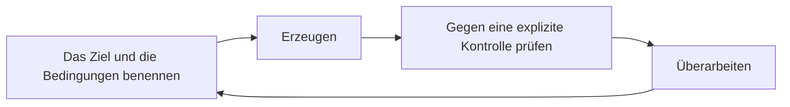

<!-- fr-synced: 254eaff1359db085b870b149459eb5dd80ce822b -->

# Warum BASE

> **Die Frage ist nicht, wo Ihre Server stehen, sondern wem die Artikulation Ihres Denkens mit der KI gehört.**
> BASE macht Sie darin souverän: was die KI weiss, was sie tut, was Sie erwarten, Ihre Anweisungen, festgehalten als Text, der Ihnen gehört. Und es ist diese Struktur, die Sie dauerhaft fähig hält zu prüfen, dort, wo das Prüfen Ihnen zukommt.

Dieses Dokument erklärt, *warum* BASE existiert. Nicht seine Befehle (siehe [Schnellstart](../start/quickstart.md)), nicht seine Architektur (siehe [Öffentliches Framework](../reference/framework-public.md)): die Methode, die es ausführbar macht, um mit der KI gemeinsam zu denken.

## Das Ungleichgewicht zwischen Erzeugen und Prüfen

Die generative KI hat die Ökonomie der geistigen Arbeit umgekehrt. **Eine plausible Antwort zu erzeugen verlangt heute wenig Aufwand; sich zu vergewissern, dass sie richtig ist, ist eine andere Art von Arbeit, die von der Aufgabe abhängt.** Der Kern eines Modells, das berühmte «LLM», ist ein Generator wahrscheinlicher Vervollständigungen. Er kann erzeugen, vergleichen und simulieren. Aber er prüft nicht an Ihrer Stelle die Wirklichkeit, die Verantwortung oder die Folgen für Ihre Organisation.

In manchen Bereichen existiert ein Prüfer ausserhalb des Modells: ein Compiler für Code, die Regeln des Schachspiels, ein Datenschema. Dort entdeckt und korrigiert sich der Fehler von selbst. **Aber die meiste reale Arbeit hat keinen externen Prüfer.** Eine Analyse, ein Angebot, eine Entscheidung, eine interne Notiz: Es ist an Ihnen, dort die Fehler zu entdecken und zu korrigieren, und Sie sind am besten in der Lage zu wissen, ob das Ergebnis wirklich Ihrer Absicht, Ihrem Kontext und Ihrer Risikoschwelle dient.

Die Konsequenz ist einfach: **Für diese Arbeit sind Sie der Prüfer**, kalibriert auf das Risiko, das Sie akzeptieren. Verlässlichkeit findet sich nicht fertig vor: Sie wird aufgebaut, und sie wird durch das Prüfen aufgebaut.

## Das wahre Risiko: die Prüfschuld

Das Problem ist, dass wir standardmässig schlecht prüfen. Ein flüssiger Text weckt ein Vertrauen, das er nicht verdient hat; eine mühelos erhaltene Antwort schaltet das kritische Denken ab. Und angesichts eines selbstsicheren Tons ziehen wir es oft vor, der Quelle zu vertrauen, statt die Aussage zu beurteilen.

So setzt sich das häufigste Versagensszenario lautlos durch: Am Anfang prüfen wir gut, dann erzeugt das System schneller, als wir folgen können. Wir verlieren den Überblick. Wir hören auf, die nötige Intuition zum Urteilen zu entwickeln. Das Vertrauen wird blind oder bricht zusammen. Jede ohne Kontrolle akzeptierte Behauptung erhöht eine **Prüfschuld**: einen Vorrat ungeprüfter Annahmen, der schliesslich unter dem ersten echten Druck nachgibt. Das Projekt wirkt an der Oberfläche beeindruckend, ist darunter aber brüchig.

## Die vier Kontrollverluste, die BASE vermeidet

| Verlust | Was geschieht |
|-------|---------------|
| **Souveränität verlieren** | betreiben, ohne zu besitzen: Ihr Wissen lebt auf der Plattform eines anderen. |
| **Verständnis verlieren** | liefern ohne Intuition: Man erzeugt Ergebnisse, die man nicht mehr verteidigen könnte. |
| **Auf Dauer verlieren** | einsetzen, ohne zu wissen, wie man wartet: Es funktioniert am ersten Tag, nicht mehr am hundertsten. |
| **Prüfung verlieren** | erzeugen ohne Kontrolle: Die Schuld häuft sich bis zum Bruch. |

BASE ist genau die Struktur, die diese vier Verluste verhindert.

## Was BASE bringt: eine Struktur, die das Prüfen leicht macht

Prüfen darf Sie nicht überfluten. Eine starke Struktur weiter oben macht das Prüfen weiter unten leicht. So geht BASE dabei vor:

- **Auf das Wesentliche zeigen.** Ein *Process* öffnet nur die für *diese* Aufgabe nützlichen Ressourcen, nicht Ihr ganzes Dossier. Sie entscheiden, was die KI sieht. Weniger Rauschen, bessere Antworten und eine menschliche Prüfung, die sich auf einen lesbaren Schritt richtet statt auf einen undurchsichtigen Block.
- **Die Grenze explizit machen.** Das ist zuerst eine Sicherheitsfrage: Anweisungen werden ausgeführt, Inhalt nicht. Beides zu vermischen öffnet die Tür zur Injection, wenn ein verarbeitetes Dokument am Ende das Verhalten des Modells diktiert. BASE trennt also das **Können** (ein Text, dem das Modell folgt, ohne Garantie) vom **Wissen** (Inhalt, den es konsultiert), und unterscheidet die **Anweisung** vom **Mechanismus**, der tatsächlich vom Code angewandt wird. Man dokumentiert die Grenze, statt sie zu kaschieren.
- **Entscheidungen sichtbar halten.** Ein Vorschlag wird vor jedem Schreiben gezeigt (ein Diff); die Markierungen `[A VALIDER]` signalisieren, was auf Ihr Urteil wartet. Diese Markierungen zählen viel: Sie dienen als durchsuchbarer Anhaltspunkt in Ihren Dateien und eignen sich für eine algorithmische Verarbeitung (man kann sie auflisten, zählen, blockieren, solange welche übrig sind). Nichts Wichtiges geschieht ohne Sie.
- **Ein geteiltes Gedächtnis geben.** Ein generalistisches Chat-Modell beherrscht eine Menge überprüfbarer Bereiche und kennt nichts von Ihrem. Zwei reale Mängel folgen daraus. Erstens teilt es standardmässig Ihr Gedächtnis nicht: Jeder Austausch beginnt bei null. Zweitens ist sein Verhältnis zur Sprache unterspezifiziert, was zugleich seine Stärke (es passt sich an alles an) und seine Schwäche ist (es rät, statt zu wissen). BASE behandelt beides: Das Gedächtnis wird zu einer einfachen Dateistruktur; die Sprache wird zu einer expliziten Artikulation, schwarz auf weiss festgehalten statt dem Raten überlassen.

Die operative Form ist eine **Schleife des gemeinsamen Denkens**: das Ziel und die Bedingungen benennen, erzeugen, gegen eine explizite Kontrolle prüfen, überarbeiten. Man fängt wieder an, und die Struktur trägt den Kontext, damit jede Runde leicht bleibt.

## Die feine Kontrolle macht die Effizienz

**Zugang zu Information zu haben ist nicht dasselbe wie Zugang zu nützlicher Information.** Sein ganzes Postfach und seine ganze Festplatte als Kontext anzuschliessen ist Rauschen, wenn nichts gezielt ist. Zu wählen, was die KI sieht, ist eine Frage der Vertraulichkeit, aber auch und vor allem der **Effizienz**: in der Information (der richtige Kontext, nicht alles), in den Kosten (ein enger Kontext ist schneller und günstiger) und in der Aufmerksamkeit (Sie lesen einen abgegrenzten Schritt nach, kein Mega-Ergebnis).

Auch deshalb täuscht der Reflex des «alles multi-agent» oft, und es lohnt sich, über seinen wahren Wert genau zu sein. An mehrere Agenten parallel zu delegieren ist ein Gewinn, wenn die Teile wirklich unabhängig sind, und vor allem, wenn ein klares Prüfsignal dafür sorgt, dass mehr Rechenleistung mehr Ergebnisse bringt: Protokolle durchgehen, um Vorfälle zu finden, Code nach Schwachstellen durchsuchen, tausend Varianten erzeugen und dann sortieren. Dort zahlt sich Parallelität aus, und man sollte sie nutzen. Der Preis erscheint, sobald sich die Aufgabe nicht sauber zerlegen lässt, das heisst, sobald die Agenten Kontext *teilen* müssen. Ihr einziger Kanal ist dann die natürliche Sprache, von Natur aus unterspezifiziert: Bei jeder Übergabe wird der Kontext kopiert, zusammengefasst, neu geprüft, und ein wenig Kohärenz geht verloren. Die Kopien desselben Modells zu vervielfachen fügt im Übrigen keine zusätzlichen Augenpaare hinzu, nur Durchsatz: Sie teilen denselben Bias. Für die Urteilsarbeit, die sich selten ohne Verlust zerlegen lässt, kostet ein einziger Agent, der den Faden hält, getragen von einer expliziten Struktur, weniger als eine Koordination, die in Tokens und Missverständnissen bezahlt wird. **Der Engpass agentischer Systeme ist nicht die Leistung, sondern das geteilte Verständnis.** Die nützliche Frage lautet also nicht «ein Agent oder mehrere», sondern «lässt sich diese Aufgabe zerlegen, ohne die Kohärenz zu kosten»: oft nicht, und deshalb beschreibt das «agentische überall» nur einen Winkel der realen Arbeit.

## Die Grenzen der Aufgabe teilt die KI

Ein Modell prüft nicht; ebenso wenig befreit es sich von den Grenzen der Aufgabe selbst. Eine Information zu suchen verlangt, dort durchzugehen, wo sie sein kann; richtig zu rechnen verlangt, einer Prozedur fehlerfrei zu folgen; weit zu schliessen verlangt, immer zahlreichere Zwischenschritte zu halten. Der Mensch wie die KI stossen an diese drei Anforderungen und antworten ihnen auf dieselbe Weise: eine Suchmaschine, ein Rechengerät, ein Träger, auf den man schreibt, um kohärent zu bleiben. Der Unterschied liegt nicht im Bedarf an Werkzeugen, sondern in der Hand: Sie sind es, die entscheiden, sie heranzuziehen, und Sie sind es, die beurteilen, was daraus hervorgeht.

Diese Grenzen sind kein Mangel der KI, sie sind Eigenschaften des Problems, das niemand allein durch Intelligenz umgeht. Eine Berechnung erschafft nicht die in ihren Eingaben fehlende Information, und kein physikalischer Vorgang übersteigt das Berechenbare: Das ist die physikalische Church-Turing-These (jeder physikalische Vorgang lässt sich auf einer Turing-Maschine mit der gewünschten Genauigkeit simulieren). Ihre erweiterte Fassung, zur Effizienz (eine klassische Simulation mit nur polynomiellem Mehraufwand), ist heikler: Das Quantencomputing widerspricht ihr für gewisse Aufgaben, aber unter Härteannahmen, die anerkannt und nicht bewiesen sind, und ohne die Sprachmodelle zu berühren, die klassisch sind. Die praktische Lehre passt in eine Zeile, es ist das [Prinzip 6 des gemeinsamen Denkens](pratiques-co-pensee.md): Was von Ihnen Zwischenschritte verlangen würde, verlangt sie von der KI wie von jedem System auf der Welt.

## Die KI findet nur wieder, was Sie auffindbar gemacht haben

Man hört oft, dass «die KI bei jedem Austausch bei null beginnt». Präzisieren wir, denn die Nuance ändert das, was zu tun ist. Es ist nicht das ganze System, das vergisst: Es ist der generative Kern, das Sprachmodell. Bei jedem Aufruf startet er mit einem leeren **Kontextfenster**, ohne Erinnerung an das vorherige. Das Gedächtnis ist deswegen nicht verschwunden; es ist einfach *ausserhalb* des Modells. Ein grösseres System um es herum, wie BASE, kann es ihm sehr wohl zurückgeben: Ihre Dateien sind dieses Gedächtnis, und die ganze Herausforderung wird es, das Fenster zum richtigen Zeitpunkt mit den richtigen Teilen zu füllen.

Wie werden diese Teile in Ihren Dateien wiedergefunden? Durch mechanische Mittel, dieselben wie die Ihren, aber schneller: Man listet Ordner auf, sucht Wörter, gleicht nach Ähnlichkeit ab (glob, grep und semantische Suche, im Vokabular der Werkzeuge). Aus Ihrer Welt findet das System also nur wieder, was Sie auffindbar gemacht haben, und in der Körnung, in der Sie es auffindbar gemacht haben.

Die praktische Konsequenz: **Strukturieren Sie die Information jedes Mal, wenn Sie sie berühren, und räumen Sie sie besser auf, als Sie sie vorgefunden haben.** Ob sie als Gedächtnis dient (eine Historie, eine vergangene Entscheidung) oder nicht (eine Regel, eine Tatsache, ein Katalog), das Modell wird sie nur vor Augen haben, wenn das System sie wiederfindet und in sein Fenster legt. Und nicht nur für die heutige Aufgabe, sondern für alle, die folgen: eine klar benannte Notiz, eine am richtigen Ort abgelegte Tatsache, eine einmal sauber geschriebene Regel zahlen sich jedes Mal zurück, wenn man wiederkommt, um daraus zu schöpfen, wie eine Anlage, die bei jeder Nutzung Ertrag bringt. Es ist die Kehrseite von «ein Zugang ist kein nützlicher Zugang»: Man räumt nicht für heute auf, man macht auffindbar für das, was folgt.

Bleibt die richtige Maschenweite. Zu grob, und man kann das nützliche Teil in einem ununterscheidbaren Block nicht mehr bezeichnen; zu fein, und das Teil verliert den Sinn, den ihm seine Nachbarschaft gab. Die richtige Granularität ist die, die sich mit einer Geste bezeichnen lässt und sich selbst genügt: klein genug, um sie zu öffnen, ohne den Rest mitzuschleppen, gross genug, um ihren Sinn zu bewahren. Es ist diese wiederholte Arbeit, die dafür sorgt, dass zum richtigen Zeitpunkt die richtige Information im Fenster auftaucht, bereit, präzise zu dienen, statt tastend gesucht zu werden. Die Disziplin ist zuerst menschlich; BASE gibt ihr Stützen (benannte Dateien, ein externes Gedächtnis, das Ihnen gehört, wiederverwendbare Kompetenzen, getrennt von den Process, ein Router, der die richtige Arbeitseinheit wiederfindet), aber die Gewohnheit, jedes Mal gut aufzuräumen, bleibt die Ihre.

## Die Freiheit, jeden beliebigen Prozess zu denken

Die meiste Arbeit besteht darin, dem Faden des eigenen Denkens zu folgen, fliessend, nicht ihn im Voraus in «Agenten» zu zerschneiden. Viele Werkzeuge erzwingen jedoch eine Grammatik: zerlegen Sie in Agenten, Rollen, Staffelübergaben, konfiguriert in ihrer Oberfläche. Es ist das Werkzeug, das den Prozess diktiert.

BASE erzwingt diese Grammatik nicht. Sie können ebenso gut einen abgegrenzten Kontext behalten und denken. **Autonomie ohne Dialog bleibt brüchig, welche Intelligenz auch immer gegenüber steht.** Über die Frage «wo sind meine Server?» hinaus ist das tiefe Risiko, die Freiheit unserer Interaktionen mit der KI zu verlieren, am Ende in Agenten und Oberflächen zu denken, über fremde Anweisungen. BASE verteidigt die Freiheit, *jeden beliebigen* Prozess zu artikulieren, auch keinen.

### Warum wir «Agent» sagen, obwohl wir die Grammatik der Agenten kritisieren

Weil die Modelle und die Werkzeuge ihrerseits an dieses Wort gewöhnt sind. Die Modelle sind auf das Vokabular von «agents», «skills», «tools» trainiert; die Werkzeuge (KI-Editoren, Agentenplattformen, MCP-Server) sind darum herum gebaut. Um auf diesen Werkzeugen *ausführbar* zu sein, muss BASE an der Grenze ihre Sprache sprechen. Das Wort zu verweigern würde BASE nicht reiner machen, nur inkompatibel.

Wir übernehmen «Agent» also **aus Pragmatismus, nicht aus Überzeugung**: Es ist ein Schnittstellenbegriff zu den Werkzeugen hin, nicht das mentale Modell der Arbeit. Konkret ist ein BASE-«Agent» **Ihr** Markdown, lesbar, vergleichbar, löschbar und **optional**. Es ist kein autonomer Arbeiter, den man startet und vergisst. Was Ihnen gehört, ist die Intelligenzschicht; das Wort «Agent» gehört zur Ausführungsschicht, die sie laufen lässt.

## Die Souveränität, die zählt, liegt rund um die Modelle

Die Souveränität der Server (wo die Berechnung läuft) ist **notwendig, aber sie genügt nicht**. Man kann seine Chips, seinen Strom, seine Festplatte besitzen und dem fremd bleiben, was am meisten zählt: seinen Interaktionen mit der KI. Eine KI, die durch ihre Server souverän, aber durch ihre Nutzung fremd ist, bleibt eine Falle: Was Sie weder artikulieren noch prüfen können, gehört Ihnen nicht wirklich, wo auch immer es ausgeführt wird.

Diese Feststellung hat eine beruhigende Konsequenz. Für das Wesentliche der Wissensarbeit **genügt schon ein freies Modell, das auf einem guten Laptop läuft**; die rohe Leistung ist nicht der begrenzende Faktor, und die offenen Modelle, die lokal laufen, werden morgen mehr leisten, niemals alles (manche Anwendungen, wie die Suche in grossem Massstab, verlangen weit mehr Rechenleistung). Die pharaonischen Infrastrukturinvestitionen betreffen vor allem eine *andere* Art von KI: jene, die auf Daten der Welt jenseits des allein Menschlichen lernt (zum Beispiel indem sie Wellenlängen jenseits des sichtbaren Spektrums erfasst), und für die die Ausrichtung an unseren Repräsentationen nicht das primäre Ziel ist. Das ist für AI Swiss nicht die vorrangig zu entwickelnde KI: Viele menschliche Probleme lassen sich lösen, bevor man die KI die Welt mit wenig menschlicher Repräsentation erkunden lässt. Die Souveränität, die zählt, ist also kein Wettlauf um Rechenleistung. **Sie liegt rund um die Modelle: die Freiheit zu artikulieren, zu strukturieren, mit diesen Intelligenzen zu denken.** Es ist die *kognitive Souveränität*, die Schicht, die Ihnen niemand anders zurückgibt.

Daher eine klare Trennung:

- **Ihre Intelligenzschicht**: wie Sie die Arbeit artikulieren, das Wissen strukturieren, die Kontrollen definieren, die Entscheidungen halten. Das ist BASE. In Text, Ihnen gehörend, portabel, modellunabhängig.
- **Die Ausführungsschicht**: die Berechnung, die Modelle, die Orchestrierung, das interne Gedächtnis, die Konnektoren. Austauschbar, zu mieten und weiterzuentwickeln.

Die richtige Frage lautet also nicht «wo sind meine Server?», sondern **«wem gehört die Artikulation meiner Denkweise mit der KI, mir oder meinem Anbieter?»**. BASE ersetzt Ihre Werkzeuge nicht und hindert Sie nicht daran, sie zu nutzen: Es ist ihre souveräne Schicht. Behalten Sie Ihre Werkzeuge für die Berechnung und die Ausführung; besitzen Sie in BASE die Intelligenz, die sie ausführen. Detail: [BASE und Ihre KI-Werkzeuge](../reference/base-et-vos-outils-ia.md) und [wo BASE in der Landschaft der Werkzeuge steht](../reference/positionnement.md).

## Ein Anker, wenn die Werkzeuge sich schneller ändern als die Literalität

Mit der KI zu bauen lässt sich nicht auf die Wahl eines Produkts reduzieren. Die Oberflächen ändern sich so schnell, dass selbst jene, die sie gestalten, nicht wissen, wie sie in einigen Monaten aussehen werden. Die übliche Antwort der grossen Akteure ist implizit: probiert es aus, lernt im Vorangehen, wechselt alle paar Monate das Werkzeug. Darauf baut man keine dauerhafte Literalität auf, und man bildet kein Team auf einem Boden aus, der sich bewegt.

BASE **will als Anker dienen**, insofern Ihre Dateien lesbar und portabel bleiben. Ihre Methode, Ihre Process, Ihre Kontrollen leben in einer Struktur, die Ihnen gehört und die nicht dem Rhythmus der Produkte folgt. Die Tiefe der Integration variiert ihrerseits je nach Werkzeug; aber sich an ein neues Werkzeug anzupassen verlangt nicht, alles neu zu lernen: Es geschieht über die **Anpassungsschichten** von BASE (eine Brücke, ein Adapter), mit wenig Aufwand, und die KI selbst kann Ihnen helfen, sie umzuschreiben. Sie wechseln die Ausführung; Ihre Intelligenz bleibt.

## Kalibriert, nicht anti-Automatisierung

Gemeinsam denken heisst **bewusst wählen**, nicht alles von Hand machen. Delegieren Sie, was einen Prüfer hat oder kein Urteil verlangt; denken Sie gemeinsam, was Risiko und Sinn trägt. BASE macht einfach den Menschen-in-der-Schleife zur *Standard*-Wahl und die Delegation zu einer *expliziten und sichtbaren* Wahl, dort, wo der Markttrend die *unsichtbare* Automatisierung ist.

## BASE stellt das Wesentliche vor Sie hin

Eine gute Zusammenarbeit lässt einen nicht suchen. So wie ein *Process* der KI die Information geben muss, die zählt, muss BASE *Ihnen* das geben, was zählt, ohne dass Sie darum bitten müssen:

- der **Empfang** (Concierge) orientiert Sie, sobald Sie verloren sind; ein **Router**, rudimentär, aber wirksam und durch Adapter erweiterbar, nimmt Ihnen die geistige Last ab, den richtigen Process zu suchen; selbst seine ehrliche Enthaltung verweist Sie zurück an den Empfang statt ins Leere;
- jeder Process hebt hervor, was Sie prüfen oder entscheiden müssen, und signalisiert die Entscheidungspunkte (`[A VALIDER]`, `[ATTENTION]`), bevor ein Problem auftritt.

Sie sollten niemals graben müssen, um auf das Wesentliche zu stossen.

## Um weiterzugehen

- [Die Prinzipien des gemeinsamen Denkens](pratiques-co-pensee.md): die Methode, Prinzip für Prinzip.
- [Die interaktive Dokumentation](../reference/documentation-interactive.md): die Doku lokal, und BASE Studio, um Ihre Process zu sehen und zu pflegen, zwei optionale lokale Oberflächen.
- [Öffentliches Framework](../reference/framework-public.md): die Abstraktionen, die Souveränität rund um die Modelle, die Interoperabilität.
- [BASE und Ihre KI-Werkzeuge](../reference/base-et-vos-outils-ia.md): mit Ihren Werkzeugen, nicht an ihrer Stelle.
- [Manifest](../../MANIFESTO.md): die Vision.
