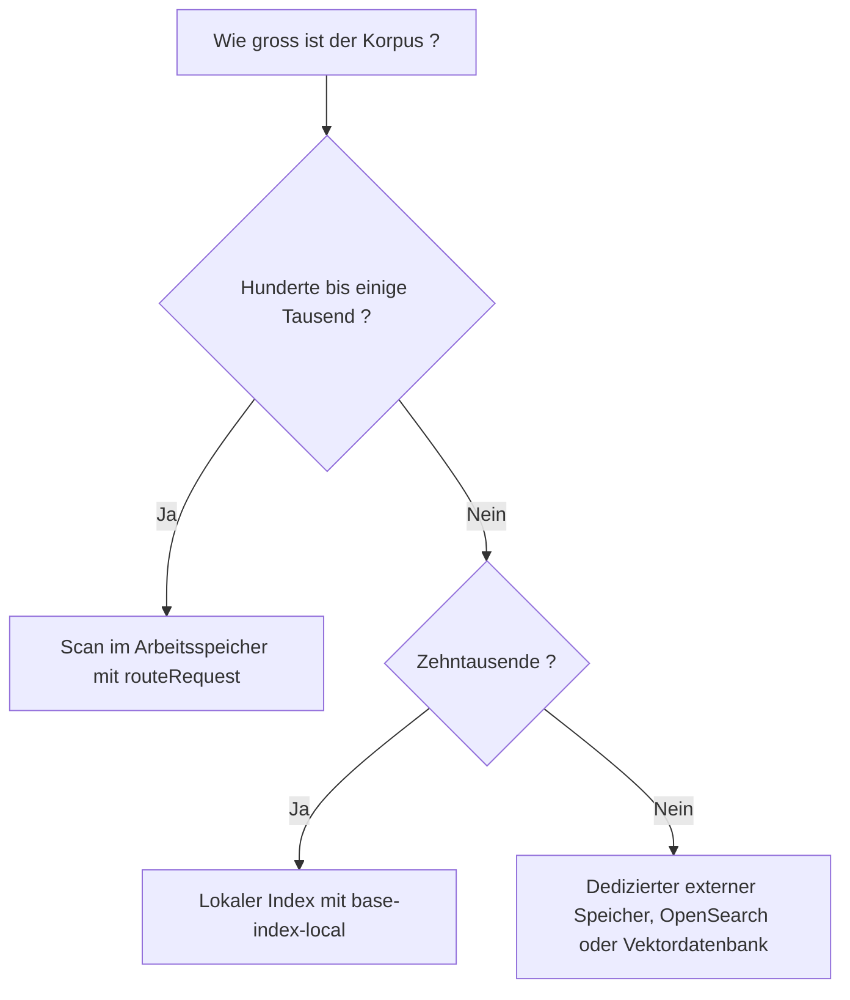

<!-- fr-synced: d75bebf8e1a782dfbd8ac6a8fb4f19069f923fd1 -->

# Zwischen Scan, lokalem Index und externem Speicher je nach Grössenordnung wählen

Das Routing von BASE richtig zu dimensionieren bedeutet, zwei Fallstricke zu vermeiden: für eine
Infrastruktur zu bezahlen, die Sie nicht brauchen, oder gegen eine Mauer der Langsamkeit zu laufen,
wenn der Korpus wächst. Diese Seite gibt Ihnen eine bezifferte Entscheidungsregel, von kleinen
Projekten bis zu umfangreichen Korpora, damit Sie wissen, wann ein Scan im Arbeitsspeicher genügt,
wann ein lokaler Index nützlich wird und wann ein externer Speicher gerechtfertigt ist.



## Wann ein Scan im Arbeitsspeicher genügt

Standardmässig liest `routeRequest` die Ressourcen und bewertet sie im Arbeitsspeicher. Dieser Ansatz
ist einfach, ohne Zustand und ohne Artefakt, das neu erzeugt werden müsste, und er **genügt** für
Hunderte, ja sogar einige Tausend Ressourcen. Die meisten Projekte brauchen nichts anderes.
Erhöhen Sie die Komplexität nicht, bevor Sie tatsächlich einen Kostenfaktor beobachten.

## Wann ein lokaler Index hilft

Wenn der Korpus wächst (Zehntausende von Ressourcen) und ein Scan pro Anfrage unangenehm wird,
leiten Sie einen lokalen Index mit `@ai-swiss/base-index-local` ab:

```bash
base-index-local build  <projet>
base-index-local route  <projet> "préparer un devis client"
base-index-local bench  --sizes 100,1000,10000,50000
```

Der Index ist eine **lokale Projektion**: Er vermeidet das erneute Lesen des gesamten Dateisystems und
kann eine Postings-Liste für die lexikalische Suche bereitstellen. Gemessen auf einem Laptop (siehe
[Benchmarks](../guides/benchmarks-echelle.md)): Ein Index mit **52 500 Dokumenten** wird in ~0,4 s
aufgebaut und im warmen Zustand in **weniger als 1 ms** durchsucht.

Das indexierte Routing liefert dieselben Status wie das standardmässige Routing im Arbeitsspeicher.
Um diese Parität zu wahren, bewertet `routeWithIndex` alle im Index gespeicherten Routables mit dem
gleichen injizierten Ranker und dem gleichen injizierten Router. Teams, die wissen, dass ihr Routing
lexikalisch kompatibel ist, können eine Vorfilterung über Postings (`candidateMode: "lexical"`) als
ausdrückliche Optimierung aktivieren.

## Wann ein externer Speicher legitim wird

Darüber hinaus (Millionen von Dokumenten, verteilte Suche, mandantenfähig) wird eine dedizierte Engine
(OpenSearch, eine Vektordatenbank, ein internes Gateway) gerechtfertigt. BASE schreibt sie weder vor
noch bettet sie sie in den Kern ein: BASE legt dieselbe Form offen (Kandidaten → Entscheidung), damit
Sie die Engine Ihrer Wahl dahinter anschliessen können.

## Warum der Index eine Projektion bleibt

Der Index ist **niemals** eine Quelle der Wahrheit. Er wird deterministisch neu aufgebaut aus:
Inventar, abgeleiteten Routing-Signalen, Frontmatter, Titeln/Beschreibungen, `route_text` und
optionalen Embeddings. Folgen daraus:

- **Löschbar.** Löschen Sie `.ai/index/local.json`: Sie verlieren nichts, erzeugen Sie ihn neu.
- **Deterministisch.** Zwei Builds derselben Dateien sind identisch: Ein CI-Gate kann ihre Aktualität
  prüfen (`git diff --exit-code`). *Runtime-Embeddings sind von diesem Gate nicht betroffen: Der Index
  bleibt deterministisch für abgeleitete Signale, nicht für berechnete semantische Scores.*
- **Kein manueller Katalog.** Keine von Hand gepflegte Tabelle kann von den Dateien abweichen.

## In einem Satz

BASE weiss, wann ein Scan genügt, wann ein Index hilft und wie viel jede Option kostet.
Reproduzierbare Benchmarks messen es: Das ist besser als eine blosse Behauptung.
