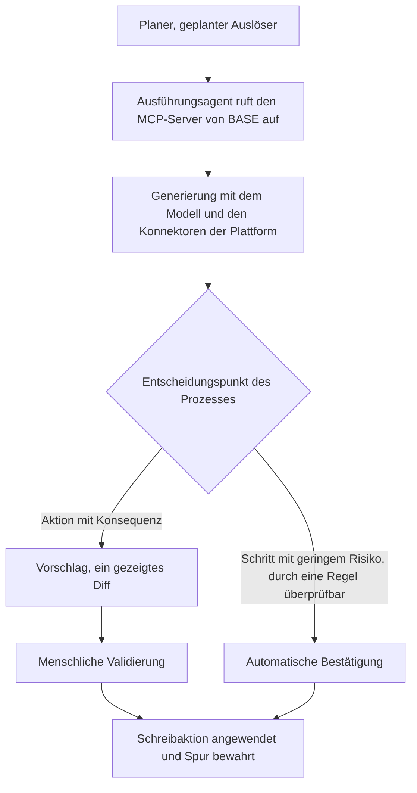

<!-- fr-synced: e9966b96132fd307f127afc28a43dc5262a53401 -->

# Behalten Sie Ihre KI-Werkzeuge, besitzen Sie die Intelligenz, die sie ausführen

> Diese Seite richtet sich an alle, die bereits ein KI-Werkzeug nutzen (einen Assistenten, eine Plattform, eine Suite) und sich fragen, wo BASE seinen Platz hat. Kurz gesagt: Sie behalten Ihre Werkzeuge für die Ausführung, und Sie besitzen in BASE die Intelligenz, die sie ausführen.

«BASE oder mein Werkzeug?» ist eine falsche Alternative: Beide spielen nicht dieselbe Rolle. Eine Plattform oder eine Suite gibt Ihnen die Ausführung: Rechenleistung, Speicher, Konnektoren und zunehmend Assistenten und Automatisierung obendrauf. BASE liefert etwas anderes: **die besessene und portable Artikulation dessen, wie die KI an Ihrem Fachgebiet arbeitet**.

Die eigentliche Frage lautet: **Wem gehört diese Artikulation, Ihnen oder Ihrem Anbieter?**

Um BASE Kategorie für Kategorie in der Werkzeuglandschaft von 2026 einzuordnen (gehostete Assistenten, Office-Copiloten, RAG-Pipelines, governte Agentenplattformen, Orchestrierungsframeworks und der Rest: wo es sich differenziert, ergänzt oder bloss ein Port ist), siehe [Wo BASE seinen Platz hat](positionnement.md). Diese Seite vermittelt das Prinzip; jene Karte vermittelt den Platz.

## Wo es wirklich vergleichbar wird

Viele Werkzeuge erlauben es heute, die KI auf Ihre Dateien zu richten (massgeschneiderte Assistenten, Quellensammlungen, Erinnerungen). Das ist real und nützlich. Der Unterschied entscheidet sich anderswo.

«Ich habe schon ein KI-Werkzeug», sagen Sie. Welches? Sie spielen nicht alle dieselbe Rolle, und keines übernimmt die von BASE.

| | Generischer Chat | KI-Office-Suite | Agentenplattform | BASE |
|---|---|---|---|---|
| **Sie besitzen die Dateien** | Nein | Nein | Nein | **Ja, lesbares und portables Markdown** |
| **Umfang des Kontexts** | Das Gespräch | Pro verbundener Quelle | Pro konfiguriertem Agenten | **Pro Aufgabe: der Prozess öffnet nur das Nützliche** |
| **Egress-Kontrolle (Mechanismus)** | Nein | Nein | Variabel | **Ja, vor dem Aufruf, durch den Broker** |
| **Vorschlagen, dann committen (ein Diff vor dem Schreiben)** | Nein | Nein | Variabel | **Ja** |
| **Modellwahl** | Vorgegeben | Oft vorgegeben | Je nach Plattform | **Ihre, extern** |

Der entscheidende Punkt: Der Umfang ist an die **Aufgabe** gebunden statt an den Assistenten. Es ist **Text, den Sie besitzen** statt eines in einer Plattform untergebrachten Objekts, und er funktioniert mit **dem Modell Ihrer Wahl**. Daraus folgen eine feinere Prüfung, eine portable Nutzung und eine souveräne Intelligenz.

Und was BASE nicht ersetzt (IAM, DLP, rechtliche Archivierung, Governance): siehe [Sicherheit und Grenzen](../trust/securite-et-limites.md).

## Vier Versprechen, die man Ihnen verkauft hat, und was sie auslassen

Man hat Ihnen wahrscheinlich all das eingerichtet: Der Assistent sieht das Postfach und das geteilte Laufwerk, Sie können sich eine Bibliothek von Agenten aufbauen, die KI greift auf Ihre sorgfältig gepflegte Datenbank zu, und das Ganze erfüllt die Vorgaben, AI Act inklusive. Der Eindruck setzt sich fest, dass die Struktur fertig sei. Lesen Sie jeden Satz noch einmal: Was fehlt, ist nie die Leistung, sondern eine Struktur, die Sie besitzen und die sich wieder abspielen lässt.

**«Meine KI sieht alle meine E-Mails und mein geteiltes Laufwerk.»** Die «Alles-sehen»-Voreinstellung lässt einen undurchsichtigen Prozess an Ihrer Stelle entscheiden, was er liest, und ein Modell verschlechtert sich, wenn man es mit themenfremden Informationen überschwemmt: Es antwortet schlechter, kostet mehr, ist schwerer zu überprüfen. Diese Suiten können durchaus gezielt vorgehen. Aber dort ist das Anvisieren manuell und wird jedes Mal neu gemacht, nie aufbewahrt. Die Voreinstellung bleibt «Alles-sehen».

**«Ich kann eine ganze Bibliothek von Agenten aufbauen.»** Ja. Und damit eine Last: in Agenten zu denken, statt Ihrem Faden zu folgen, und dann jedes Mal herauszufinden, welcher zutrifft. Die Komplexität ist nicht verschwunden, sie hat den Ort gewechselt: von der Aufgabe zu Ihnen.

**«Meine KI sieht meine gesamte sorgfältig strukturierte Datenbank.»** Ein Zugang ist kein nützlicher Zugang. Ohne der KI zu sagen, was sie lesen soll und warum, schafft das Öffnen der ganzen Datenbank keinen Wert, nur eine weitere Fläche, die es zu überwachen gilt.

**«Mein System erfüllt alle Vorgaben, den AI Act inklusive.»** Konform zu sein ist notwendig. Es macht die KI deswegen noch nicht nützlich: Konformität begrenzt das Risiko, sie erzeugt nicht den Wert.

Keines dieser Werkzeuge ist schuld. Das Problem ist die Voreinstellung, jene, die die Strukturierung einem undurchsichtigen Prozess oder Ihnen überlässt, ohne sie besessen oder wiederabspielbar zu machen. BASE verschiebt diese Einstellung: Es bindet den Umfang an die **Aufgabe**, schreibt ihn einmal, in Text, den Sie behalten, und spielt ihn identisch wieder ab, statt ihn aus dem Gedächtnis neu zu machen. Sie sagen dem Prozess, was er öffnen soll und warum, und diese Wahl wird bewahrt, statt verloren zu gehen. Die Lehre passt in einen Satz: **Ein Zugang ist kein nützlicher Zugang.**

## Komplementarität: BASE lässt sich von Ihren Werkzeugen konsumieren

Da BASE Text plus ein MCP-Server ist, klinkt es sich in Ihre Werkzeuge ein, statt sich ihnen entgegenzustellen:

- **MCP** (ein offener Standard): BASE stellt einen MCP-Server bereit; ein kompatibles Werkzeug kann ihn aufrufen, um seine Ressourcen zu routen, zu öffnen und zu lesen.
- **Dateien**: Ihr Markdown kann dort leben, wo Ihr Werkzeug es liest, und einen bestehenden Assistenten speisen.
- **Offene Agentenprotokolle**: ein Entwicklungsweg, um in BASE definierte Agenten mit anderen kooperieren zu lassen; in BASE heute nicht implementiert.

### Eine Tür, kein Wirrwarr von Werkzeugen

Ein MCP-Server kann Dutzende feingranularer Werkzeuge bereitstellen. Das ist eine trügerische Bequemlichkeit: Jedes hinzugefügte Werkzeug verstopft den Kontext des Modells, verwässert seine Aufmerksamkeit und vervielfacht die Flächen für Fehler und Berechtigungen. Je mehr man ein Modell mit Werkzeugen ausstattet, desto schlechter wählt es.

BASE wählt den umgekehrten Weg, und das ist eine Designentscheidung, keine Einschränkung. Seine Oberfläche läuft im Wesentlichen auf einen Punkt hinaus: eine **semantische Eingangstür**, das routing, das die Absicht in natürlicher Sprache empfängt und sie an den richtigen Agenten und den richtigen Prozess weiterleitet, wobei nur die für *diese* Aufgabe nützlichen Ressourcen geöffnet werden. Um diese Tür herum einige vermittelte Operationen (eine Ressource lesen, eine Schreibaktion vorschlagen und dann bestätigen, die Marker auflisten) unter den Garantien des Brokers, statt einer Schar von Fähigkeiten. Das Modell muss nicht zwanzig Werkzeuge kennen; es muss eine Tür sauber durchschreiten und dahinter einen bereits abgesteckten Kontext vorfinden.

Mit anderen Worten: Behalten Sie Ihre Werkzeuge für Rechenleistung, Speicher und Ausführung; besitzen Sie in BASE die Intelligenzschicht. Siehe auch [Öffentliches Framework](framework-public.md), Abschnitt «Souveränität rund um die Modelle».

## Geplante und autonome Agenten

Sie möchten einen Agenten, der nach einem Zeitplan läuft (zum Beispiel jeden Montag), ausgehend von einem in BASE definierten Prozess? Das ist ein guter Fall, unter einer Bedingung: Ein Agent, der monatelang allein läuft, ist oft genau der Ort, an dem die Prüfung am meisten erschlafft. Die Regel passt in einen Satz: **Die Generierung kann automatisch sein, die Validierung bleibt in der Hand.**

Der empfohlene Weg, unabhängig vom Werkzeug, governt und auditierbar:

1. Ein **Planer** startet die Ausführung (ein geplanter Auslöser, ein Scheduler). Er enthält keine Fachlogik.
2. Der **Ausführungsagent** Ihrer Plattform ruft den **MCP-Server von BASE** auf, um den Prozess und seine gezielten Ressourcen zu erhalten.
3. Er **führt die Generierung aus** mit dem Modell und den Konnektoren der Plattform.
4. An den **Entscheidungspunkten** des Prozesses **hält der Agent für die menschliche Validierung an** (die meisten neueren Plattformen bieten einen Modus «Entwurf» oder «Genehmigung erforderlich»).
5. Nach der Genehmigung wird die Schreibaktion **angewendet**, und eine Spur bewahrt die Erinnerung daran (auf dem Detailgrad, den Sie wählen).

Auf der Seite von BASE wird nichts blind geschrieben: Aktionen mit Konsequenzen durchlaufen einen **Vorschlag** (ein gezeigtes Diff), bevor sie angewendet werden; Schritte mit geringem Risiko, durch eine Regel überprüfbar, können automatisch bestätigt werden. Sie kalibrieren, Schritt für Schritt, was automatisch ist und was auf einen Menschen wartet.

Das Kernstück: Der Prozess ist Text, den **Sie besitzen**. Sie können Planer, Modell oder Plattform wechseln, ohne ihn neu zu schreiben.

> **Wenn man Ihnen von Planung oder autonomen Agenten erzählt:** Behalten Sie die Logik in BASE, lassen Sie sie von der Plattform aufrufen, und halten Sie den Menschen am Validierungspunkt. Die Planung automatisiert die *Produktion*, nicht die *Entscheidung*.

## Für Ihr konkretes Werkzeug: fragen Sie BASE

Dieses Dokument beschreibt das **Prinzip**, gültig für jedes Werkzeug. Für die **konkrete Integration in Ihr Werkzeug** kann BASE Sie anleiten:

- sagen Sie ihm, um welches Werkzeug es sich handelt;
- geben Sie ihm den Link zu dessen Integrationsdokumentation (oder lassen Sie es danach suchen, wenn Ihre Umgebung das Surfen im Web erlaubt);
- BASE liest diese Dokumentation und leitet Sie Schritt für Schritt an, ordnet jeden Schritt dem richtigen Plan zu (Planer, Aufruf des MCP-Servers von BASE, menschliche Validierung, Anwendung) und bewahrt die Prüfpunkte.

Konkret: Laden Sie den BASE-Concierge und fragen Sie «hilf mir, BASE in [mein Werkzeug] zu integrieren» oder «wie plane ich einen Agenten mit [mein Werkzeug]». Siehe den Empfangsagenten in `.ai/agents/concierge-base/`.

---

*Die Fähigkeiten von Drittwerkzeugen entwickeln sich rasch. Dieses Dokument beschreibt strukturelle Unterschiede und ein dauerhaftes Prinzip, ohne von einem konkreten Produkt abzuhängen; für die Details Ihres jeweiligen Werkzeugs stützen Sie sich auf dessen aktuelle Dokumentation (BASE kann Ihnen dabei helfen).*
