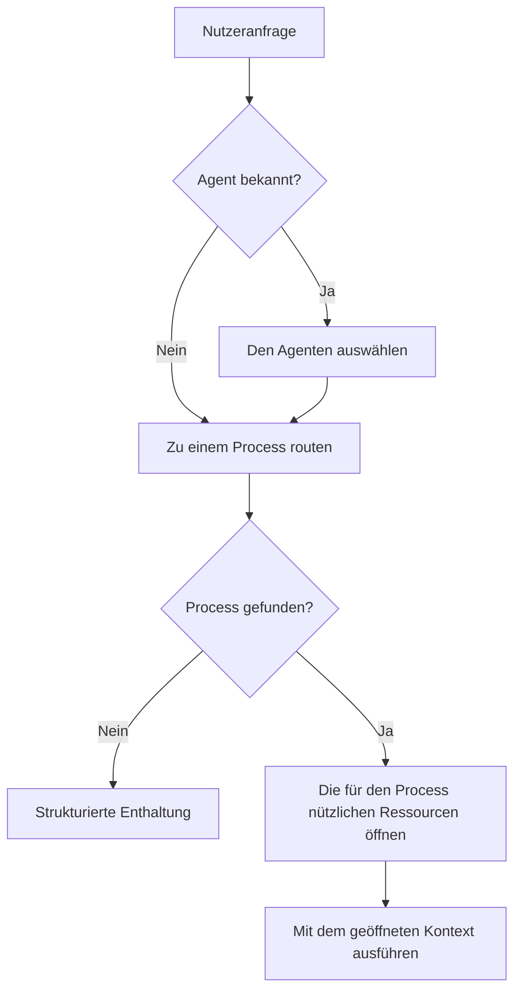

<!-- fr-synced: 26978391401c9a6f07d56c21001a07d8a31fe343 -->

# BASE public einführen: vom Lokalen zum Team

Wenn Sie eine Privatperson, ein Freiberufler, ein Startup, ein KMU oder ein kleines Team sind, zeigt Ihnen diese Seite, was BASE public Ihnen bringt: Ihre Zusammenarbeit mit der KI zu strukturieren, ohne eine schwere Plattform zu installieren. Sie erklärt auch, wie Sie es schrittweise einführen, an der Oberfläche einfach bleiben, ohne das spätere Wachstum zu blockieren.

Der Leitgedanke: zu Beginn wenig vorgeschrieben, vollständige Abstraktionen dahinter, Anforderungen, die mit Ihren Bedürfnissen steigen, und Strenge nur dort, wo der Kontext sie verlangt.

Wenn Sie das Repository neu entdecken, beginnen Sie mit `docs/start/lire-dans-quel-ordre.md`. Dieses Dokument ist die Quelle der Wahrheit für die Lesepfade: was je nach Profil zu lesen ist, was am Anfang zu ignorieren ist und was danach zu prüfen ist.

## Wer soll was lesen?

Der Lesepfad nach Profil (Einzelperson, KMU, Grossunternehmen) wird an einer einzigen Stelle gepflegt, um abweichende Versionen zu vermeiden: siehe [In welcher Reihenfolge lesen](../start/lire-dans-quel-ordre.md). Dieses Dokument ist eine der Etappen dieser Pfade.

## Drei Schichten, die nicht zu verwechseln sind

| Schicht | Inhalt | Warum sie existiert |
| ------ | ------- | -------------------- |
| Nutzung | `README.md`, `docs/start/quickstart.md`, `exemples/` | Starten, ohne die ganze Architektur zu verstehen |
| Struktur | `.ai/agents/`, `docs/reference/framework-public.md`, `base.schema.json` | Agenten, Skills, Ressourcen und Workflows stabilisieren |
| Integration | `tools/`, `mcp/`, `tests/`, `docs/reference/specification-v0.md` | Prüfen, verbinden und auditieren, ohne BASE in ein Werkzeug einzusperren |

`CLAUDE.md` und `.cursor/rules/` sind Harness-Adapter. Sie helfen Claude Code und Cursor, den richtigen Kontext zu laden, sind aber nicht die konzeptionelle Quelle des Frameworks. Als Annehmlichkeit, nie als Pflicht, existieren zwei optionale lokale Schnittstellen: Studio (`npm run studio -- <dossier>`, auf `127.0.0.1:5174`), um Ressourcen mit der Barriere Vorschlag dann Commit zu durchsuchen und zu bearbeiten, und die lokal bereitgestellte Dokumentation (`npm run docs:serve`).

BASE public ist direkt nutzbar für lokale Arbeit und kleine Teams. Für ein Grossunternehmen dient es als Strukturierungsgrundlage und Architekturreferenz, nicht als vollständige Compliance-Plattform.

Um jede Mehrdeutigkeit zu vermeiden, wird der tatsächliche Zustand des öffentlichen Kerns in `docs/reference/etat-implementation.md` verfolgt: was implementiert ist, was als Erweiterung vorgesehen ist und was bewusst ausserhalb des Umfangs bleibt.

Die Seite `docs/audiences/pour-qui.md` liefert die Lesart nach Kontext: Privatleben, Startup, KMU und Grossunternehmen.

## Adoptionsstufen

### Persönlich

Ziel: ohne Reibung starten.

- freies Markdown;
- optionales YAML;
- lokaler Agent oder kopiertes Beispiel;
- menschliche Validierung vor dem Schreiben;
- kein obligatorisches Manifest.

Eine persönliche Datei kann einfach sein:

```markdown
# Kunden-E-Mails beantworten

Wenn ich eine E-Mail erhalte...
```

### KMU / Team

Ziel: teilen ohne Bürokratie.

- minimales Frontmatter empfohlen;
- `base validate --root <dossier>` vor dem Teilen;
- `base index --root <dossier>` zum Erzeugen des Manifests;
- `base entretien --root <dossier>`, um defekte Links, offene Marker und fehlende Beschreibungen zu erkennen;
- kontrollierte Beförderung persönlicher Ressourcen zum Team.

Der richtige organisatorische Ausgangspunkt ist `docs/audiences/kit-demarrage-pme-suisse.md`: erlaubte Daten, Verantwortlicher für die Validierung, einfache Versionierung und monatliches Ritual. Das genügt oft, bevor schwerere Kontrollen hinzugefügt werden.

Das Team-Minimum ist:

```yaml
---
schema_version: base.resource.v1
id: nouveau-devis
type: process
title: Nouveau devis
description: Créer un devis professionnel à partir d'une demande client.
scope: team
status: active
sensitivity: internal
---
```

### Grossunternehmen

Ziel: eine dauerhafte Struktur bewahren, die regiert werden kann.

BASE strukturiert die Ressourcen, die Prozesse, die Tools, die Policies und die Adapter. Die Organisation muss ihre eigenen Enterprise-Kontrollen ergänzen: Identität, Berechtigungen, Klassifizierung, DLP, SIEM, rechtliche Archivierung, Compliance-Prüfung, Verwaltung der Geheimnisse und Trennung der Umgebungen.

Lassen Sie diese Kontrollen nicht aus Bequemlichkeit vom öffentlichen Kern tragen. BASE bleibt die Schicht der lokalen Strukturierung und Vermittlung; die Enterprise-Garantien müssen von den Systemen durchgesetzt werden, die tatsächlich die technische und rechtliche Autorität dazu haben.

Die richtige Lesart ist daher:

```text
BASE public = local-first Rahmen + Konventionen + Router + lokales MCP
Unternehmen = regierte Integration + interne Richtlinien + zusätzliche technische Kontrollen
```

## Stabile Abstraktionen

| Konzept | Für den Nutzer | Dauerhafte Rolle |
|---------|--------------------|--------------|
| Resource | nützliche Datei | Was entdeckt und genutzt werden kann |
| Source | Ort, an dem es lebt | Lokaler Ursprung oder zukünftige Integration |
| Connector | Zugang | Mechanismus, der eine Source liest oder schreibt |
| Process | Vorgehensweise | Wiederverwendbarer textueller Workflow |
| Tool | Werkzeug | Aufrufbare Aktion, oft ein lokales Skript |
| Policy | Zugriffsregel | Absicht oder Nutzungsgrenze |
| Event | nützliche Spur | Minimales Signal für Wartung oder Debug |
| Adapter | Integration eines KI-Werkzeugs | Brücke zu Cursor, Claude, ChatGPT oder anderen |

Diese Konzepte müssen nicht alle in der Einsteiger-UX erscheinen. Sie dienen dazu, zu verhindern, dass die Struktur weggeworfen werden muss, wenn eine Organisation wächst.

**Sprache.** Keine dieser Abstraktionen ist an das Französische gebunden. Das Routing ist lexikalisch und sprachunabhängig (Vergleich normalisierter Wörter, ohne Grammatik und ohne Lexikon einer bestimmten Sprache), und ein mit deutschen oder italienischen Schlüsselwörtern deklarierter Assistent routet in dieser Sprache. Die Dokumentation des Rahmens beginnt auf Französisch; die Assistenten, die Sie bauen, sprechen hingegen die Sprache ihrer Nutzer.

In dieser Tabelle bedeutet `accès` nicht, dass BASE die nativen Berechtigungen ersetzt. Ein Connector ist der Mechanismus, der versucht, eine Source zu lesen oder zu schreiben. Der tatsächliche Erfolg hängt immer von den Rechten des betroffenen Systems ab: Filesystem, Drive, API, Token, Benutzerkonto, Netzwerk oder Harness.

## Zwei Arten von Skills

BASE übernimmt das Format `SKILL.md`, das in mehreren Harnesses bereits vertraut ist, behandelt aber nicht alle Skills als denselben Block von Anweisungen. Es ist zunächst eine Frage der Sicherheit: Die Anweisungen eines Process werden ausgeführt, der Inhalt einer Kompetenz wird konsultiert, ohne ausgeführt zu werden. Die beiden zu verwechseln öffnet die Tür zur Injektion, bei der sich Daten als Anweisung auszugeben versuchen.

| Typ | Frage | Beispiel |
|------|----------|---------|
| **Process skill** | Was tun, in welcher Reihenfolge, mit welchen Entscheidungspunkten? | `nouveau-devis`, `traiter-candidature`, `preparer-newsletter` |
| **Competence skill** | Was muss man wissen, um es gut zu machen? | MwSt., Rabattpolitik, Kommunikationston, Marker, Journal |

Diese Unterscheidung verhindert, dass ein Agent nur eine grosse Liste von Skills hat. Ein Process kann die nötigen Kompetenzen deklarieren oder vorschlagen; der Router kann den richtigen Prozess finden und dann nur das nützliche Wissen öffnen. Das ist ein wichtiger Unterschied zu Harnesses, die vor allem einen flachen Katalog von Skills bereitstellen.

Die vollständige Doktrin lautet: den Agenten auswählen, wenn er bekannt ist, zu einem Process routen, wenn der Workflow gewählt werden muss, dann die für den Process nützlichen Ressourcen öffnen. Sie ist in `docs/reference/routage-process-et-ressources.md` detailliert beschrieben.



## Berechtigungsmodi

BASE public ist ehrlich darüber, was es garantieren kann:

- `advisory`: Standardmodus, der Agent leitet an und meldet Risiken.
- `hybrid`: Bestimmte sensible Aktionen laufen über BASE, während der Harness deklarierte native Fähigkeiten behält.
- `strict`: Aktionen, die über die CLI, das MCP oder einen kontrollierten Connector vermittelt werden, mit Einschliessung im Projekt und Ablehnung von Symlinks ausserhalb des Umfangs, wenn der Connector dies unterstützt.

BASE verspricht weder ein Enterprise-RBAC noch eine vollständige Blockade, wenn ein Agent direkten Shell-Zugang besitzt.

Die praktische Regel ist einfach: Eine Berechtigung ist nur dann real, wenn der Zugang oder die Aktion über BASE, einen Connector oder ein Werkzeug läuft, das sie durchsetzen kann. Andernfalls bleibt sie eine Anweisung und ein Audit-Signal. Umgekehrt schafft BASE niemals einen Zugang, den das OS, das Drive, die API oder der Harness bereits verweigert.

Referenzformel:

```text
advisory = Anleitung/Audit
hybrid = expliziter teilweiser Enforcement
strict = vermittelter Enforcement
```

## Lokaler Broker und Router

Der öffentliche Broker, geteilt von der CLI und dem MCP, liefert:

- Inventar der Ressourcen;
- erklärbare lokale Suche;
- Routing Agent zu Process mit strukturierter Enthaltung (`base route`, `route_request`);
- fachliche Routing-Tests (`base route-test`);
- eingeschränktes Öffnen einer Ressource mit Projektion `metadata`, `instructions` oder `full`;
- lokaler Zugriff auf Dateien oder Ressourcen;
- Aufruf eines Werkzeugs (Skript) standardmässig im Dry-Run, mit Bestätigung, wenn nötig;
- Validierung des Projekts.

Der Router wählt unter den aus den Dateien abgeleiteten Agenten und Processes. Er sucht nicht frei im gesamten Repository und lädt nicht alle Anweisungen. Die Kompetenzen, Tools, Templates, Dokumente und Daten werden anschliessend als Kontext abgerufen.

BASE könnte sich zu einem breiteren Routing entwickeln, zum Beispiel um direkt eine Kompetenz oder ein Werkzeug zu finden. Der öffentliche Kern tut dies standardmässig nicht: eine Aktion zu routen und Kontext abzurufen sind zwei verschiedene Verantwortlichkeiten, und sie getrennt zu halten macht das System lesbarer und testbarer.

Die lokale Suche nutzt YAML-Metadaten, Markdown-Titel, Beschreibungen, Schlüsselwörter und einfachen lokalen Text. Der Kern liefert auch einen `semanticHybridRanker` ohne Abhängigkeiten, der per Config aktivierbar ist. Für echte Embeddings stellt BASE das separate offizielle Paket `@ai-swiss/base-ranker-semantic` bereit, ohne dem Kern ein Modell oder ein Cloud-SDK hinzuzufügen. Es akzeptiert einen expliziten Anbieter, liefert einen OpenAI-kompatiblen Connector und bietet einen optionalen Ollama-Helfer (`createOllamaEmbedder`, Modell `nomic-embed-text`) für Teams, die einen einfachen lokalen Weg wollen. Siehe `docs/guides/routage-semantique-quickstart.md`, `docs/guides/choisir-provider-embeddings.md` und `docs/trust/securite-donnees-routage.md`.

Für die Skalierung stellt `@ai-swiss/base-index-local` einen optionalen lokalen Index bereit, abgeleitet und löschbar. Er wird nicht zur Quelle der Wahrheit und bleibt ausserhalb des Kerns. Siehe `docs/learn/comprendre-echelle.md` und `docs/guides/benchmarks-echelle.md`.

Das Register `.ai/routing/registry.json` ist erzeugbar, bleibt aber eine Projektion für Audit und Vorbereitung auf die Skalierung. Es ist keine Quelle der Wahrheit, und der Router hängt heute nicht von ihm ab. Die genauen Grenzen sind in `docs/reference/etat-implementation.md` aufgeführt.

## Souveränität rund um die Modelle

Die Souveränität der Server (wo die Berechnung läuft) ist notwendig, ohne ausreichend zu sein: Eine KI, die durch ihre Server souverän und durch ihre Nutzungen fremd ist, bleibt eine Falle. Für den Grossteil der laufenden Wissensarbeit (dialogisieren, verfassen, umformulieren, einem gerahmten Process folgen) genügt bereits ein freies Modell, das auf einer guten lokalen Maschine läuft, und diese Grenze verschiebt sich weiter: die Berechnung, die nötig ist, um eine bestimmte Fähigkeit zu erreichen, sinkt etwa um die Hälfte alle acht Monate (Epoch AI, 2024), schneller als die Hardware Fortschritte macht, und die pro Parameter erreichte Fähigkeit verdoppelt sich etwa alle drei bis vier Monate (Xiao et al., 2024). Für diese Klasse von Arbeit ist die rohe Leistung also nicht der begrenzende Faktor, und die gewaltigen Infrastrukturinvestitionen betreffen vor allem eine andere Art von KI, die BASE nicht vorrangig bedienen will. Die Souveränität, die zählt, liegt also **rund um die Modelle**: die Freiheit, mit diesen Intelligenzen zu artikulieren, zu strukturieren und zu denken.

Daher eine klare Trennung der Verantwortlichkeiten, die man besser Schicht für Schicht liest, nicht nach technischer Reife, sondern nach **wer jede Ebene besitzt**:

| Schicht | Wer sie gewöhnlich besitzt | Was BASE Ihnen zurückgibt |
| --- | --- | --- |
| Die Berechnung und die Modelle | Ihr KI-Anbieter | Nichts, und das ist gewollt: mieten Sie sie, entwickeln Sie sie weiter, wechseln Sie sie. |
| Der interne Speicher und die Orchestrierung | Die Plattform | Das Recht auszusteigen: Ihre Daten bleiben Text, anderswo lesbar. |
| Die Werkzeuge zum Lesen, Schreiben und Suchen | Der Anbieter des Werkzeugs | Gezielte Werkzeuge, die Sie deklarieren, auf die aktuelle Aufgabe begrenzt. |
| Das Routing und die Arbeitsabläufe | Das Produkt, über seine Menüs und Einstellungen | Process in Text, die Sie schreiben, versionieren und regieren. |
| **Die Interaktionen: die Artikulation Ihres Denkens** | **Niemand gibt sie Ihnen zurück** | **Die kognitive Souveränität: wie Sie mit der KI denken, bleibt Ihnen, im Klartext, unabhängig vom Modell.** |

Sie besitzen die mittleren Schichten und vor allem die der Interaktionen; der Anbieter liefert die Berechnung und die Modelle, die Sie mieten und weiterentwickeln.

## Interoperabilität: mit Ihren Werkzeugen, nicht an ihrer Stelle

BASE bleibt offen. Da es Text plus ein MCP-Server ist, lässt es sich von jedem Harness oder jeder Plattform konsumieren, die Dateien lesen oder MCP sprechen kann:

- **MCP** (ein offener Standard): BASE stellt einen MCP-Server bereit; ein kompatibles Werkzeug kann BASE aufrufen, um seine Ressourcen zu routen, zu öffnen und zu lesen.
- **Dateien**: Ihre Markdown können dort leben, wo Ihr Werkzeug sie liest, und einen bestehenden Assistenten speisen.
- **Offene Agenten-Protokolle**: ein Entwicklungsweg, um in BASE definierte Agenten mit anderen kooperieren zu lassen, heute nicht implementiert; nicht als gegeben darzustellen.

Konkret drei Reichweiten, von der leichtesten zur vollständigsten: Ihre **an einen Chat angehängten Dateien**, Ihr **in einem Werkzeug geöffneter Ordner**, das Dateien liest, oder der **MCP-Server**, der an ein kompatibles Werkzeug angeschlossen ist, bis hin zu einem Endkunden-Chat, wenn er MCP spricht.

Die richtige Frage ist also nicht "BASE oder mein Werkzeug?", sondern "wer besitzt die Artikulation davon, wie ich mit der KI denke?". Behalten Sie Ihre Werkzeuge für die Ausführung; besitzen Sie in BASE die Intelligenz, die sie ausführen. Details und Hilfe zur Integration Ihres konkreten Werkzeugs: [BASE und Ihre KI-Werkzeuge](base-et-vos-outils-ia.md).

*Hinweis: Die Fähigkeiten von Drittwerkzeugen entwickeln sich schnell; dieses Dokument bleibt von einem bestimmten Produkt unabhängig. Für ein werkzeugspezifisches Detail stützen Sie sich auf dessen aktuelle Dokumentation.*

## Enterprise: nur dokumentiert

Die folgenden Bedürfnisse sind möglich, gehören aber nicht zum anfänglichen öffentlichen Kern:

- vollständiges SSO und OAuth;
- fortgeschrittene SharePoint- oder Drive-Connectors;
- RBAC;
- vollständiges Audit;
- vollständige Trace;
- vector search;
- Umgebungen dev, staging, prod;
- data retention und legal holds;
- secrets manager;
- externe policy engine;
- SIEM.

Die BASE-Struktur blockiert diese Bedürfnisse nicht. Sie binden sich über Sources, Connectors, Policies, IndexProviders und Adapters an.

Die Entwurfsregel bleibt konservativ: keine Enterprise-Abstraktion zum öffentlichen Kern hinzufügen, solange sie nicht von einem realen Bedürfnis, einem überprüfbaren Mechanismus und mindestens zwei plausiblen Integrationen getragen wird. Andernfalls ist es besser, die Grenze zu dokumentieren, als ein fragiles Versprechen hinzuzufügen.

## Was BASE nicht verspricht

BASE verspricht nicht:

- eine automatische Richtigkeit der KI-Antworten;
- ein Modellgedächtnis unabhängig von den Dateien;
- eine rechtliche Archivierung;
- einen vollständigen Audit-Nachweis;
- eine Sicherheitsisolierung, wenn der Agent direkten Shell-Zugang besitzt;
- eine Konformität mit DSGVO, FINMA, ISO oder SOC 2 ohne zusätzliche organisatorische Kontrolle.

BASE verspricht einen lesbaren, local-first und erweiterbaren Rahmen, in dem die Annahmen, Entscheidungen, Ressourcen und Prozesse explizit sind.
