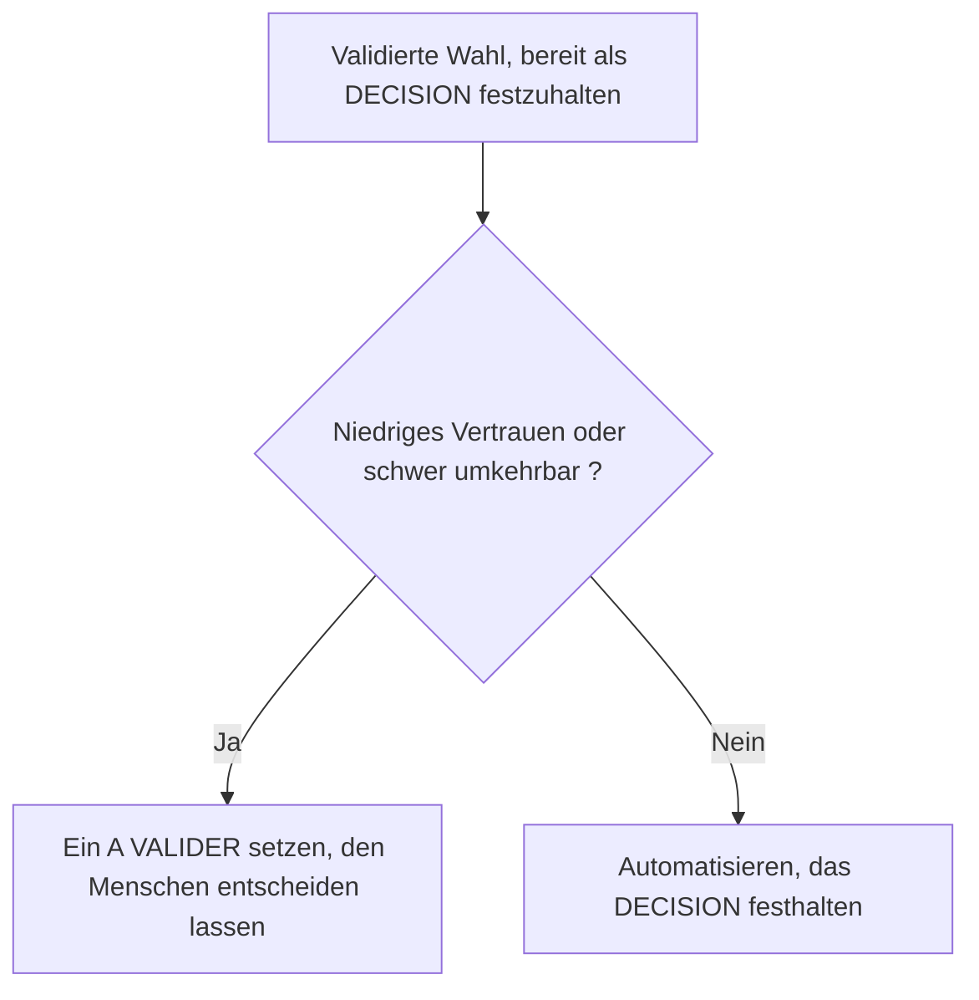

<!-- fr-synced: ea39bb91b48807f14ff61049a74807160db4cf19 -->

# Die Marker von BASE und wann man sie setzt

Ein schlecht gesetzter Marker, oder einer, der vom Menschen, vom Agenten und vom Werkzeug unterschiedlich verstanden wird, lässt die Spur des tatsächlichen Arbeitsstands verlieren. Um das zu vermeiden, wird das Vokabular ein einziges Mal hier definiert: welche Marker existieren, was jeder bedeutet und wann man ihn setzt. Ein Marker ist ein durchsuchbarer Textverweis, in eckigen Klammern in einem Dokument geschrieben, der diesen Zustand sichtbar macht, ohne die Datei zu verlassen. Er dient als gemeinsame Referenz für alle, die in BASE schreiben oder gegenlesen, ebenso wie für den Agenten, der sie unterstützt.

Ein Marker wird per Textsuche bearbeitet (durchsuchbar, also nachvollziehbar und skriptfähig), nicht mit dem Auge. Genau das ist der Sinn: Ein Marker ist ein Verweis, den man über eine standardisierte algorithmische Methode wiederfindet (die markierten Dokumente auflisten und eines nach dem anderen bearbeiten), statt sich auf eine unscharfe semantische Suche zu verlassen, die alles über das schiere Volumen aufnehmen muss. BASE erkennt davon eine **geschlossene** Menge, aufgeteilt auf zwei Ebenen, die sich nicht vermischen:

1. **Die fachlichen Marker**, in den Benutzerdokumenten (Offerten, Kundenblätter, Berichte, Journal). Sie machen den Arbeitsstand direkt in der Datei sichtbar und nachvollziehbar.
2. **Die Marker des Spezifikationsplans**, in der Spec und im Code. Sie kennzeichnen einen Bereich bewusst in Kauf genommener Unsicherheit oder eine Codeänderung, die ohne Spec-Änderung deklariert wird.

Diese Seite ist die **einzige Quelle** dieses Vokabulars. Der Scanner (`tools/core/markers.mjs`), die Anforderung FR-CORE-010, die spec-sync-Prüfung und die Kompetenz «Marker» jedes Agenten leiten sich alle aus dieser geschlossenen Menge ab. Der letzte Abschnitt erklärt, warum man keinen davon leichtfertig hinzufügt.

## A. Fachliche Marker

Vier Marker, und nur vier, leben in den Benutzerdokumenten. Jeder entspricht einer Phase der Schleife des gemeinsamen Denkens (Rahmen setzen, Anvertrauen, Bewerten, Anpassen). Sie werden von `base markers` (und vom MCP-Werkzeug `list_markers`) gesucht und sind in den Framework- und Spec-Dateien **verboten**.

Für jeden Marker: seine Bedeutung, der Zeitpunkt, ihn zu setzen, und wer ihn schliesst.

### `[A COMPLETER: champ]`

- **Bedeutung.** Eine zum Weiterkommen nötige Information fehlt.
- **Wann verwenden.** Phase «Rahmen setzen»: beim Verfassen, wenn ein unverzichtbares Datum noch nicht bekannt ist (zum Beispiel eine IDE-Nummer, eine E-Mail, ein Betrag).
- **Wer schliesst ihn.** Er verschwindet, sobald die Information geliefert ist, durch den Agenten oder durch die Benutzerin.

### `[A VALIDER: description]`

- **Bedeutung.** Der Agent schlägt etwas vor, das von der Benutzerin noch nicht bestätigt wurde.
- **Wann verwenden.** Phase «Anvertrauen»: für jeden Wert, jede Annahme oder Formulierung, die der Agent erzeugt hat und die eine menschliche Entscheidung erwartet.
- **Wer schliesst ihn.** Die Benutzerin. Ein bestätigtes `[A VALIDER]` wird zu einem `[DECISION]`.

### `[ATTENTION: description]`

- **Bedeutung.** Ein Risiko, eine Unstimmigkeit oder eine Warnung, die die Benutzerin prüfen sollte.
- **Wann verwenden.** Phase «Bewerten»: wenn der Agent einen Punkt erkennt, der einen menschlichen Blick verdient, bevor es weitergeht.
- **Wer schliesst ihn.** Er bleibt, solange das Risiko nicht behandelt ist; er schliesst sich, wenn der Punkt gelöst oder ausdrücklich akzeptiert wurde.

### `[DECISION: choix | raison]`

- **Bedeutung.** Eine Wahl wurde von der Benutzerin bestätigt, zur Nachvollziehbarkeit festgehalten.
- **Wann verwenden.** Phase «Anpassen»: um eine validierte Wahl festzuhalten und zu bewahren, warum sie getroffen wurde.
- **Wer schliesst ihn.** Nichts. Ein `[DECISION]` ist eine dauerhafte Spur der Wahl, die als Historie im Dokument bleibt, und kein offener, zu bearbeitender Punkt.
- **Angereicherte Form (hoher Einsatz).** Wenn die Wahl bedeutende Folgen hat (hoher Betrag, feste Verpflichtung, schwer korrigierbares Datum), dokumentiert man die verworfene Alternative, das Vertrauensniveau und die Kosten einer Rückabwicklung, zum Beispiel: `[DECISION: Arche florale à 1100 CHF | Pivoines plus coûteuses | Alternative: roses standard 850 CHF | Confiance: haute | Réversibilité: faible (devis à refaire)]`. Vorgeschlagenes Vokabular, vom Menschen wie vom Agenten gelesen (es ist kein vom Scanner ausgewertetes Feld): **Confiance: haute | moyenne | basse**, **Réversibilité: facile | moyenne | difficile**.
- **Eskalationsregel.** Ein Agent, der im Begriff ist, ein `[DECISION]` mit **niedrigem Vertrauen** *oder* mit **schwieriger** Rückabwicklung festzuhalten, entscheidet nicht allein: Er setzt ein `[A VALIDER]` und lässt den Menschen entscheiden. Man automatisiert, was sicher und leicht umkehrbar ist; den Rest eskaliert man. Das ist eine Konvention des Urteilsvermögens, keine vorgeschriebene Syntax.

### Gemeinsame Regeln für die fachlichen Marker

- Sie leben in den **generierten Dokumenten** (Offerten, Kundenblätter, Berichte) und im **Journal**, niemals in den Framework-Dateien (`AGENT.md`, `SKILL.md`, Templates) oder in der Spec.
- Sie werden von `base markers` (und vom MCP-Werkzeug `list_markers`) gescannt, das nur die fachlichen Dateien zurückgibt: `listMarkers` ignoriert `.ai/agents/`, `docs/`, `specs/`, `tests/`, `tools/`, `mcp/`, die READMEs und die Testdateien (FR-MARKERS-001). Zu Beginn einer Sitzung kann der Agent den offenen Stand in einer Zeile zusammenfassen (zum Beispiel «2 `[A VALIDER]`, 1 `[DECISION]` festgehalten»).
- Der Wartungsbericht (`base entretien`, FR-CORE-010) zählt dieselben Marker als offene Punkte und meldet **veraltete** Marker: einen in einer fachlichen Datei offen gebliebenen Marker, deren Änderungsdatum 30 Tage überschreitet, das Signal des «Verifikationstheaters».
- Die Menge ist im Scanner **geschlossen und unabhängig von Gross- und Kleinschreibung**; jede andere eckige Klammer ist kein fachlicher Marker und wird nicht gemeldet.

### Domänenvarianten

Die vier fachlichen Marker bilden die **kanonische** Menge: Sie ist es, die der Scanner erkennt, die `base markers` meldet und die die Standardkompetenz «Marker» lehrt. Ein Agent kann jedoch **zusätzlich** Anmerkungen lehren, die seiner Domäne eigen sind, um lesbar zu machen, was bei ihm zählt: Der Reflexionsassistent zum Beispiel setzt `[HYPOTHESE: …]` und `[INCERTITUDE: …]`. Diese Anmerkungen sind keine kanonischen fachlichen Marker (der Scanner meldet sie nicht) und beanspruchen nicht den Status der geschlossenen Menge.

Die Grenze wird von einer Prüfung gehalten (`tools/spec/check-markers.mjs`): Eine Kompetenz «Marker», die die kanonische Menge verwendet (sie erwähnt `A COMPLETER`), ist eine **Kopie** davon und muss alle vier Marker tragen, ohne einen auszulassen; eine Kompetenz, die `A COMPLETER` nicht verwendet, wird als **Domänenvariante** behandelt, vom Kanon verschieden und von dieser Vollständigkeitsprüfung übergangen. Eine Variante zu wählen bleibt eine bewusst verantwortete Entscheidung des Agenten; sie verändert die kanonische Menge nicht, die sich nur durch Entscheidung ändert (siehe weiter unten).

## B. Marker des Spezifikationsplans

Zwei Marker leben im technischen Plan (der Spec und dem Code), niemals in den Benutzerdokumenten. Sie werden von `base markers` nicht gemeldet: Es sind Konventionen des Repositorys, durchgesetzt von den Disziplinprüfungen der Spec.

### `[NEEDS CLARIFICATION: reason]`

- **Bedeutung.** Eine bewusst in Kauf genommene Unbekannte in der Spezifikation: ein Bereich, in dem das erwartete Verhalten noch nicht entschieden ist.
- **Wo er gilt.** In den Kapiteln von `specs/current/`. Die Regel der Spec lautet, **niemals eine Anforderung zu erfinden**: Eine echte Unbekannte wird inline markiert, statt sie zu erraten. Der Grund in den Klammern ist obligatorisch.
- **Warum.** Die Spec beschreibt das gegenwärtige Verhalten, ohne Status. Ein `[NEEDS CLARIFICATION]` ist die ehrliche Art zu sagen «dies bleibt zu entscheiden», ohne eine Antwort zu fabrizieren oder geplante Arbeit in ein Kapitel zu schmuggeln (geplante Arbeit lebt in `CHANGELOG.md` und `.plans/`).

### `[SPEC-NEUTRAL: reason]`

- **Bedeutung.** Die ehrliche und überprüfte Erklärung, dass eine Runtime-Codeänderung kein von der Spec beschriebenes Verhalten verändert.
- **Wo er gilt.** In der Commit-Nachricht oder im Rumpf des Pull Request, gelesen von der **spec-sync**-Prüfung (`tools/spec/spec-sync-check.mjs`).
- **Warum.** Die spec-sync-Prüfung garantiert, dass die Wahrheit der Entwicklung nicht hinterherhinkt: Eine Änderung am Runtime-Quellcode muss `specs/` in derselben Änderung berühren, **oder** `[SPEC-NEUTRAL: reason]` deklarieren. Es ist das **Sicherheitsventil** der Prüfung und keine stille Abkürzung: Die Erklärung ist ein expliziter Prüfpunkt, und die Gegenlesenden überprüfen, dass die Änderung wirklich keine Auswirkung auf das Verhalten hat. Der Grund in den Klammern ist obligatorisch.

Diese beiden Marker gehören zur Disziplin der Spec (NFR-CORE-010), auf gleicher Stufe wie die neu generierte Matrix Anforderungen zu Tests und die Unveränderlichkeit der Identifikatoren. Sie haben in einer Offerte oder einem Kundenblatt nichts zu suchen, und die fachlichen Marker haben in einem Spec-Kapitel nichts zu suchen.

## Niemals (harte Regeln)

Die harten Regeln für einen Agenten, der **innerhalb** von BASE arbeitet (dem Repository des Frameworks), nicht für die fachlichen Dokumente:

- **Niemals ein fachlicher Marker in einer Framework- oder Spec-Datei.** Die Marker `[A COMPLETER]`, `[A VALIDER]`, `[ATTENTION]`, `[DECISION]` leben in den generierten Dokumenten und im Journal, niemals in `AGENT.md`, `SKILL.md`, den Templates oder dem Baum `specs/`.
- **Niemals ein generiertes Artefakt von Hand bearbeiten.** Jede Datei, deren Kopfzeile angibt, dass sie generiert ist (`AGENTS.md`, `CLAUDE.md`, `BASE_BOOTSTRAP.md`, `.cursor/rules/assistant.mdc`, `base.manifest.json`, die Matrix `requirements-matrix.md`), ist eine Projektion: Ändere die kanonische Quelle (zum Beispiel `tools/core/bootstrap.mjs` für die vier Einstiegspunkte), dann generiere neu. Das Frische-Gate (`build --write`, dann `git diff --exit-code`) verweigert jede Abweichung.
- **Niemals ein fehlendes Datum erfinden.** Eine fehlende Information wird mit `[A COMPLETER: champ]` in einem fachlichen Dokument notiert, und eine Unbekannte in einer Spec wird inline mit `[NEEDS CLARIFICATION: raison]` gekennzeichnet. Rate nicht, fabriziere keinen Wert, kein simuliertes Vertrauen.
- **Niemals direktes Schreiben auf ein geschütztes Ziel.** Jedes Schreiben läuft über den vermittelten Fluss «vorschlagen, dann committen»; das Vorschlagen bereitet ein Diff vor und schreibt nichts, das Committen prüft die Entscheidung und den `base_hash` erneut, bevor geschrieben und überprüft wird. Ein Vorschlag befreit sich niemals selbst.
- **Niemals einen stabilen Identifikator umnummerieren, wiederverwenden oder löschen** (`UR`/`NFR`/`FR`/`RC`/`AD`). Eine zusammengeführte ID ist unveränderlich; eine aus dem Umfang entfernte Anforderung behält ihre ID und trägt `[DE-SCOPED: raison]`. Neue IDs werden vom Werkzeug zugeteilt (`base spec new <PREFIX> <DOMAIN>`), niemals von Hand.

## Eine geschlossene Menge, nur durch Entscheidung verändert

Diese Seite ist die einzige Quelle der Wahrheit für das Vokabular der Marker. Alles andere leitet sich davon ab:

- der Scanner `tools/core/markers.mjs`, dessen Muster nur die vier fachlichen Marker erkennt;
- die Anforderung FR-CORE-010, die definiert, was der Wartungsbericht zählt und meldet;
- die Kompetenz «Marker» jedes Agenten, die dem Assistenten beibringt, wann jeder fachliche Marker zu setzen ist.

Weil diese Ableitungen mit dieser Seite konsistent bleiben müssen, **ist das Hinzufügen eines Markers (oder das Ändern seiner Bedeutung) eine Framework-Änderung, keine Improvisation**: Es läuft über einen Entscheidungseintrag (`decisions/`) und dann über die Neugenerierung der davon abgeleiteten Artefakte. Man erfindet keinen Marker beim Schreiben: Man wählt aus dieser geschlossenen Menge, oder man eröffnet eine Entscheidung.
