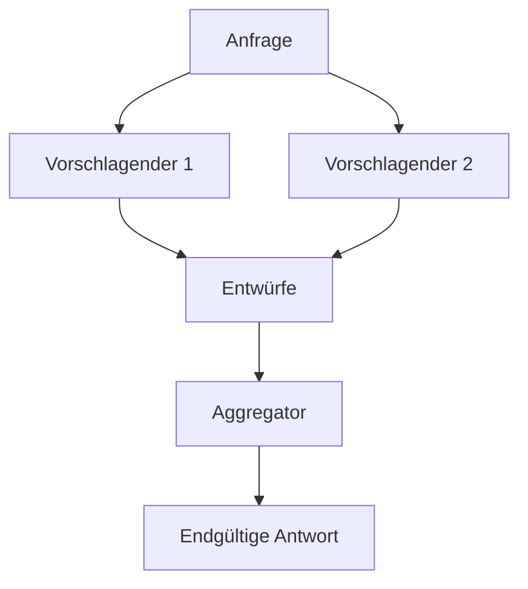

<!-- fr-synced: c3027d43be98ae750a20d8c860fdb5d9cf01023c -->

# Mehrere Modelle orchestrieren und Aufrufe überwachen

Das Paket `@ai-swiss/base-llm` stellt einen einzigen Modell-Port bereit: Jedes Modell bietet dieselbe `complete`-Schnittstelle. Da die Meta-Modelle diesen Port einhalten, lassen sie sich komponieren: Jedes umhüllt ein oder mehrere Modelle und ist selbst ein Modell. Es fügt sich daher überall dort ein, wo ein einfaches Modell verwendet wird, von den Einstellungen bis zum routing. Die Wahl eines Modells bleibt stets eine bewusste Entscheidung.

## Mixture of Agents

`createMoaModel` befragt mehrere Vorschlagende parallel, danach fasst ein Aggregator ihre Entwürfe zu einer einzigen Antwort zusammen. Die Vorschlagenden arbeiten ohne Werkzeuge und erzeugen Text; der Aggregator erhält die Entwürfe als private Anleitung und behält die ursprünglichen Werkzeuge. Der Tokenverbrauch summiert sich über alle Aufrufe, und die Synthese läuft weiter, selbst wenn einzelne Vorschlagende ausfallen.

## Triumvirat

`createTriumviratModel` übernimmt die Architektur von Sakana Fugu und von TRINITY. In jeder Runde wählt ein Koordinator ein Modell aus einem austauschbaren Pool und weist ihm eine Rolle zu: Der Denker plant, der Ausführende erzeugt oder korrigiert die Antwort und erhält als Einziger die Werkzeuge, der Prüfer beurteilt den Entwurf und entscheidet über den Abbruch. Die Schleife läuft bis zur Annahme oder bis zu einer Rundenobergrenze.

Der Standard-Koordinator stützt sich auf ein Modell aus dem Pool, mit einem deterministischen Rückfall Denker, Ausführender, Prüfer. Eine vom Aufrufer bereitgestellte `decide`-Funktion ersetzt diesen Koordinator, ohne die Schnittstelle zu ändern.

## Ensembles aus den Einstellungen konfigurieren

Ein `ensembles`-Block in `.ai/studio.settings.json` macht diese Kompositionen verfügbar, ohne Code zu schreiben. Jeder Eintrag benennt einen `type` (`moa` oder `triumvirat`) und Mitgliederreferenzen im Format `<fournisseur>/<modèle>`. Der Name des Ensembles lässt sich anschliessend überall dort verwenden, wo eine Modellreferenz verwendet wird, zum Beispiel in `routing.model`. Eine fehlerhafte Konfiguration schlägt mit einer klaren Meldung fehl.

## Überwachung mit Langfuse

`createLangfuseModel` umhüllt ein beliebiges Modell und verfolgt jeden Aufruf in Langfuse: Eingabe, Ausgabe, Tokens, Dauer und Fehler. Die Hülle fügt keine Abhängigkeit hinzu: Sie schreibt über `fetch` an die öffentliche Ingestion-Schnittstelle. Der Versand erfolgt im Hintergrund und fügt dem Aufruf keine Latenz hinzu; `flush()` leert die noch laufenden Versände vor dem Ende eines kurzen Prozesses. Ein Fehler bei der Überwachung unterbricht niemals den überwachten Aufruf. Die keys stammen aus den Umgebungsvariablen `LANGFUSE_PUBLIC_KEY` und `LANGFUSE_SECRET_KEY`, und ein selbst gehosteter Host wird über `LANGFUSE_HOST` angegeben.

## Zwischen Mixture und Triumvirat wählen

Die Mixture zielt auf Breite in einer einzigen Runde: parallele Vorschläge und danach eine Synthese, einfach und sparsam. Das Triumvirat zielt auf Tiefe in einer Sequenz: planen, erzeugen, prüfen, wiederholen, mit Selbstkorrektur und Werkzeugnutzung. Beide teilen denselben Port, daher umhüllt die Langfuse-Überwachung sie auf dieselbe Weise.
