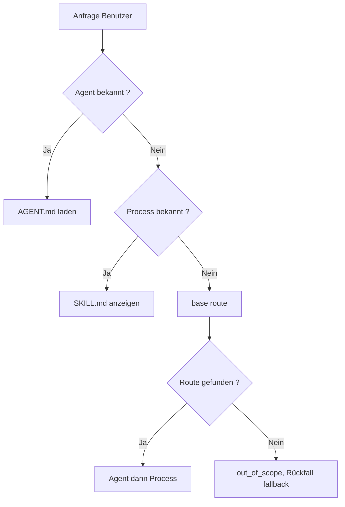

<!-- fr-synced: c192630befb37a2e09652f9440e6e5fc6841ed8a -->

# Eine Anfrage an den richtigen Process leiten (und die passenden Ressourcen öffnen)

Eine falsch geleitete Anfrage lädt alles, vermischt alles und ertränkt die wichtigen Entscheidungen unter einer Mauer von Anweisungen. BASE vermeidet das, indem es drei Gesten unterscheidet, die KI-Werkzeuge oft verwechseln: einen Agent wählen, an einen Process routen, die Ressourcen öffnen. Wenn man sie trennt, bleibt sichtbar, was wirklich entschieden wird. Wenn Sie ein BASE bauen oder nutzen und wissen wollen, wie eine Anfrage ihren Weg findet, zeigt diese Seite es.



## 1. Einen Agent wählen

Wenn Sie wissen, welchen Assistenten Sie nutzen möchten, ist es am einfachsten, ihn direkt auszuwählen:

```text
Lis .ai/agents/assistant-devis/AGENT.md
```

Der Agent ist die Stellenbeschreibung. Er sagt, welche Rolle einzunehmen ist, wie zu sprechen ist, welche Workflows existieren und wo sich die nützlichen Dateien befinden.

Für einen einzelnen Assistenten genügt diese manuelle Auswahl oft. Es gibt nichts zu installieren, nichts zu indexieren und keinen Routing-Katalog zu pflegen.

## 2. An einen Process routen

Wenn mehrere Workflows möglich sind, kann BASE eine Anfrage an den richtigen Process routen:

```bash
base route "je dois préparer un devis client" --root <dossier-base>
```

Der Router wählt ein Paar Agent → Process oder enthält sich mit einer lesbaren Begründung. Er lädt nicht alle Anweisungen und durchsucht nicht frei das gesamte Repository. Sein Mechanismus bleibt rudimentär, aber wirksam, und er erweitert sich über Adapter. Vor allem nimmt er dem Benutzer die geistige Last ab, den richtigen Process zu suchen.

Diese Begrenzung ist gewollt. Ein Process beantwortet die Frage:

```text
Que faut-il faire maintenant ?
```

Das ist eine Workflow-Entscheidung. Sie muss kurz, testbar und erklärbar bleiben.

Die empfohlenen Signale für einen routbaren Process sind:

- `description`: was der Process tut;
- `use_when`: wann er zu verwenden ist;
- `routing.examples`: echte Formulierungen von Benutzern;
- `routing.avoid_when`: Gegenbeispiele, die falsche Routen verhindern.

Die Fixtures `.ai/routing/route-tests.json` schützen die wichtigen Routen vor Regressionen.

## 3. Die nützlichen Ressourcen öffnen

Sobald der Process gewählt ist, kann er die benötigten Ressourcen referenzieren:

- Fachkompetenzen;
- Dokumente;
- Templates;
- tools;
- lokale Daten;
- externe Quellen über Konnektoren.

Diese Ressourcen beantworten eine andere Frage:

```text
Avec quoi faut-il le faire ?
```

Sie sind Kontext, Werkzeuge oder Daten. Diese Grenze zu wahren ist zuallererst eine Frage der Sicherheit: die Anweisungen eines Process werden ausgeführt, der Inhalt einer Ressource wird nicht ausgeführt. Beides zu vermischen öffnet die Tür zur Injektion, bei der Daten versuchen, sich als Anweisung auszugeben. Die Wahl des Haupt-Workflows bleibt deshalb getrennt.

Ein Process kann sie in seiner frontmatter deklarieren:

```yaml
requires:
  - ref: calculer-devis
    access: execute
    purpose: chiffrer le devis
may_use:
  - catalogue/services.json
```

Verwenden Sie `requires` für eine Ressource, die der Process strukturiert öffnen oder ausführen muss, idealerweise über ihre `id`. Das Feld `access` beschreibt die vom Process erwartete Nutzung, zum Beispiel Lesen oder Ausführen. Es gewährt kein Zugriffsrecht.

Verwenden Sie `may_use` für einfachen oder optionalen Kontext, oft ein lesbarer Pfad im Projekt. Der Process kann diese Ressourcen auch in seinen Schritten nennen, wenn der Kontext einfach bleibt. Wichtig ist, dass die Logik lesbar bleibt: der Router wählt den Process, dann gibt der Process an, was zu öffnen ist.

## Wer setzt die Rechte durch?

BASE ersetzt nicht die normalen Rechte der Umgebung. Wenn eine Quelle in einem Ordner, einem Drive, einer API oder einem externen Werkzeug liegt, bleiben die tatsächlichen Rechte jene dieses Ordners, dieses Drive, dieser API oder dieses Werkzeugs.

BASE setzt seine eigenen Schutzmechanismen nur auf den Aktionen durch, die durch BASE laufen:

- `base open` oder `open_resource`, um eine inventarisierte Ressource zu öffnen;
- `base access` oder `access_resource`, um einen auf das Projekt beschränkten Pfad zu lesen;
- `base invoke` oder `invoke_tool`, um eine tool vorzubereiten oder auszuführen;
- `base propose` dann `base commit`, oder `propose_change` dann `commit_change`, für ein vermitteltes Schreiben.

Die praktische Regel lautet:

```text
Le process déclare les besoins.
BASE médie certaines actions.
Les droits réels restent portés par l'OS, l'outil, le connecteur ou l'API.
```

## Warum nicht alle Ressourcen routen?

BASE könnte sich zu einem breiteren Routing entwickeln: direkt aus einer Anfrage eine Kompetenz, ein Werkzeug, ein Template oder ein Dokument finden.

Das wäre in manchen Kontexten nützlich, aber es muss eine ausdrückliche Erweiterung bleiben. Eine Aktion zu routen und Kontext wiederzufinden sind nicht dieselbe Verantwortung.

Die aktuelle Wahl ist daher konservativ:

```text
route = choisir le process à suivre
discover/open = trouver ou ouvrir les ressources utiles
```

Diese Trennung hält das System verständlich für eine einzelne Person, testbar für ein Team und erweiterbar für eine Organisation.

## Wenn BASE keine Route findet: der Rückfall (fallback)

Der Router bleibt ehrlich: wenn die Anfrage zu keinem Workflow passt, enthält er sich (`out_of_scope`), statt eine Route zu erfinden. Aber der Benutzer darf nie ohne nächsten Schritt bleiben.

Ein Projekt kann einen Hilfe-Rückfall in `base.config.json` oder `base.config.mjs` deklarieren:

```json
{
  "routing": {
    "fallback": { "agent": "concierge-base", "process": "accueil" }
  }
}
```

Wenn der Router sich ehrlich enthält, fügt er dem Ergebnis einen `fallback`-Zeiger hinzu. Das ist getrennte Metadaten, nie eine falsche Route: der `status` bleibt die ehrliche Enthaltung. Der Assistent lädt dann diesen Rückfall (ein Agent → Empfangs-Process), statt den Benutzer blockiert zu lassen.

Der Kern bleibt agnostisch: das Ziel ist konfiguriert, nie hart codiert; ein nicht auffindbares Ziel hängt keinen Rückfall an (und `base validate` meldet es). Der Rückfall begnügt sich damit zu orientieren, ohne mehr zu versprechen.

```text
Routage "Bonjour": out_of_scope (below_floor)
Fallback: concierge-base -> accueil
```

Dieses Versprechen gilt, wenn das Routing aktiviert ist und wenn das Rückfall-Ziel in der gewählten Wurzel existiert. In einem kopierten Beispiel, das direkt einen Fach-Agent lädt, kann «Hilfe» einfach die lokale Fachhilfe öffnen. Um den BASE-Concierge zu erhalten, fügen Sie den Rückfall und den Ordner `concierge-base` hinzu, oder laden Sie direkt `.ai/agents/concierge-base/AGENT.md`, wenn er existiert.

## Wurzel und Workspace

Eine **Wurzel** (root) ist ein abgeschlossenes BASE-Projekt: ein Ordner mit seinem `.ai/`, seinen Agents, seinen Daten. Jedes Lesen, Schreiben oder Ausführen bleibt innerhalb der gewählten Wurzel.

Drei Situationen, von der einfachsten zur fortgeschrittensten:

- **Eine einzige Wurzel.** Der Standardfall. Öffnen Sie den Ordner, das ist Ihr BASE.
- **Verschachtelte Unterprojekte.** Ein Container-Ordner mit mehreren `.ai/agents/` darunter: die CLI und das MCP erkennen die nächstgelegene Wurzel.
- **Mehrere deklarierte Wurzeln (Multi-Kunde).** Eine Datei `base.workspace.json` listet benannte Wurzeln auf:

```json
{
  "schema_version": "base.workspace.v1",
  "id": "agence",
  "roots": [
    { "id": "client-a", "path": "clients/a", "default": true },
    { "id": "client-b", "path": "clients/b" }
  ]
}
```

`base route "<demande>" --workspace base.workspace.json` kann dann zwischen den Wurzeln suchen; `--root-id client-b` zielt auf eine bestimmte Wurzel. Das Routing durchquert die Wurzeln, aber jede Aktion bleibt auf die gewählte Wurzel beschränkt. Einzelheiten in `specs/current/10_core/cli.md` und `mcp/README.md`.

## Praktische Regel

- Wenn Sie wissen, welchen Agent Sie nutzen möchten, laden Sie seine `AGENT.md`.
- Wenn Sie bereits wissen, welchem Process Sie folgen möchten, zeigen Sie direkt auf seine `SKILL.md`: das Routing ist ein Einstiegspunkt, kein Pflichtweg.
- Wenn die Anfrage mehreren Workflows folgen könnte, verwenden Sie `base route` oder `route_request`.
- Wenn der Process Kontext braucht, öffnen Sie nur die Ressourcen, die er referenziert oder die Sie für diesen Bedarf entdecken.

Diese Disziplin vermeidet die Mauer von Anweisungen, begrenzt unnötige Tokens und hält die wichtigen Entscheidungen sichtbar.
