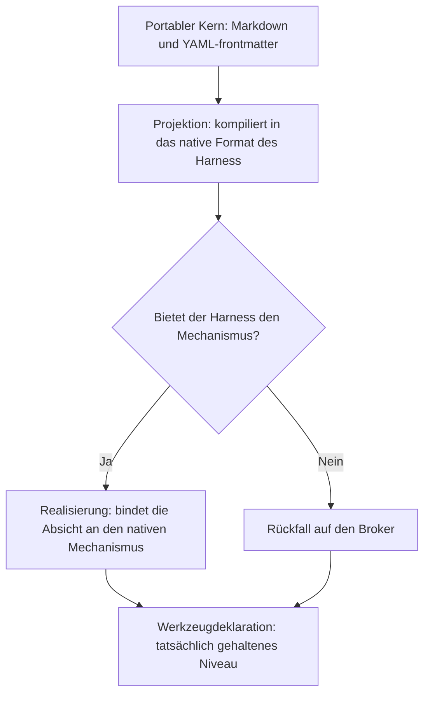

<!-- fr-synced: 07917297c3698cc37ef72c539981af908b860cf0 -->

# BASE Spezifikation v0: Gründungsprinzip und wo die aktuelle Spec zu finden ist

Diese Seite dient als Orientierungspunkt für alle, die die Spezifikation von BASE suchen. Sie nennt das Gründungsprinzip und verweist auf die aktuelle Engineering-Spezifikation, damit Sie nicht an einem veralteten Text arbeiten.

> **Diese Seite ist bewusst kurz gehalten.** Die Engineering-Spezifikation des BASE-Werkzeugs (broker, CLI, MCP, ports, schemas) lebt in `specs/current/`, auf Englisch, gegen den Code und die Tests verifiziert; jede veröffentlichte Version wird durch einen git-Tag eingefroren (`git show v1.0.0:specs/current/…`). Bei Abweichungen ist `specs/` massgebend.

Einstiegspunkt: [`specs/current/README.md`](../../specs/current/README.md).

Die «v0» bezeichnete die ursprüngliche konzeptuelle Erzählung von BASE, bevor die Engineering-Spezifikation existierte. Ihr normativer Inhalt wurde in `specs/current/` aufgenommen; diese Seite bewahrt das Gründungsprinzip und die Lesekarte.

## Das fundamentale Prinzip, unverändert

> Der Mensch und die KI arbeiten mit Textdateien. Der Code garantiert die Invarianten, die natürliche Sprache nicht garantieren kann.

BASE ist ein minimales Protokoll, um Wissen, Anweisungen, Prozesse, Daten, ausführbare Werkzeuge, Berechtigungen, menschliche Entscheidungen, nützliche Spuren und Adapter zu verschiedenen Agenten oder Harnesses dauerhaft zu artikulieren. Um häufige Verwechslungen auszuräumen: Es ist weder eine App noch eine Automations-UI, weder eine Workflow-Engine noch eine Datenbank, und auch kein einfach verpacktes Prompt.

## Wo jetzt was zu lesen ist

| Was v0 beschrieb | Wo es heute lebt |
| ---------------------- | ----------------------- |
| Definitionen (Resource, Source, Connector, Broker, usw.) und Invarianten | [`specs/current/00_overview/`](../../specs/current/00_overview/vision.md) und [`specs/current/10_core/requirements.md`](../../specs/current/10_core/requirements.md) |
| Stabile Form der Ressourcen (YAML-frontmatter + freies Markdown) | [`specs/current/10_core/frontmatter.md`](../../specs/current/10_core/frontmatter.md) und [`base.schema.json`](../../base.schema.json) |
| Process Skills vs Competence Skills | [BASE verstehen](../learn/comprendre.md) und [Routing, Prozesse und Ressourcen](routage-process-et-ressources.md) |
| Modi advisory / hybrid / strict und Ehrlichkeitsregel | [Sicherheit und Grenzen](../trust/securite-et-limites.md) und die generierte Matrix [Harness-Kompatibilität](compatibilite-harnesses.md) |
| Primitive des Routers und des Brokers | [`specs/current/10_core/routing.md`](../../specs/current/10_core/routing.md) und [`specs/current/10_core/architecture.md`](../../specs/current/10_core/architecture.md) |
| Ablauf propose → commit, Ausführung, Promotion | [`specs/current/10_core/writes.md`](../../specs/current/10_core/writes.md) |
| Testdisziplin | [`specs/TESTING.md`](../../specs/TESTING.md) |
| Was ausgeliefert, geplant oder ausserhalb des Geltungsbereichs ist | [Implementierungsstand](etat-implementation.md) |

## Die zentralen Invarianten, je eine Zeile

Das Detail lebt in `specs/current/`, aber drei Invarianten verdienen es, hier lesbar zu bleiben:

- **Abgeleiteter Index**: Manifeste, Caches und Indizes sind nicht die Quelle der Wahrheit; sie regenerieren sich aus den Dateien.
- **Externe Daten ≠ Anweisung**: Eine E-Mail, ein Lebenslauf oder ein Webinhalt wird als Daten behandelt, niemals als Governance-Anweisung.
- **Kanonischer Broker**: Die CLI, das MCP und die Adapter delegieren an dieselben Primitive, anstatt Parsing, Suche, Berechtigungen oder Tracing neu zu implementieren.

## Die Ehrlichkeitsregel der Modi

```text
advisory = guide/audit
hybrid = enforcement partiel explicite
strict = enforcement médié
```

Ein Adapter muss sein tatsächliches Niveau deklarieren. BASE verspricht nicht den strict-Modus, wenn der Harness nur advisory zulässt. Die generierte Matrix [Harness-Kompatibilität](compatibilite-harnesses.md) macht diese Regel berechenbar.

## Die hier bewahrte langfristige Vision: Portabilität

Der einzige Teil von v0, der zukunftsgerichtet bleibt, ist das Ziel der Portabilität zwischen Harnesses. «Totale» Kompatibilität ist kein erreichbares Ziel und darf nicht versprochen werden; das erreichbare Ziel ist **graceful degradation + deklariertes Niveau**. Drei Schichten:

1. **Portabler Kern**: Markdown und ein semantisches YAML-frontmatter, die Absichten und Anschlusspunkte deklarieren, niemals werkzeugspezifische Mechanismen.
2. **Zwischenschicht**: Die Projektion kompiliert den Kern in das native Format jedes Harness (generierte Ausgabe, niemals Quelle); die Realisierung bindet jede Absicht an den besten Mechanismus, den der Harness bietet, fällt sonst auf den Broker zurück und erfasst das erreichte Niveau.
3. **Werkzeugdeklaration**: pro Agent, Harness und Absicht das tatsächlich gehaltene Niveau, berechenbar statt redaktionell. Genau das projiziert `.ai/tools.md` bereits.



Der Broker ist die Rückfall-Realisierung: Was ein Harness nicht nativ leistet, übernimmt der Broker, sobald die Aktion durch ihn läuft (Confinement, dry-run, Trace, mediiertes Schreiben). Eine Absicht wie `requires_confirmation` erreicht nur für die Aktionen ein strict-Niveau, die tatsächlich durch ihn laufen.

Dokumentiertes Migrationsziel: ein einziger semantischer Dialekt (`base.resource.v2`), der den heute getrennten Ressourcen-Dialekt und den Skill-Dialekt vereinen würde; die nativen frontmatter würden zu Projektionen, in der CI generiert und verifiziert wie jedes abgeleitete Artefakt.

---

BASE ist ein Framework von [AI Swiss](https://a-i.swiss). Anwendungsfall in Partnerschaft mit [Innovaud](https://innovaud.ch).
