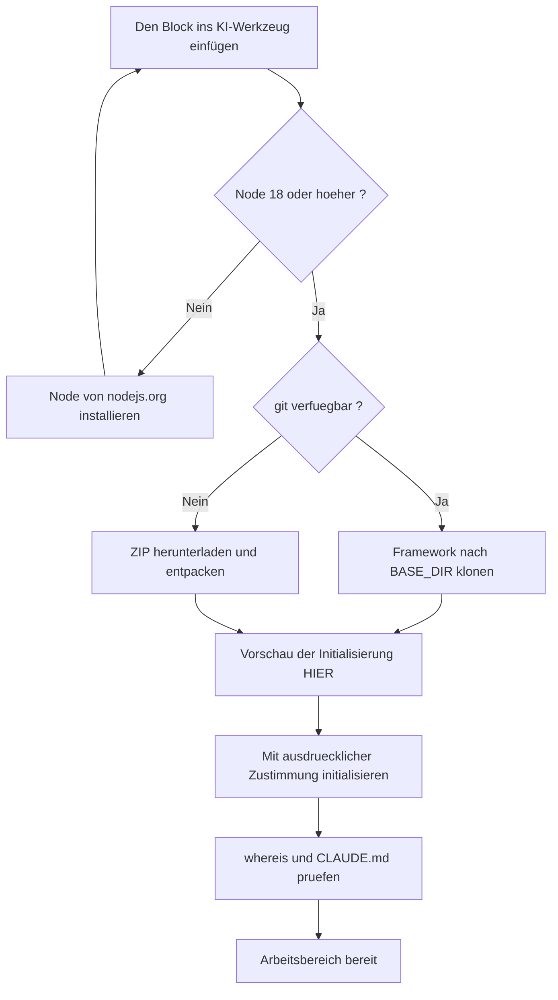

<!-- fr-synced: 54f945b325d420c33afb1ca56d89d61d651a0abd -->

# Lassen Sie BASE von Ihrer KI installieren

Die Installation von BASE kann Sache Ihrer KI sein, nicht Ihre eigene: Sie erhalten einen
gebrauchsfertigen Arbeitsbereich, ohne einen einzigen Befehl eingetippt zu haben, vorausgesetzt,
Sie verfügen über ein Werkzeug, das diese Befehle für Sie ausführen kann, und Sie können jeden
Schritt prüfen, bevor er angewendet wird. Konkret fügen Sie einen Block in ein KI-Werkzeug ein,
das Befehle ausführen kann (zum Beispiel GitHub Copilot, Antigravity, Claude Code oder Cowork,
OpenCode, Kilo Code), es übernimmt die Installation für Sie und sagt Ihnen, wann Ihr
Arbeitsbereich bereit ist.

## Bevor Sie den Block einfügen

1. Erstellen Sie einen leeren Ordner für Ihre Arbeit: zum Beispiel in Ihren Dokumenten einen
   Ordner `mon-assistant`.
2. Öffnen Sie diesen Ordner in Ihrem KI-Werkzeug, das Ihre Dateien lesen kann (zum Beispiel
   GitHub Copilot, Antigravity, Claude Code oder Cowork, OpenCode, Kilo Code): je nach Werkzeug
   ist das ein *File → Open Folder* oder ein `cd mon-assistant` und anschliessend der Start des
   Werkzeugs in diesem Ordner.
3. Öffnen Sie den Chat im **Agent-Modus** (jener, der Befehle ausführen kann): je nach Werkzeug
   ist das ein *Agent*-Modus, den Sie im Chat-Bereich aktivieren, oder der Standardmodus.
4. Fügen Sie den Block unten ein und senden Sie ihn ab.

## Der einzufügende Block

```text
Mission: installer BASE et créer mon espace de travail dans le dossier courant.

D'abord, demande-moi: «Où veux-tu installer le framework BASE?»
(propose le sous-dossier "base" de mes Documents, et appelle ce chemin <BASE_DIR>).

Étapes, vérifie chaque sortie avant de continuer:
1. `node --version`: il faut Node 18 ou plus. Sinon, guide-moi pour l'installer depuis
   nodejs.org. Après l'installation, je ferme et rouvre mon outil, je recolle cette
   lettre, et tu reprends ici.
2. Installe le framework dans <BASE_DIR> s'il n'y est pas déjà:
   `git clone https://github.com/ai-swiss/base.git <BASE_DIR>`
   Si git n'est pas disponible, télécharge
   https://github.com/ai-swiss/base/archive/refs/heads/main.zip, décompresse-le, et
   place son contenu dans <BASE_DIR>, puis continue. (Sur Mac, taper git peut ouvrir un
   dialogue d'installation des outils de développement: c'est normal, le ZIP l'évite.)
3. Montre-moi ce que l'initialisation créerait ICI (mon dossier de travail, pas <BASE_DIR>):
   `node <BASE_DIR>/tools/base.mjs init`
   puis, avec mon accord explicite: `node <BASE_DIR>/tools/base.mjs init --yes`
4. Vérifie: `node <BASE_DIR>/tools/base.mjs whereis` montre <BASE_DIR>,
   et le fichier CLAUDE.md existe maintenant dans mon dossier.
5. Dis-moi la phrase exacte à t'écrire pour commencer
   («importer mes procédures existantes» si j'ai déjà des documents à convertir).

Garde-fous: n'écrase JAMAIS un fichier existant; n'installe rien d'autre sans me
demander; si une étape échoue, montre-moi l'erreur exacte au lieu de bricoler.
```

Hier ist der Ablauf, dem Ihre KI folgt:



## Was als Nächstes geschieht

Ihr Ordner enthält nun einen Agenten, seine Konfiguration und die Dateien, die Ihr Werkzeug
liest, um zum **Router** Ihres Fachbereichs zu werden (je nach Werkzeug eine `CLAUDE.md`, eine
`AGENTS.md` oder eine gleichwertige Regeldatei im Ordner des Werkzeugs). Sprechen Sie ganz
normal mit ihm: er lenkt jede Anfrage zum richtigen Prozess und folgt diesem, ohne dass Sie
suchen müssen, welchen Sie verwenden sollen.

- **Ihre bestehenden Dokumente konvertieren**: sagen Sie «importer mes procédures existantes».
  Jede Konvertierung wird Ihnen als Diff vorgeschlagen; nichts wird ohne Sie geschrieben.
- **Das Studio**: um Ihre Assistenten in einer Oberfläche zu durchsuchen, zu bearbeiten und zu
  bewerten, öffnet `node <BASE_DIR>/tools/base.mjs studio --root .` das BASE Studio.
- **Das Framework aktuell halten**: `node <BASE_DIR>/tools/base.mjs update`.
- **Wo BASE lebt**: `node <BASE_DIR>/tools/base.mjs whereis` (der Speicherort ist auch in
  `~/.config/base/config.json` vermerkt und kann von Hand bearbeitet werden).

Möchten Sie lieber alles selbst machen? Siehe [BASE beziehen](obtenir-base.md) und
[Einen Arbeitsbereich installieren](installer.md).
