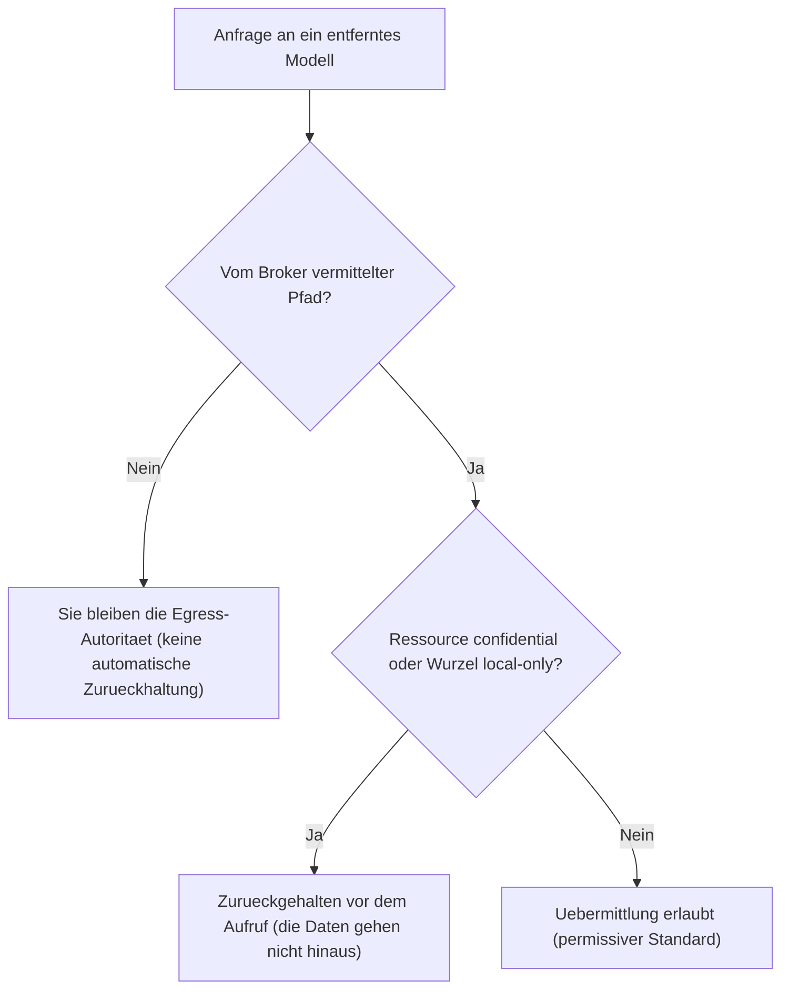

<!-- fr-synced: d6b9fdf9cda323341e86fafd0ba43b7f99fee844 -->

# Die Grenze, lokal als Standard

Zu wissen, was auf Ihrer Maschine bleibt und was zu einem entfernten Dienst gelangen kann, bedeutet zu wissen, was Sie BASE bewusst anvertrauen koennen. Diese Seite zieht diese Grenze, fuer eine Institution, die wissen muss, was sie erwarten kann. Der Inhalt ist informativ und stellt weder eine Rechtsberatung noch eine Compliance-Beurteilung dar: Die Institution bleibt fuer ihre eigene Datenschutz-Folgenabschaetzung (DPIA) und ihre Sicherheitsrichtlinie verantwortlich.

Auf dieser gesamten Seite unterscheiden wir zwei Stufen der Garantie:

- ein **Mechanismus**: ein vom BASE-Broker durchgesetztes, ueberpruefbares Verhalten, das nicht vom guten Willen eines Modells abhaengt;
- eine **Vorgabe**: eine Anweisung, die in einer Datei festgehalten und von einem kooperativen Modell befolgt wird, ohne technische Garantie.

Diese Unterscheidung begruendet die Ehrlichkeit von BASE. Eine Garantie ist nur dann real, wenn sie ueber einen Mechanismus laeuft, der sie durchsetzen kann.

## 1. Was lokal als Standard ist

In der Standardkonfiguration fuehrt BASE keinerlei Netzwerkausgang aus.

- **Das Routing ist zu 100 % lexikalisch und lokal.** Die Auswahl des Agents und des Prozesses erfolgt durch lexikalischen Abgleich auf der Maschine, ohne jeglichen Netzwerkaufruf (Mechanismus). Die semantische Einstufung durch Embeddings ist eine Option, die standardmaessig deaktiviert ist.
- **Die Dateien verlassen die Maschine nicht.** BASE bewahrt Ihre Ressourcen lokal auf. Der BASE-Kern ruft niemals von sich aus einen Anbieter auf; in einer Konfiguration ohne Provider werden keine Daten ausserhalb der Maschine gesendet (Mechanismus).
- **Das Protokoll `.ai/trace` ist lokal.** Die vom Broker vermittelten Operationen schreiben eine lokale Zeile in `.ai/trace/`, auf der Maschine, standardmaessig ohne fachlichen Inhalt (Mechanismus). Siehe den dafuer vorgesehenen Abschnitt weiter unten.

Dass Ihre Dateien lokal bleiben, bedeutet nicht, dass alles, was Sie anschliessend einem KI-Werkzeug anvertrauen, lokal bleibt. Der Inhalt einer Unterhaltung oder einer in einem KI-Werkzeug geoeffneten Datei kann an den Anbieter dieses Werkzeugs uebermittelt werden. Das ist Gegenstand der beiden folgenden Abschnitte.

## 2. Was nur bei ausdruecklicher Wahl hinausgehen kann

Kein Netzwerkausgang erfolgt ohne eine bewusst getroffene Konfigurationsentscheidung. Zwei Ausgaenge sind moeglich, und zwar nur, wenn Sie sie aktivieren.

- **Ein Embeddings-Anbieter, wenn Sie ihn aktivieren.** Die optionale semantische Einstufung sendet Text (die Anfrage und den Text der routbaren Ressourcen) an einen Embeddings-Dienst. Dieser Ausgang existiert nur, wenn Sie einen Embedder bereitstellen. Sie koennen ihn mit Ollama (`createOllamaEmbedder`) vollstaendig lokal halten, in welchem Fall es weiterhin keinen Netzwerkausgang gibt. Sie koennen ihn auch ueber ein internes Gateway leiten, das Sie kontrollieren. Die Einzelheiten finden sich in [Sicherheit und Daten des Routings](securite-donnees-routage.md).
- **Der Aufruf des Modells selbst.** Der Aufruf des Sprachmodells wird vom KI-Werkzeug ausgefuehrt, das Sie verwenden (die CLI, die Erweiterung oder die Anwendung), an den Anbieter, den die Institution gewaehlt hat. Dieser Aufruf erfolgt **ausserhalb von BASE**: die Wahl des Modells und des Anbieters sowie die Verarbeitungen auf der Anbieterseite liegen nicht im Geltungsbereich von BASE. Bevor Sie personenbezogene, kunden-, personal-, finanz-, medizinische oder regulierte Daten verarbeiten, pruefen Sie die Nutzungsbedingungen, die Aufbewahrungsoptionen, die vertraglichen Garantien und den Ort der Verarbeitung dieses Werkzeugs.

## 3. Unter welcher Autoritaet

Die Grenze wird an zwei Stellen gehuetet, durch zwei verschiedene Autoritaeten.

- **Die Institution waehlt das Modell und den Anbieter.** Diese Wahl ist BASE gegenueber extern. BASE waehlt kein Modell aus, schreibt keinen Anbieter vor und tritt nicht an die Stelle der Richtlinie der Institution.
- **BASE verweigert den Ausgang vertraulicher oder streng lokaler Ressourcen zu einem entfernten Modell, vor jedem Aufruf.** Das ist ein Egress-Kontrollmechanismus: eine als vertraulich markierte Ressource oder eine als lokal-only deklarierte Wurzel wird nicht an ein entferntes Modell uebermittelt, und die Pruefung erfolgt **vor** dem Aufruf, nicht danach. Dieser Mechanismus schuetzt vor einer ungewollten Uebermittlung von Ressourcen, die unter die Kontrolle des Brokers gestellt wurden. Er kontrolliert nicht, was der Benutzer direkt in ein KI-Werkzeug ausserhalb von BASE eingibt, noch was der Anbieter anschliessend mit den empfangenen Daten tut.

Ein konkretes Beispiel. Ein Kundendatensatz enthaelt eine IBAN, und Sie markieren ihn als `confidential`. Sie bitten Ihren ueber den Broker angebundenen Assistenten, eine Zahlungserinnerung mit einem entfernten Modell zu verfassen. Vor dem Aufruf sieht BASE den Marker, haelt den Datensatz zurueck, und der Assistent arbeitet, ohne dass die IBAN zum Anbieter gelangt. Die sensiblen Daten verlassen Ihre Maschine nicht, und Sie mussten nichts ueberwachen.

Die Egress-Entscheidung folgt diesem Ablauf vor jedem Aufruf eines entfernten Modells:

**Genauer Geltungsbereich des Mechanismus.** Die Zurueckhaltung wirkt auf den vom Broker vermittelten Pfaden, dort, wo BASE vorbereitet, was zum Modell hinausgeht: der MCP-Server, der Studio-Chat, die Evaluation. Auf der direkten Befehlszeile (zum Beispiel `base open` einer Ressource, dann Kopieren und Einfuegen in ein KI-Werkzeug) bleiben Sie die Egress-Autoritaet: keine automatische Zurueckhaltung wirkt, gemaess Konzeption. Und die Zurueckhaltung wird durch das **ausdrueckliche Flag `confidential`** einer Ressource ausgeloest (oder eine Wurzel lokal-only), nicht durch die Taxonomie `sensitivity`: Daten, die als `restricted` oder `sensitive` eingestuft, aber nicht als `confidential` markiert sind, werden nicht zurueckgehalten. Markieren Sie jede Ressource, die niemals ein entferntes Modell erreichen darf, als `confidential`. Schliesslich ist der **Standard permissiv**: eine Wurzel hat die Egress-Richtlinie `any`, sofern nicht anders deklariert, sodass ihr Inhalt ausserhalb von `confidential`-Ressourcen uebermittelt werden kann; deklarieren Sie die Wurzel als `local-only` in `base.config.json`, um alles gegenueber einem entfernten Modell zurueckzuhalten.

Zusammengefasst entscheidet die Institution auf Anbieterebene, wohin die Daten gehen; BASE verhindert auf Brokerebene, dass eine ausdruecklich vertrauliche oder lokale Ressource zu einem entfernten Modell gelangt.

## Das Trace-Protokoll

Das Protokoll `.ai/trace` macht die vermittelten Operationen lokal pruefbar, ohne zu einem Ueberwachungswerkzeug zu werden.

- **Was es aufzeichnet.** Die Operationen, die ueber den Broker laufen (eine Ressource oeffnen, auf eine abgeschottete Datei zugreifen, eine Tool aufrufen, eine Schreiboperation vorschlagen und dann bestaetigen), schreiben eine minimale JSONL-Zeile: Bezeichner, Entscheidungen, Dauern. Standardmaessig wird **kein fachlicher Inhalt** aufgezeichnet.
- **Wo es lebt.** Das Protokoll ist lokal, im Ordner `.ai/trace/` des Projekts. Es wird von BASE nicht an einen entfernten Dienst uebermittelt, und dieser Ordner wird von git ignoriert.
- **Wie man es bereinigt.** Sie koennen das Protokoll mit `base trace clear` leeren, mit `base trace prune --keep-days N` nur die letzten N Tage behalten oder, als letztes Mittel, den Ordner `.ai/trace/` manuell loeschen.

Die Aufbewahrung dieses Protokolls wird nicht von BASE verwaltet. Sie liegt in der Verantwortung des Betreibers oder der Institution: die Festlegung einer Aufbewahrungsdauer, die Bereinigung und gegebenenfalls die Archivierung fallen unter Ihre interne Richtlinie. BASE bietet weder eine regulatorische Aufbewahrung noch eine gesetzliche Archivierung.

## Grenzen, die man im Blick behalten sollte

- BASE ist weder eine Agent-Laufzeitumgebung noch eine Orchestrierungs-Engine, noch ein RAG-System, noch eine Plattform, noch ein IAM, DLP, SIEM, RBAC. Es bietet weder eine regulatorische Aufbewahrung noch eine gesetzliche Archivierung.
- BASE garantiert weder die Richtigkeit der Antworten des Modells noch die vom KI-Anbieter durchgefuehrten Verarbeitungen.
- Die Egress- und Abschottungsmechanismen gelten fuer die vom Broker vermittelten Aktionen. Eine Aktion, die BASE umgeht, haengt von den nativen Rechten des Werkzeugs und der Umgebung ab.

Fuer das vollstaendige Sicherheitsmodell und die Grenzen je nach Adoptionsstufe siehe [Sicherheit und Grenzen](securite-et-limites.md). Fuer die Einzelheiten der beim semantischen Routing gesendeten Zeichenketten siehe [Sicherheit und Daten des Routings](securite-donnees-routage.md).
