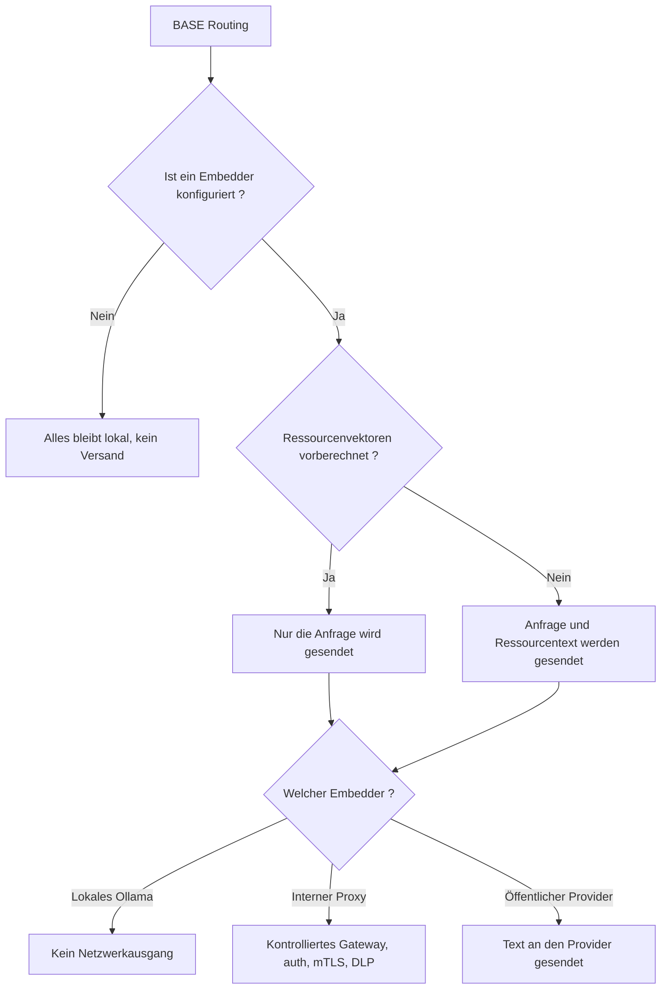

<!-- fr-synced: bba615a9b31faa3b7934e2d24861000553a552de -->

# Ihre Daten unter Kontrolle behalten, wenn das Routing einen Provider nutzt

Sobald sich das semantische Routing von BASE auf einen Embeddings-Provider stützt, verlässt Text Ihre Maschine, und Sie müssen genau sagen können, welcher Text das ist und wie Sie ihn beherrschen. Für Teams, die dieses Routing anbinden, zeigt diese Seite, was tatsächlich gesendet wird, wie Sie die Exposition reduzieren, wie Sie über einen internen Proxy gehen und wie Sie protokollieren, ohne jemals geschäftliche Inhalte preiszugeben.

## Kein Versand ohne ausdrückliche Konfiguration

Der BASE-Kern ruft **niemals** einen Provider auf. In einer Zero-Provider-Konfiguration werden keine Daten ausserhalb der Maschine gesendet. Ein Versand wird nur möglich, wenn Sie ein `embed` bereitstellen (direkt oder über `createOpenAICompatibleEmbedder` / `createOllamaEmbedder`). Der Zero-Config-Pfad (lexikalisch + `semanticHybrid`) ist vollständig lokal.

## Welche Zeichenketten gesendet werden

Mit einem konfigurierten Provider können zwei Arten von Text embeddet werden:

1. **Die Anfrage** (die Anfrage der Nutzerin oder des Nutzers).
2. **Der Text jeder routbaren Ressource**: standardmässig `route_text` + `title` + `description` +
   `keywords` + `body` (`textForResource`). Diesen Umfang steuern Sie.

## Die Exposition reduzieren

Das folgende Diagramm fasst zusammen, was je nach Konfiguration die Maschine verlässt:



- **Berechnen Sie vorab** die Ressourcenvektoren in einer kontrollierten Umgebung (`@ai-swiss/base-index-local`)
  und stellen Sie sie über `getResourceEmbedding` bereit. Zur Anfragezeit wird **nur die Anfrage** gesendet.
- **Reduzieren Sie `textOf`** auf das Minimum, das noch gut routet; oft genügt `route_text` allein:

  ```js
  createSemanticRanker({ embed, textOf: (r) => [r.route_text, r.title].filter(Boolean).join("\n") });
  ```

- **Bleiben Sie lokal** mit `createOllamaEmbedder()`: kein Netzwerkausgang.
- **Gehen Sie über ein internes Gateway**: `createOpenAICompatibleEmbedder({ baseUrl })` zu einem Reverse
  Proxy, den Sie kontrollieren (auth, mTLS, DLP). Gut konfiguriert hält dieser Proxy geschäftlichen Text von jedem öffentlichen Endpunkt fern.

## Secrets

`createOpenAICompatibleEmbedder` liest standardmässig `OPENAI_API_KEY` oder akzeptiert einen expliziten `apiKey`.
Speichern Sie Keys in einem Secrets-Manager oder in Umgebungsvariablen, niemals im
Repository. Ein Auth-Fehler ist als `EmbeddingAuthError` typisiert (`code: "semantic.auth"`) und wird **niemals
wiederholt**: Ein falscher Key scheitert schnell, statt den Provider zu bombardieren.

## Protokollieren ohne geschäftliche Inhalte

Der Hook `onMetric` meldet nur betriebliche Signale (`{ provider, batchSize, attempt,
latencyMs, cacheHit, similarity, dimension }`): **kein Text, keine Vektoren**. Protokollieren Sie sie
frei; protokollieren Sie niemals die embeddeten Zeichenketten oder die rohe Anfrage, wenn der Korpus sensibel ist.

```js
createSemanticRanker({ embed, onMetric: (m) => logger.info({ embedding: m }) }); // sicher: kein Inhalt
```

## Abbruch und Limits

Jeder Provider-Aufruf respektiert ein `timeoutMs` und ein `AbortSignal` (`ctx.signal`): Ein Embedding, das zu lange läuft oder
ausser Kontrolle gerät, kann begrenzt und über die CLI, das MCP oder einen Server abgebrochen werden.

## Geltungsbereich

Das semantische Routing verbessert die **Relevanz**; es ersetzt nicht die IAM-, DLP-, SIEM- oder
Aufbewahrungsrichtlinien Ihrer Organisation. Siehe auch [`docs/trust/securite-et-limites.md`](securite-et-limites.md).
