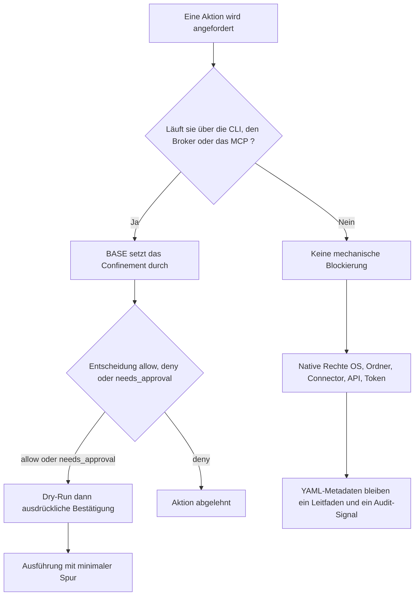

<!-- fr-synced: 17c53c9e60a8dc5b9e9e85da9d6de5220e530b51 -->

# Sicherheit und Grenzen

Bevor Sie BASE Daten oder Aktionen anvertrauen, müssen Sie wissen, was der lokale Kern wirklich schützt und was Sie je nach Kontext selbst ergänzen müssen: Wer zu viel darauf vertraut, legt offen, was er für abgedeckt hielt. Ob Sie für sich selbst oder für eine Verwaltung entscheiden, hier ist die Grenze. BASE verbessert die Kontrolle über die Zusammenarbeit von Mensch und KI, aber es verwandelt ein allgemeines KI-Werkzeug nicht in eine Sicherheitsumgebung auf Unternehmensniveau.

## Zentrales Prinzip

Eine Garantie ist nur dann real, wenn die Aktion durch einen Mechanismus läuft, der sie durchsetzen kann.

Im öffentlichen BASE sind diese Mechanismen:

- die `base` CLI;
- der Broker in `tools/base-core.mjs`;
- der MCP-Server, wenn er an den Broker delegiert;
- ein künftiger kontrollierter Connector.

Wenn ein Agent direkten Zugriff auf die Shell, das Dateisystem oder eine externe API hat, ohne über BASE zu gehen, bleiben die YAML-Metadaten als Leitfaden und Audit-Signal nützlich, aber sie blockieren die Aktion nicht mechanisch.

**Konkrete Folge, ohne technisches Team:** allein im Browser sind die Garantien *consignes* (Vorgaben), die von einem kooperativen Modell befolgt werden, keine durchgesetzten Mechanismen. Um eine echte Durchsetzung zu erhalten (Confinement, Vorschau vor dem Schreiben, validiertes routing), braucht es den Broker über die CLI oder das MCP. Die Details, Stufe für Stufe, finden Sie unter [BASE ausprobieren, ohne etwas zu installieren](../start/essayer-sans-installer.md), nützlich insbesondere für eine Verwaltung, die wissen muss, was auf jeder Ebene garantiert ist.

Ein Prozess kann erklären, dass er eine Quelle lesen oder eine Tool ausführen muss. Diese Erklärung drückt einen Arbeitsbedarf aus. Sie gewährt keine Berechtigung. Die tatsächlichen Rechte bleiben beim OS, beim geteilten Ordner, beim Drive, beim Connector, bei der API, beim Token oder beim verwendeten Harness.

## Aktionen, die über BASE laufen

Eine Aktion läuft über BASE, wenn sie die CLI, den Broker oder den MCP-Server nutzt, um BASE um Handeln zu bitten. Typische Beispiele:

- `base open <id>` oder `open_resource`: eine inventarisierte Ressource öffnen, mit Projektion und Policy;
- `base access <path>` oder `access_resource`: eine Datei lesen, die im Projektstamm eingeschlossen ist;
- `base invoke <tool>` oder `invoke_tool`: einen Befehl als Dry-Run vorbereiten und ihn nur ausführen, wenn er bestätigt wird;
- `base propose` dann `base commit`, oder `propose_change` dann `commit_change`: über eine vorgeschlagene, bestätigte und überprüfte Änderung schreiben.

In diesen Fällen kann BASE Confinement, `allow` / `deny` / `needs_approval`-Entscheidungen, Dry-Run, Bestätigung und eine minimale Spur durchsetzen. Wenn die Aktion diese Einstiegspunkte umgeht, hängt sie von den nativen Rechten des Werkzeugs oder der Umgebung ab.



## Was das öffentliche BASE schützt

Das öffentliche BASE bietet lokale Schutzgeländer:

- Einschluss der Pfade im Projektstamm;
- Ablehnung von Pfadtraversierungen;
- Ablehnung von Symlinks, die aus dem Projekt herausführen;
- Validierung von Bezeichnern, relativen Links, lokalen Quellen und Entrypoints;
- Öffnen von Ressourcen über die Projektion `metadata`, `instructions` oder `full`;
- erklärbare Zugriffsentscheidungen für sensible Ressourcen;
- Aufruf von Werkzeugen standardmässig als Dry-Run;
- ausdrückliche Bestätigung vor der echten Ausführung;
- minimale JSONL-Spuren standardmässig ohne fachlichen Inhalt.

Diese Schutzmassnahmen machen BASE für eine lokale, persönliche, KMU- oder Integrationsprototyp-Nutzung auditierbar und wartbar.

Zum semantischen routing mit Embeddings siehe auch `docs/trust/securite-donnees-routage.md`: diese Seite
präzisiert, welche Zeichenketten an einen Provider gehen können, wie man die Exposition reduziert und wie man
ohne fachlichen Inhalt protokolliert.

## Was das öffentliche BASE allein nicht schützt

Das öffentliche BASE bietet nicht:

- Identitätsverwaltung;
- SSO;
- vollständiges Enterprise-RBAC;
- DLP;
- SIEM;
- regulatorische Aufbewahrung;
- rechtliche Archivierung;
- verpflichtende Dokumentenklassifizierung;
- zentrale Verwaltung von Secrets;
- vollständige Sandbox;
- Garantie für die Richtigkeit der Antworten des Modells;
- Garantie für die vom KI-Anbieter durchgeführten Verarbeitungen;
- Transparenz über die Anweisungen, die das KI-Werkzeug über Ihren Dateien einfügt (System-Prompt, Regeln, Richtlinien des Anbieters).

Diese Elemente liegen bei der Organisation, ihrer technischen Umgebung und ihren Anbieterverträgen.

**Externe Sicherheitsprüfung: geplant, noch nicht durchgeführt.** Der Kern ist auf Audit ausgelegt (ohne Abhängigkeit, getestete und dokumentierte Mechanismen), aber BASE wurde noch keiner unabhängigen Sicherheitsprüfung unterzogen.

## Daten und KI-Anbieter

BASE bewahrt Ihre Dateien lokal auf. Das bedeutet nicht, dass alles, was Sie einem KI-Werkzeug geben, lokal bleibt.

Je nach verwendetem Werkzeug kann der Inhalt einer Konversation, einer geöffneten Datei oder eines Prompts an den Anbieter des Modells übermittelt werden. Bevor Sie personenbezogene, Kunden-, HR-, Finanz-, medizinische oder regulierte Daten verarbeiten, prüfen Sie:

- die Nutzungsbedingungen des KI-Werkzeugs;
- die Aufbewahrungsoptionen;
- die vertraglichen Garantien;
- den Ort der Verarbeitungen;
- die internen Regeln Ihrer Organisation.

Für sehr sensible Daten nutzen Sie eine geeignete Umgebung oder halten Sie die KI aus der Schleife heraus.

## Lesart nach Adoptionsstufe

| Stufe | Vernünftige Erwartung | Was noch zu ergänzen ist |
| ------ | ------------------- | ---------------------- |
| Persönlich | Lesbare Dateien, menschliche Entscheidungen, Vorsicht bei sensiblen Daten | Wählen, was dem KI-Werkzeug anvertraut wird |
| KMU | Lokale Validierung, Pflege, Sensibilitätskonventionen, minimale Spuren | Teamregeln, menschliche Prüfung, Verwaltung der Ordnerzugriffe |
| Grossunternehmen | Sockel für Strukturierung und Integration | IAM, SSO, RBAC, DLP, SIEM, Aufbewahrung, Secrets, Audit, Compliance |

## Typische Bedrohungen

| Risiko | Antwort des öffentlichen BASE | Grenze |
| ------ | ------------------- | ------ |
| Bösartiger Pfad | Lokaler Einschluss und Ablehnung von Traversierungen | Nur für vermittelte Zugriffe |
| Ausgehender Symlink | Ablehnung von Symlinks ausserhalb des Projekts | Hängt vom verwendeten Connector ab |
| Sensible Daten ohne Grund geöffnet | Metadaten und erklärbare Zugriffsentscheidung | Blockiert keinen direkten Zugriff ausserhalb von BASE |
| Unumkehrbare Aktion | Dry-Run standardmässig und Bestätigung | Schützt keine Aktionen ausserhalb des Brokers |
| Falsche, aber plausible Antwort | Entscheidungspunkte, Marker, menschliche Überprüfung | Das Modell kann sich immer irren |
| Prompt Injection über externe Daten | Konstruktionsprinzip (Vorgabe, kein vom Code durchgesetzter Mechanismus wie das Confinement oder die Egress-Kontrolle): eine Anweisung wird ausgeführt, externe Daten bleiben ein zu lesender Inhalt | Erfordert Disziplin und technische Vermittlung |
| Unsichtbare Anweisungen des KI-Werkzeugs | Souveränität über Ihre Schicht: lesbare, portable, auditierbare Dateien | BASE sieht nicht, was das Harness über Ihren Dateien einfügt |

## Verantwortungsregel

BASE hilft beim Strukturieren, Überprüfen und Nachverfolgen. Der Mensch behält die Verantwortung für die Entscheidungen, und die Organisation behält die Verantwortung für Sicherheit, Compliance und Zugriffe.

Das richtige Versprechen lautet daher:

```text
BASE augmente la maîtrise locale.
BASE ne remplace pas une politique de sécurité.
```

## Konform heisst nicht nützlich

In Ordnung zu sein und nützlich zu sein sind zwei unterschiedliche Anforderungen. Die Compliance (Verzeichnis der Verarbeitungstätigkeiten, Folgenabschätzung und je nach Rechtsraum die DSGVO, das Schweizer nDSG oder der europäische AI Act) regelt, was Sie mit KI tun dürfen. Sie macht die Arbeit deswegen aber nicht nützlich oder überprüfbar: das Abhaken der Felder eines regulatorischen Rahmens strukturiert die Interaktion nicht, zielt nicht auf die relevante Information und schliesst die Verifikationsschleife nicht. Das ist es, was BASE hinzufügt, neben der Compliance und niemals an ihrer Stelle. Dieser Hinweis ist informativ und stellt keine Compliance-Beratung dar.
