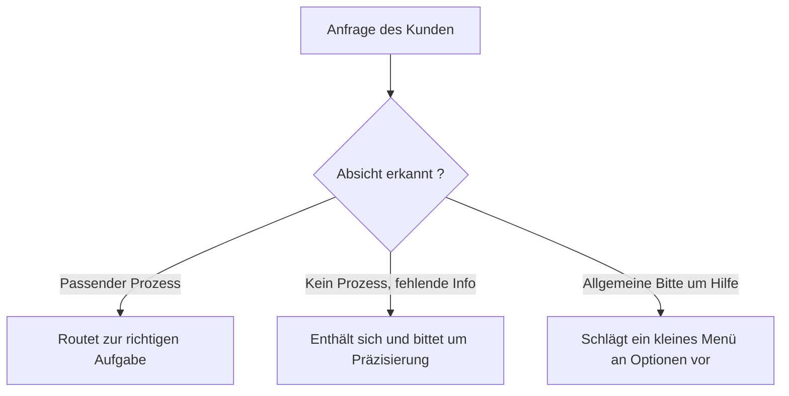

<!-- fr-synced: 440a02337e57dba37c7c76a6916b993840433f2d -->

# Bringen Sie das Tourismusbüro zum Sprechen

*⏱ ~10 Min. · Modul 1/3, Lernpfad Entdeckung*

**Sie werden**: erkennen, wann der Assistent routet und wann er sich ehrlich enthält, belegt durch das ✅ weiter unten.
**Sie brauchen**: ein installiertes und verbundenes KI-Werkzeug sowie den geöffneten Ordner exemples/veytaux-tourisme (siehe [Schritt 0](harnais.md)).

Geben Sie diese vier Anfragen nacheinander ein:

```routage-fixture
Quelles activités à faire cet après-midi ?
Organiser une sortie pour notre groupe de 30 personnes
Vous avez une plage où se baigner ?
Quelles sont mes options ?
```

1. *«Welche Aktivitäten kann ich heute Nachmittag unternehmen?»*: Er sucht in den Datenblättern und nennt seine Quelle.
   Er prüft ausserdem, ob die Agenda aktuell ist, und stützt sich auf die Agenda und die zitierten Datenblätter, statt etwas zu erfinden.
2. *«Einen Ausflug für unsere Gruppe von 30 Personen organisieren»*: Er wechselt zur Vorbereitung eines Angebots.
3. *«Haben Sie einen Strand zum Baden?»*: eine echte Tourismusfrage, aber kein Prozess passt dazu.
4. *«Welche Möglichkeiten habe ich?»*: eine allgemeine Bitte um Hilfe.



✅ **Prüfen Sie**: Der Assistent muss im Kern: (1-2) in die richtige Aufgabe einsteigen; (3) KEINEN Strand erfinden und Sie bitten zu präzisieren, was Sie suchen, statt zu raten; (4) ein kleines Menü an Optionen anbieten. Beide Ausgänge von (3) sind lehrreich: siehe Warum.

💡 **Warum es funktioniert hat**: Der richtige Prozess wird durch die Absicht gewählt, nicht durch Schlüsselwörter. Auf der Stufe der Anweisungen (ohne CLI/MCP) ist es das Modell, das dem in CLAUDE.md geschriebenen Router folgt: Es KANN über das Ziel hinausschiessen und eine Antwort auf «einen Strand?» improvisieren, statt um Präzisierung zu bitten. Genau das ist die Grenze, die das deterministische routing aufhebt (der Buchstabe, die Aufwertung).

🔁 **Bei Ihnen**: Welche 2 oder 3 Anfragen richten Ihre Kundinnen/Kollegen am häufigsten an Sie? Notieren Sie sie: Das werden Ihre Prozesse sein.

→ **Und jetzt**: [Modul 2: Ändern Sie eine Regel](decouverte-2-changez-une-regle.md): Sie werden den Assistenten einer Datei gehorchen sehen, die SIE bearbeiten.

🆘 **Häufige Pannen**: *Er improvisiert eine Antwort auf «einen Strand?», als wäre das normal*: auf der Stufe der Anweisungen erwartet; das ist die Lektion, kein Fehler. *Eine Anfrage gelangt nicht in die richtige Aufgabe*: formulieren Sie sie mit der Absicht um («ich möchte eine Auskunft», «einen Ausflug für eine Gruppe organisieren»).
