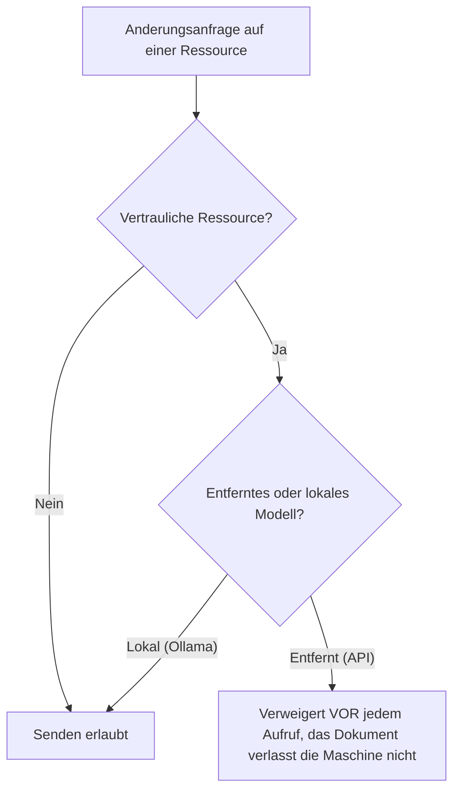

<!-- fr-synced: 677f5f82e5965291bdd5fadd5e565f06d119a93d -->

# Perimeter und Egress-Governance

*⏱ ~15 Min · Modul 2/3, Team-Parcours*

**Sie werden**: ein Egress-Verweigerung auf einer echten vertraulichen Ressource auslosen und anschliessend lesen, belegt durch das ✅ weiter unten.
**Sie brauchen**: abgeschlossenes Modul 1; das Studio geoffnet auf `exemples/agence-multi-clients`; ein ENTFERNTES Modell (API), das in den Einstellungen verbunden ist (Anleitung «Ein Modell verbinden», Praktiker-Parcours Modul 6). Die Prufung erfolgt VOR jedem Aufruf des Modells: schon ein ungultiger Key genugt, um die Verweigerung zu beobachten.
↻ **Erinnerung**: ohne nachzuschauen: was garantiert ein Root? (einen isolierten Schreib-Perimeter)

Der Kunde Dupont Conseil enthalt eine bereits als vertraulich markierte Ressource:
`clients/dupont-conseil/tarifs/remises-confidentielles.md` (`confidential: true`).

1. Offnen Sie diese Ressource im Studio.
2. Offnen Sie ihren Chat und wahlen Sie Ihr ENTFERNTES Modell.
3. Verlangen Sie eine Anderung (zum Beispiel *«formuliere diese Rabattliste um»*).

✅ **Prufen Sie**: BASE verweigert das Senden an das entfernte Modell und erklart den Grund («dieses Dokument ist vertraulich … wahlen Sie ein lokales Modell»); Sie sehen den Grund auf dem Bildschirm. Dieselbe Anfrage mit einem LOKALEN Modell (Ollama) geht durch: genau das ist die Regel.

💡 **Warum es funktioniert hat**: die Governance lebt in Dateien (`confidential: true` auf einer Ressource oder `egress: local-only` auf einem ganzen Root), nicht in einer Konsole. Es gibt eine einzige Regel: nichts Vertrauliches verlasst die Maschine in Richtung eines entfernten Modells, und die Prufung erfolgt VOR dem Aufruf, sodass das Dokument die Maschine nie verlasst. Die Verweigerung wird AUSGESPROCHEN: das ist der Unterschied zwischen einer Anweisung (befolgt) und einem Mechanismus (durchgesetzt).

🔁 **Bei Ihnen**: welche Ihrer Daten durfen NIE Ihre Maschine in Richtung einer API verlassen? Markieren Sie sie mit `confidential: true` oder schalten Sie den ganzen Root auf `egress: local-only`.

→ **Und jetzt**: [Modul 3: verteilen](equipe-3-distribuer.md).

🆘 **Haufige Pannen**: *Keine Verweigerung*: ist das gewahlte Modell wirklich ENTFERNT? (ein lokales Modell wie Ollama ist erlaubt, das ist so gewollt). Tragt die Ressource `confidential: true`? *Kein Modell zur Auswahl im Chat*: fugen Sie zuerst einen Provider in den Einstellungen hinzu (Praktiker-Parcours Modul 6).
