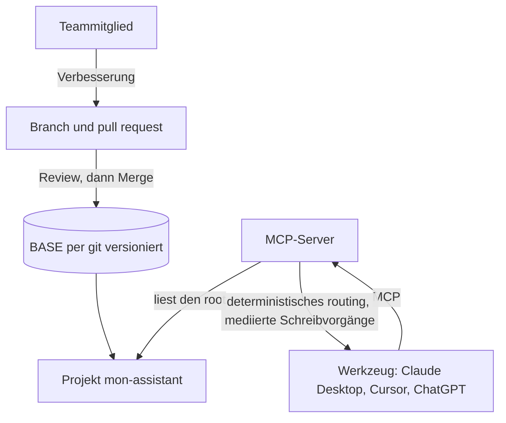

<!-- fr-synced: e1a44dba9171206c397c7c670d5b5e173decdbc1 -->

# An ein Team verteilen

*⏱ ~20 Min · Modul 3/3, Team-Parcours*

**Sie werden**: Ihr BASE per git versionieren UND einen MCP-Server hochfahren, den ein Werkzeug abfragt, bewiesen durch das ✅ weiter unten.
**Sie brauchen**: Modul 2 abgeschlossen; git und Node 18+ installiert; das BASE-Repository lokal; Ihr Projekt `~/mon-assistant`.
↻ **Erinnerung**: ohne nachzuschauen: wie verhindert BASE das Abfliessen vertraulicher Daten? (die Egress-Regel, geprüft vor dem Aufruf)

Ein BASE zu verteilen heisst, Dateien zu verteilen: **git** für Historie und Review, **MCP**
für die geteilten mechanischen Garantien (deterministisches routing, mediierte Schreibvorgänge), für das ganze Team.



1. **Versionieren.** Initialisieren Sie in Ihrem Projekt git und committen Sie:

   ```
   cd ~/mon-assistant
   git init && git add -A && git commit -m "Mon BASE, départ"
   ```

   Die Ressourcen sind Markdown: eine Prozessänderung liest sich wie ein Diff. Eine
   Verbesserung = ein Branch + ein **pull request**, geprüft vor dem Mergen.

2. **MCP-Server hochfahren.** Aus dem BASE-Repository heraus:

   ```
   cd mcp/
   npm install
   npm run build
   npm start -- --root ~/mon-assistant
   ```

3. **Ein Werkzeug verbinden.** Für Claude Desktop (Cursor ist identisch, in dessen MCP-Einstellungen)
   fügen Sie in `claude_desktop_config.json` einen ABSOLUTEN Pfad hinzu und starten dann das Werkzeug neu:

   ```
   {
     "mcpServers": {
       "base": {
         "command": "node",
         "args": ["/chemin/absolu/vers/mcp/dist/index.js", "--root", "/chemin/absolu/vers/mon-assistant"]
       }
     }
   }
   ```

   (ChatGPT verlangt zusätzlich eine HTTPS-URL und ein Token: die Schritt-für-Schritt-Anleitung pro Werkzeug findet sich in
   [den MCP-Server installieren](../start/installer-mcp.md).)

✅ **Prüfen**: `git log` zeigt Ihren Commit (eine Prozessänderung erscheint als lesbarer Diff, bereit für ein Review); und Ihr Werkzeug, per MCP verbunden, antwortet auf *«Welche Agenten habe ich?»*, indem es die Agenten von `mon-assistant` auflistet.

💡 **Warum es funktioniert hat**: git macht die Entwicklung nachvollziehbar und überprüfbar; MCP gibt dem ganzen Team denselben deterministischen Router und mediierte Schreibvorgänge, ohne dass jede Person die CLI anfassen muss. Sicherheit gilt standardmässig: über HTTP ist der Server schreibgeschützt, und eine Netzwerk-Exposition ohne `BASE_MCP_BEARER_TOKEN` wird beim Start verweigert. Die Governance bleibt auditierbar, weil sie im Klartext in den Dateien liegt.

🔁 **Bei Ihnen**: wer in Ihrem Team prüft die Prozessänderungen vor dem Mergen? Und welche Maschine hostet den MCP-Server?

→ **Und jetzt**: Sie haben alle drei Parcours durchlaufen. Behalten Sie den Reflex bei: Handgriff, Prüfung, dann erst das Konzept.

🆘 **Häufige Pannen**: *`npm: command not found`*: installieren Sie Node 18+ von nodejs.org. *Der Server weigert sich, im Netzwerk zu starten*: das ist ohne Authentifizierung gewollt, setzen Sie `BASE_MCP_BEARER_TOKEN`. *Die Plattform sieht keine Agenten*: prüfen Sie den `--root` (absoluter Pfad) und dass er `.ai/agents/*/AGENT.md` enthält. *Konfiguration pro Werkzeug*: siehe [den MCP-Server installieren](../start/installer-mcp.md).
