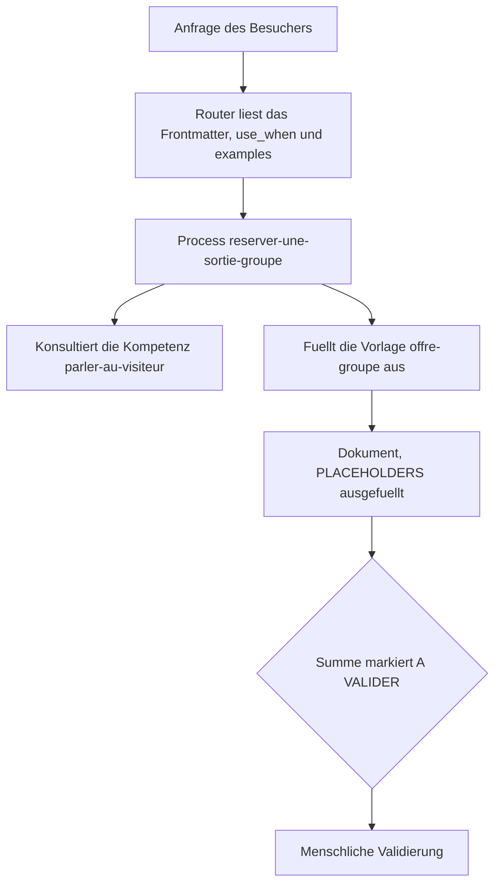

<!-- fr-synced: 229d5f5f900909fec589c145be550895fd2d71cb -->

# Kompetenzen und Vorlagen

*⏱ ~18 Min · Modul 4/9, Pfad Praktiker*

**Sie werden**: eine Kompetenz und eine Vorlage hinzufügen, sie aus einem Process referenzieren und ein Dokument erzeugen, das sich selbst ausfüllt und zur Validierung anhält, belegt durch das ✅ weiter unten.
**Sie brauchen**: die Module 1-3 abgeschlossen, Ihr Verzeichnis `~/mon-office-tourisme`.
↻ **Erinnerung**: ohne nachzuschauen: Was ist ein Process? (ein Frontmatter, das der Router liest, plus ein Rumpf, dem das Modell folgt)

Ein Process sagt, WAS zu tun ist. Aber zwei weitere Bausteine trennen das einfache Routing einer Anfrage
von der Erstellung **eines echten Liefergegenstands**, und genau das fehlt den meisten Assistenten.

- eine **Kompetenz** (`type: competence`): ein wiederverwendbares Know-how (Ton, Regeln, Konventionen),
  das ein Process **konsultiert**. Man zitiert sie in mehreren Processes, statt sich zu wiederholen.
- eine **Vorlage / ein Template** (`type: template`): ein Dokument mit Lücken, das man **ausfüllt**, statt
  ihm zu folgen. Das ist es, was ein Angebot, einen Brief oder ein Protokoll hervorbringt.

1. **Eine Kompetenz.** Erstellen Sie `.ai/agents/mon-office-tourisme/skills/competences/parler-au-visiteur/SKILL.md`:

   ```
   ---
   schema_version: base.resource.v1
   id: parler-au-visiteur
   type: competence
   title: Parler au visiteur
   description: "Ton et clarté pour parler aux visiteurs. À consulter dans toute interaction."
   scope: team
   status: active
   sensitivity: internal
   name: parler-au-visiteur
   user-invocable: false
   allowed-tools: Read
   ---

   # Parler au visiteur

   - Dans la langue du visiteur, accueillant et bref.
   - Une question à la fois.
   - Annoncer le prix au barème, jamais un chiffre inventé.
   ```

2. **Eine Vorlage.** Erstellen Sie `.ai/agents/mon-office-tourisme/templates/offre-groupe_v1.md`. Eine Vorlage trägt
   `[PLACEHOLDERS]` zum Ausfüllen und ein `[A VALIDER]` dort, wo ein Mensch entscheiden muss:

   ```
   ---
   schema_version: base.resource.v1
   id: template-offre-groupe
   type: template
   title: Trame d'offre de sortie de groupe
   description: Modèle d'offre à remplir (un template se remplit, il ne se suit pas).
   scope: team
   status: active
   sensitivity: internal
   ---
   # Offre de sortie de groupe: [NOM_GROUPE]

   **Type:** [TYPE_GROUPE]  ·  **Personnes:** [NOMBRE_PERSONNES]
   | Poste | Montant (CHF) |
   |-------|---------------|
   | Visite guidée | [NOMBRE_PERSONNES] x [PRIX_PAR_PERSONNE] = [SOUS_TOTAL] |
   | **Total** | **[TOTAL] [A VALIDER]** |
   ```

3. **Ein Process, der sie verwendet.** Erstellen Sie `.ai/agents/mon-office-tourisme/skills/processes/reserver-une-sortie-groupe/SKILL.md`.
   Er `may_use` die Vorlage und **konsultiert die Kompetenz in seinem Rumpf**:

   ```
   ---
   schema_version: base.resource.v1
   id: reserver-une-sortie-groupe
   type: process
   title: Réserver une sortie de groupe
   description: "Chiffrer une sortie de groupe et préparer une offre depuis le modèle."
   scope: team
   status: active
   sensitivity: internal
   use_when: Quand quelqu'un veut organiser une visite ou une sortie pour un groupe à Veytaux.
   routing:
     examples:
       - Organiser une sortie pour notre groupe de 30 personnes
   may_use:
     - templates/offre-groupe_v1.md
   name: reserver-une-sortie-groupe
   user-invocable: true
   allowed-tools: Read
   ---

   # Réserver une sortie de groupe

   ## Étapes
   1. Recueillir les besoins (type de groupe, date, nombre de personnes), une question à la fois
      (compétence `skills/competences/parler-au-visiteur/SKILL.md`).
   2. Remplir le modèle `templates/offre-groupe_v1.md`: compléter les `[PLACEHOLDERS]`.
   3. Laisser `[A VALIDER]` sur le total. Ne rien envoyer sans accord.
   ```

4. **Erzeugen Sie das Dokument.** Fragen Sie in Ihrem KI-Werkzeug, auf `~/mon-office-tourisme`:
   *«bereite ein Angebot für einen Gruppenausflug von 30 Personen vor»*. Der Assistent routet zu
   `reserver-une-sortie-groupe`, folgt der Kompetenz (Ton, eine Frage nach der anderen), **füllt die Vorlage aus** und lässt
   `[A VALIDER]` auf der Summe stehen. Wie in der Entdeckung: er schlägt vor, nichts wird ohne Sie geschrieben.

```routage-fixture
Organiser une sortie pour notre groupe de 30 personnes
```

✅ **Prüfen Sie**: `base validate --root .` läuft durch (Kompetenz, Vorlage und Process sind gültige Ressourcen); `base route "Organiser une sortie pour notre groupe de 30 personnes" --root .` routet zu `reserver-une-sortie-groupe`; und das erzeugte Angebot hat seine `[PLACEHOLDERS]` ausgefüllt, mit einem `[A VALIDER]` auf dem Betrag.

💡 **Warum es funktioniert hat**: ein Process orchestriert, eine **Kompetenz** lagert ein wiederverwendbares Know-how aus, eine **Vorlage** trägt die Form des Liefergegenstands. Der Router liest nur das Frontmatter (use_when, examples); der Rumpf hingegen verweist auf die Kompetenz und die Vorlage, die das Sprachmodell anschliessend anwendet. Das `[A VALIDER]` in der Vorlage verlangt, dass ein Mensch über die Zahl entscheidet: die Anweisung lautet, dass die Generierung anhält, statt an Ihrer Stelle zu entscheiden.



🔁 **Bei Ihnen**: welches wiederkehrende Dokument Ihres Berufs (Kostenvoranschlag, Standardbrief, Protokoll) würde davon profitieren, eine Vorlage mit Lücken zu werden? Welches Know-how (ein Ton, einige Regeln) verdient eine wiederverwendbare Kompetenz?

→ **Und jetzt**: [Modul 5: Daten, die verfallen](praticien-5-donnees-qui-periment.md): der Lebenszyklus einer Expertise.

🆘 **Häufige Pannen**: *`base route` findet `reserver-une-sortie-groupe` nicht*: bringen Sie Ihre `routing.examples` näher an eine echte Anfrage für einen Gruppenausflug. *Der Assistent erfindet eine Summe statt `[A VALIDER]`*: Schritt 3 muss es ausdrücklich verlangen, und die Vorlage muss den Marker tragen. *validate schlägt fehl*: eine Vorlage hat weder `name` noch `user-invocable`; eine Kompetenz schon (behalten Sie die Form der Gerüste bei).
