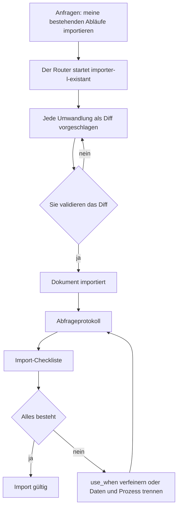

<!-- fr-synced: f338f764998f078a3f148c1681946fe159d0a91c -->

# IHRE Inhalte migrieren

*⏱ ~15 Min · Modul 9/9, Praktiker-Pfad*

**Sie werden**: zwei oder drei Ihrer echten Dokumente in Inhalte verwandeln, die Ihr Assistent wirklich nutzt, bewiesen durch das ✅ weiter unten.
**Sie brauchen**: die vorherigen Module; Ihren Ordner `mon-office-tourisme` (oder einen eigenen Ordner) geöffnet.
↻ **Erinnerung**: ohne nachzuschauen, wodurch läuft jeder Schreibvorgang in BASE? (das Gate: vorschlagen, dann committen)

Sie haben über die Module hinweg eine Liste «Bei Ihnen» angesammelt. Das ist Ihr Backlog.

1. Fragen Sie in Ihrem Ordner: *«meine bestehenden Abläufe importieren»*. Der Router startet den
   Prozess `importer-l-existant`, der jede Umwandlung als Diff vorschlägt: nichts wird ohne Sie geschrieben.
2. Importieren Sie zwei oder drei Dokumente aus Ihrer Liste.
3. Prüfen Sie jeden Import mit dem **Abfrageprotokoll** (Entdeckungsmodul 3): eine
   Frage, die nur das Dokument beantwortet, eine Fangfrage ausserhalb des Dokuments, eine Routing-Anfrage.
4. Gehen Sie die **Import-Checkliste** durch:
   - [ ] das use_when jedes Prozesses beschreibt eine Absicht, keinen Titel;
   - [ ] die Daten (Tarife, Datenblätter) sind von den Prozessen getrennt, die sie verwenden;
   - [ ] die Schritte mit menschlicher Entscheidung tragen ein `[A VALIDER]`;
   - [ ] was ablaufen kann, trägt ein Datum (`valid_until`).

✅ **Prüfen**: für jedes importierte Dokument besteht das Abfrageprotokoll (zitiert das richtige Dokument, gibt Unwissen zu, routet korrekt) UND die Checkliste ist abgehakt.

💡 **Warum es funktioniert hat**: hier wird das Tutorial zu Ihrem Werkzeug: dieselbe Struktur wie beim Tourismusbüro von Veytaux, auf Ihren Beruf angewandt. Die Checkliste kodiert, was die Module gelehrt haben: Sie importieren mit einem Raster, niemals blind.

🔁 **Bei Ihnen**: planen Sie den nächsten Schritt: welches dritte Dokument, welche nächste Aufgabe automatisieren?

→ **Und jetzt**: Sie haben den Praktiker-Pfad abgeschlossen: IHR Assistent antwortet auf IHRE Inhalte. Für mehrere Personen siehe den [Team-Pfad](equipe-1-workspace.md).

🆘 **Häufige Pannen**: *Der Import schlägt irgendetwas vor*: führen Sie ihn Dokument für Dokument, statt alles auf einmal. *Das Protokoll scheitert*: verfeinern Sie das use_when, oder trennen Sie Daten und Prozess.
