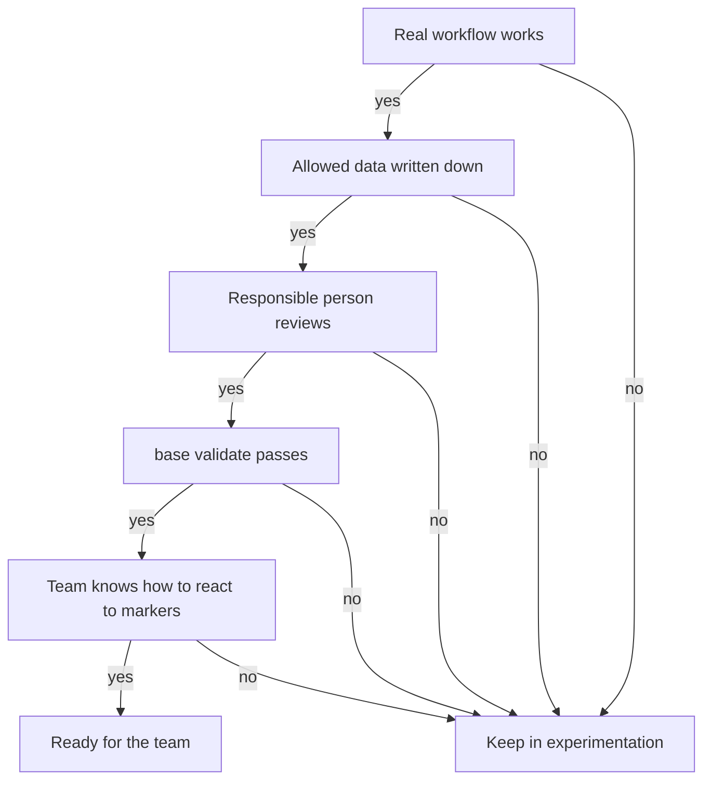

<!-- fr-synced: 1d39f832c6d003d277090020b9bf68b30b09fe48 -->
# Getting started with BASE in a Swiss SME

Getting a small Swiss team to work with AI without going off the rails or rolling out a heavyweight platform: that is what is at stake here. This kit gives you the practicable minimum to start cleanly with BASE and frame a first, controlled use. It is not a substitute for legal advice, a security policy, or document governance.

## 1. Choose a first workflow

Start with a repeatable, visible, low-risk task:

- preparing a quote;
- writing a newsletter;
- preparing an interview;
- structuring a project;
- handling a support request.

As a first use case, avoid legal, sensitive HR, medical, regulated financial, or irreversible decisions.

## 2. Define the allowed data

Before using an AI tool, the team writes a simple rule:

```text
You may enter: public information, fictional examples, non-sensitive internal templates, client data needed for the task and approved for this use.
You do not enter: secrets, passwords, medical data, sensitive HR data, client data that is not needed, confidential documents without approval or a suitable environment.
```

BASE keeps the files locally, but the AI tool you use may process the content of the conversation under its own terms. For the nLPD, the GDPR, or sector-specific obligations, the organization remains responsible for the processing, the provider chosen, and the access rights.

## 3. Name the responsibilities

For each shared assistant, decide:

- who keeps the domain files up to date;
- who reviews the outputs before they go out externally;
- who can change prices, terms, templates, and rules;
- who runs the monthly maintenance;
- who decides when the assistant flags an uncertainty.

A good rule: the AI proposes, the responsible person signs off.

## 4. Version simply

For a small team, Git is ideal if they have mastered it. Otherwise, start more simply:

- keep the files in a controlled shared folder;
- date the important changes in a log;
- do not modify critical templates without review;
- keep a copy before major changes;
- run `base validate` before sharing a new version.

If the team grows, move to Git, to change reviews, and to formalized access rights.

## 5. Set up the monthly ritual

Once a month, or before each important share, run these three commands. They go through a terminal and assume Node is installed (as it was at setup); if no one on the team is comfortable with the terminal, hand this ritual to the person who installed BASE, or ask your AI assistant to run them for you.

```bash
base validate --root <folder>
base entretien --root <folder>
base route-test --root <folder>
```

Then check as a team:

- the markers `[A VALIDER]`, `[A COMPLETER]`, `[ATTENTION]`, `[DECISION]`. The report flags those that are aging: if your markers stay open for months, your review has become decorative;
- broken links;
- missing descriptions;
- stale data;
- workflows that no longer match actual practice;
- personal resources to promote to the team.

## 6. Keep the limits visible

BASE helps an SME structure its work with AI. On its own, it does not provide:

- IAM, SSO, or RBAC;
- DLP;
- SIEM;
- legal archiving;
- regulatory retention;
- centralized secrets management;
- a guarantee that the model's answers are accurate.

If these needs arise, keep BASE as the structuring layer and add the technical controls around it.

## 7. Decision rule

A BASE use is ready for the team when:

1. a first real workflow works;
2. the allowed data is written down;
3. a responsible person reviews the outputs;
4. `base validate` passes;
5. the team knows what to do when the assistant marks `[A VALIDER]` or `[ATTENTION]`.



If any one of these is missing, keep the use in experimentation.
