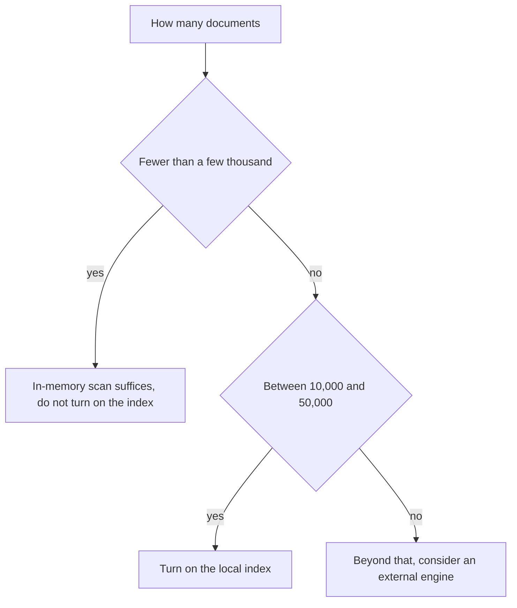

<!-- fr-synced: cc8b7a7584246944c3f41d7c8428bc5d99bf0df1 -->
# Knowing when to turn on the local index (benchmarks)

If you run a BASE repository and you're unsure whether to turn on the local index, this page gives you reproducible numbers to make the call. You'll see how many documents it takes before the in-memory scan no longer suffices, what the index brings at that point, and what it costs.

## Reproducing

```bash
node packages/base-index-local/bin/base-index-local.mjs bench --sizes 100,1000,10000,50000
# or
npm run bench:index
```

Synthetic corpus (agents + processes, 20 processes per agent), median of 20 queries per size. Cold build; search measured cold (vocabulary scanned on every query) and warm (vocabulary cached on the index object).

## Results (portable, Node 24)

| documents | build | search (cold) | search (warm) |
|---:|---:|---:|---:|
| 105 | 9 ms | 0.01 ms | 0 ms |
| 1,050 | 10 ms | 0.03 ms | 0.01 ms |
| 10,500 | 83 ms | 0.65 ms | 0.13 ms |
| 52,500 | 394 ms | 5.3 ms | 0.9 ms |

The numbers vary from machine to machine: rerun `bench` to measure your own. No aggressive threshold is enforced in CI: a *smoke* test only checks that the report is produced, not that it hits a brittle number.

## Reading the numbers



- **Up to a few thousand documents**, the core's in-memory scan is already instant: the index brings nothing observable. Don't turn it on.
- **At 10,000 to 50,000**, the build stays under a second and warm search under a millisecond: the index makes comfortable what a repeated scan would make costly.
- **Beyond that**, see [Understanding scale](../learn/comprendre-echelle.md): an external engine becomes legitimate, behind the same candidates -> decision shape.

## With and without embeddings

The numbers above are **lexical** (zero dependencies). Precomputed embeddings add a cost to the build (one provider call per document, grouped into batches) and one vector stored per document; at query time, only the query is embedded. This part runs at usage time and depends on the model or provider; it does not enter the index's deterministic freshness gate.
