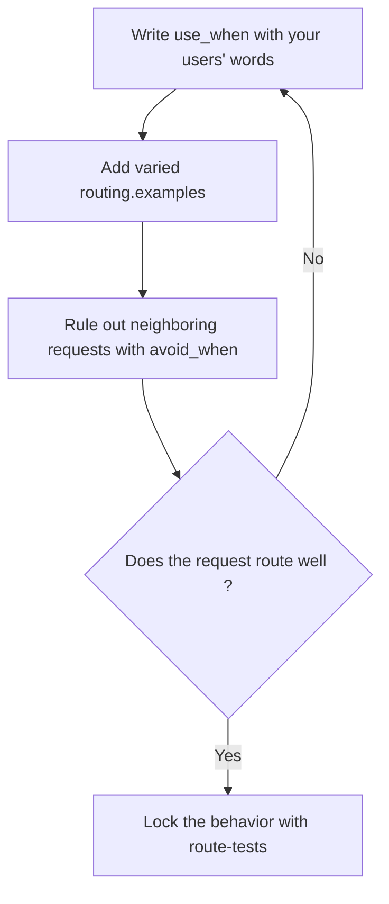

<!-- fr-synced: 8ea40981db54eae95e0b6ee6811e2a7dd8b35d37 -->
# Writing for the router

If a request like "Draft a quote for Dupont SA" never reaches the right process, your assistant stays silent or answers beside the point: it's the wording of your files that decides. This guide is for assistant builders. It explains how the router reads your files, how to write for it, and how to check that your requests arrive where they should. No technical skill is required, except for one terminal command to test.



## How the router reads your files

The router doesn't understand the meaning of your text: it **compares words**. For each process, it builds a routing text from the `use_when` (the strongest signal), supplemented by the `routing.examples`; failing that, it falls back to the description, then the title, then the keywords. A request routes well when its words overlap that text. In practice, your `use_when` should above all contain **the words your users would type**, not an elegant turn of phrase.

## Writing a good `use_when`

Write the `use_when` from the user's point of view, not your own. Internal jargon ("sales-cycle management") routes nothing if no one types it; concrete words ("quote", "price", "offer") route.

Before, a weak `use_when`:

```yaml
use_when: Gestion des propositions commerciales et du cycle de vente.
```

After, a strong `use_when`:

```yaml
use_when: Quand un client demande un devis, un prix ou une offre chiffrée.
routing:
  examples:
    - Prépare un devis pour Dupont SA, 3 jours de conseil
    - Combien ça coûterait pour ce projet ?
    - Il me faut une offre avant vendredi
  avoid_when:
    - Relancer une facture impayée.
```

## Giving varied examples

The `routing.examples` are real user phrasings. Give at least three for the same intent, with different words: a direct phrasing, a question, then a request voiced under time pressure. The router then recovers the intent more often, including when the request echoes the words of an example rather than yours.

## Ruling out neighboring requests

`routing.avoid_when` lists the counterexamples: nearby requests that should go elsewhere. If "chasing an invoice" belongs to another process, declaring it here cancels the score of the wrong candidate instead of letting two processes fight over the request.

## Checking that it routes

```bash
node tools/base.mjs route "il me faut une offre pour un client" --root <dossier>
```

Read the result: the chosen process, the score, and the reasons (`route:<terme>` indicates which words matched). If the router abstains or hesitates, the reasons say why: it's usually a word missing from your `use_when` or your examples. Add `--json` for the full detail.

## Locking in the behavior

Once the routes are correct, declare them in `.ai/routing/route-tests.json`: each entry gives a request and the expected route. Then:

```bash
node tools/base.mjs route-test --root <dossier>
```

The command replays every route and fails if one of them breaks. Your important routes are protected against regressions, even as the assistant grows.

## An honest limit

The default lexical router is rudimentary but effective, and it stays sensitive to wording: absent words match nothing, even when the meaning is close. That's the price of explainability: every score is justified by inspectable reasons, with no network and no dependency. It's also extensible through adapters. For difficult corpora (many close processes, very varied vocabulary), an optional semantic ranker exists: see the [Semantic routing quickstart](routage-semantique-quickstart.md).

---

BASE is a framework by [AI Swiss](https://a-i.swiss). Use case in partnership with [Innovaud](https://innovaud.ch).
