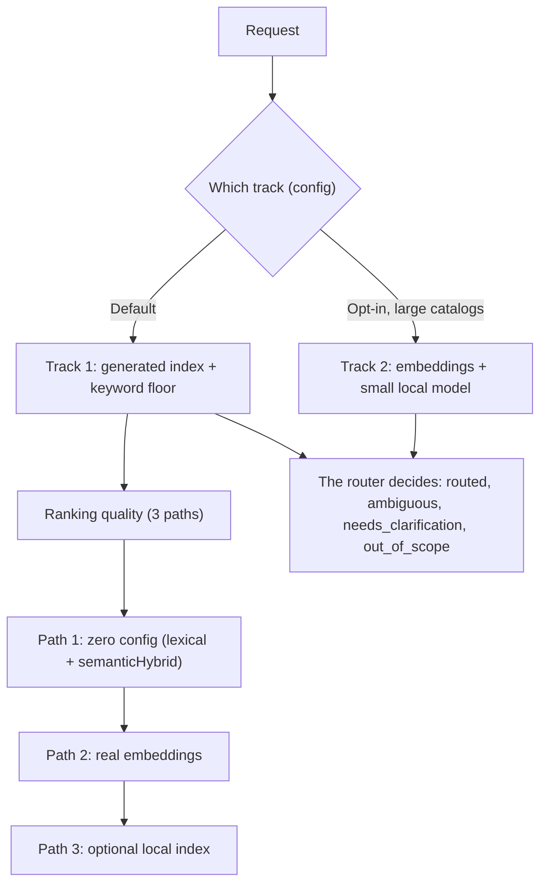

<!-- fr-synced: a57a9c3ec1fbbf766b4471bdc4eecfa4258e080f -->
# Setting up semantic routing, from zero config to real embeddings

The moment you install BASE, requests should reach the right agent and the right process with no initial config, then improve in quality when the need arises: that is what you set up here. BASE routes a request, or abstains honestly when nothing fits.

BASE routes in **two ways, chosen by configuration**. **Track 1** is the default: the assistant reads the generated index and chooses, with a deterministic keyword floor as an offline safety net. **Track 2** is optional, for large catalogs: embeddings retrieve a handful of candidates and a small local model refines them (it chooses, or asks for clarification); see [Track 2, embedding-based routing](voie-2-routage-embeddings.md). This page details Track 1 and, within it, the **ranking quality** of candidates: a ranker ranks, but the router is what decides. You will go through three paths, from the simplest to the most robust; start with the first, and go further only if you need to.



BASE routing chooses the primary workflow, not every possible resource. The full chain is this: choose an agent, route to a process, then open the competences, tools, templates, documents, or data that the process needs. For the full doctrine, see [`docs/reference/routage-process-et-ressources.md`](../reference/routage-process-et-ressources.md).

## Reaching the right agent (the simplest first)

Before the *quality* of the ranking (the "paths" below), here is how the assistant arrives at the right agent, from the most manual to the most automatic:

- **Manual, zero tools.** If you know which agent you want, point straight at its `AGENT.md`: it is the only file to load. "Read `exemples/assistant-devis/.ai/agents/assistant-devis/AGENT.md`" is enough (path relative to the repo; in an assistant project, it is simply `.ai/agents/<agent>/AGENT.md`). No routing, no installation.
- **CLI.** `base route "<request>" --root <project>` chooses the agent → process deterministically, and abstains honestly if nothing fits. The same router, from the terminal.
- **MCP.** The `route_request` tool exposes that same router to an AI tool able to read your files (for example GitHub Copilot, Antigravity, Claude Code or Cowork, OpenCode, Kilo Code). To wire it up, follow the `activer-routage` process.

Routing (CLI/MCP), deterministic by default, helps most when several processes or agents could answer, or when you want guarantees (tested abstention, fixtures). It spares the user the trouble of hunting for the right process. As soon as an embedding ranker comes into play, the ranking depends on the chosen provider; the statuses and the fixtures, though, do not change. For a single simple assistant, loading manually is enough.

The three "paths" below address a different question: the ranking quality of candidates within Track 1, from zero-config lexical to real embeddings. (Not to be confused with Track 2, which is another routing track, not a ranker.)

## Path 1: zero configuration

Write agents and processes in Markdown, with a `use_when` per process. BASE routes with its zero-dependency core: lexical + `semanticHybridRanker` (token overlap, aliases by token subset, fuzzy similarity), structured abstention, routing fixtures, MCP.

```bash
node tools/base.mjs route "le client conteste sa facture" --root exemples/routage-pme
node tools/base.mjs route-test --root exemples/routage-pme   # replays the expected routes
```

Ideal for a single person, a small team, a demo, a first deployment. See the example [`exemples/routage-pme`](../../../exemples/routage-pme/README.md).

### Strengthening without a dependency: `semanticHybrid`

In `base.config.json`, declare aliases (domain synonyms), still with zero dependency:

```json
{
  "rankers": [
    { "type": "semanticHybrid", "aliases": { "proposition": ["offre commerciale", "devis"] } }
  ]
}
```

The rule is simple: use `base.config.json` for declarative options (`semanticHybrid`, thresholds, validators), and `base.config.mjs` when you need to import code, for example an embedding provider. If both exist, BASE prefers the declarative JSON; so keep a single format per project when you turn on real embeddings.

## Path 2: real embeddings

Install `@ai-swiss/base-ranker-semantic`, choose a provider, add a ranker in `base.config.mjs` (executable config, because a ranker is code). The core gains no model or cloud dependency.

```bash
npm install @ai-swiss/base-ranker-semantic
```

In the BASE monorepo, to contribute locally, the package lives in `packages/base-ranker-semantic/`.

```js
// base.config.mjs: OpenAI-compatible endpoint (OpenAI, Azure-like, internal gateway)
import { createOpenAICompatibleEmbedder, createSemanticRanker } from "@ai-swiss/base-ranker-semantic";

const embed = createOpenAICompatibleEmbedder({
  model: "text-embedding-3-small",
  // baseUrl: "https://gateway.interne/v1",  // an internal gateway
  timeoutMs: 10_000,
  retries: 2,
});

export default { rankers: [createSemanticRanker({ embed, minSimilarity: 0.25 })] };
```

```js
// base.config.mjs: Ollama, everything stays local
import { createOllamaEmbedder, createSemanticRanker } from "@ai-swiss/base-ranker-semantic";
export default { rankers: [createSemanticRanker({ embed: createOllamaEmbedder() })] };
```

```js
// base.config.mjs: any provider, or precomputed vectors (no resource text sent)
import { createSemanticRanker } from "@ai-swiss/base-ranker-semantic";
import { vectorFor } from "@ai-swiss/base-index-local";
export default {
  rankers: [createSemanticRanker({
    embed: async (textOrTexts, ctx) => monModele.embed(textOrTexts, { signal: ctx?.signal }),
    getResourceEmbedding: (r) => vectorFor(index, r),
  })],
};
```

The package is robust by default on provider calls: it handles timeouts, the `AbortSignal`, bounded retries (transient only), and typed errors. To coalesce many concurrent calls, wrap the provider with `createBatchingEmbedder`. Details: [`packages/base-ranker-semantic/README.md`](../../../packages/base-ranker-semantic/README.md) and [the provider page](choisir-provider-embeddings.md).

## Path 3: optional local index

When the corpus grows large, derive a deletable local index with `@ai-swiss/base-index-local`. The user model stays the same, with no catalog to maintain by hand, and the default routing statuses do not move. See [Understanding scale](../learn/comprendre-echelle.md).

## Running the fixtures

`.ai/routing/route-tests.json` lists requests and the expected route (status, agent, process). It is a regression test, not an academic performance measurement:

```bash
node tools/base.mjs route-test --root <project>         # readable output, exit ≠ 0 if a route breaks
```

## Reading the score reasons

`route --json` makes every score component explicit, with inspectable reasons rather than an opaque confidence score.

```bash
node tools/base.mjs route "panne au login" --root exemples/routage-pme --json
```

| Reason | Means |
|---|---|
| `route:<term>` | the term matched the `route_text` (strongest routing signal) |
| `route_text:use_when` | the `route_text` comes from the `use_when` (the intended signal); `:title`/`:path` = weak signal |
| `route_avoid:<term>` | a `routing.avoid_when` matched: the score is **canceled** (counter-example) |
| `semantic:alias:*`, `semantic:fuzzy:*` | contribution from the zero-dependency `semanticHybridRanker` |
| `semantic:embedding:<sim>` | cosine similarity of real embeddings (semantic package) |

The status (`routed | ambiguous | needs_clarification | out_of_scope`) and its `reason_code` say *why* BASE decided, or why it preferred to ask.
