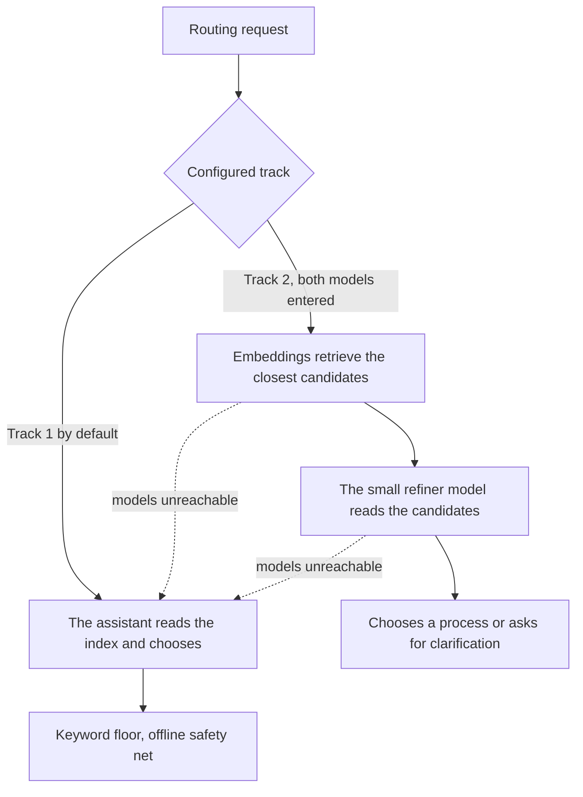

<!-- fr-synced: d582ba5e1b080529a75ebb6cbf80f42cfe706bb5 -->
# Track 2, embedding-based routing (optional, for scale)

BASE routes in two ways, and you choose through configuration. Track 1 is the default and is enough for
most BASE roots. Track 2 is a convenience for large catalogs. You only need it if you have decided you do.

## The two tracks, in one sentence each

- **Track 1 (default, already active).** The assistant reads the generated index and chooses; a
  deterministic keyword floor acts as an offline safety net. No model, nothing to install.
- **Track 2 (optional).** Embeddings retrieve the few candidates closest to the request, then a small
  model reads them and decides (it chooses, or asks for clarification). Locally.

The two tracks are independent: Track 2 is not a layer on top of Track 1, it is another track that the
configuration selects.

## Do you need it?

Be honest with yourself before installing anything.

- **Small or medium BASE root** (a few agents, a few dozen processes): **Track 1 is enough**. Track 2
  would add nothing, and would add an installation to maintain.
- **Large BASE root** (many processes, or routing that hesitates because the list is long to tell apart
  by keywords): Track 2 sharpens the choice. That is where it earns its place.

## The installation is essentially "just Ollama"

The promise is simple. Here is what to do:

1. Install **Ollama** (the application that runs models locally).
2. Download **two models**: an embedding model and a small refiner model.
3. Enter both of them in the Studio **Settings** page, the "Routing / Track 2" section (or directly in
   the configuration file).

**Local, sovereign, no cloud, no API key.** Everything stays on your machine. An OpenAI-compatible hosted
provider remains possible for anyone who wants it, but the default story is *Ollama alone*.

Track 2 only activates when **both** models are entered. A single one does nothing, and BASE stays on
Track 1. And if a model becomes unreachable, BASE automatically falls back to Track 1: never a block,
never a silence.

## Which models should you choose? (you are free)

BASE imposes no model on you. As an **illustrative, non-prescriptive** example, two lightweight local
models make a good demonstration: `qwen3-embedding:0.6b` for the embedding (multilingual, useful because
BASE is French-speaking) and `qwen3:4b` for the refiner (a small instruct model). These are examples, not
a fixed recommendation: choose your own if you prefer (for instance a long-context embedding, or a refiner
from another family).

The ecosystem moves fast. Rather than memorizing versions, **check the currently recommended models** in
the Ollama documentation, and verify the exact tag when you download. For the criteria for choosing an
embeddings provider (local, cloud, gateway, internal), see
[Choosing your embeddings provider](choisir-provider-embeddings.md). For running models while staying
sovereign, see [Sovereign models](modeles-souverains.md).

Do not chase the "best" small refiner by points of percentage. What the routing eval honestly measures is
a **structural signal** (do the embeddings surface the right candidate?), not a model's performance: the
final choice, or the request for clarification, falls to **your own AI**, far stronger than any small local
model. The local refiner is only a safety net at scale, with no Studio open. So there is no point tuning
your prompts or your structure to inflate a small model's score.

## Getting walked through it step by step

The simplest path is to ask your assistant: **"activate Track 2"**. The `activer-voie2` process guides you,
in order: confirm the need is real, install Ollama by following its up-to-date official documentation,
choose and download the two models, then enter them in Settings. It shows each command before running it,
and freezes no version.

## Where the settings live

In the Studio, the "Routing / Track 2" section of Settings exposes the two models and the number of
candidates the refiner sees (a count, not a threshold to tune; the default value is fine). Without the
Studio, the same values live in the `routing` block of the `.ai/studio.settings.json` file
(`embedding_model`, `refiner_model`, and optional `k`). The all-or-nothing rule is validated on write:
both models, or neither.

For the broader setup of routing (zero config, embedding ranker, reading the scores), see
[Setting up semantic routing](routage-semantique-quickstart.md).
