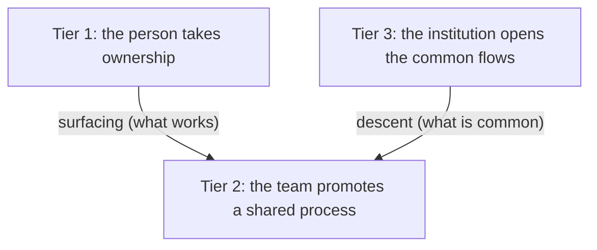

<!-- fr-synced: 816663bbe9448c3c454909e9731a6db8ed8f8267 -->
# Adoption in an organization

AI does not get installed in an organization the way software does: by decree, all at once, for everyone. An organization can check every technical box and end up, six months later, with nothing but a handful of isolated uses that nobody shares. Adoption that lasts rests on two movements running in opposite directions, and on their meeting. From the bottom, people take ownership of the dialogue with AI and structure their work in their own way. From the top, the organization makes available, AI-assisted, the few flows that block everyone. The first engine surfaces what works; the second pushes down what is common.

Adoption reads on three tiers: the person who takes ownership, the team that promotes a proven use into a shared process, the institution that opens the flows everyone is stuck with. Each tier has its gesture, its ritual, and its governance. The linked pages give the gestures: individual practices in [Human-AI co-thinking in practice](./pratiques-co-pensee.md), the life of an expertise once promoted in [Keeping an expertise alive after deployment](./cycle-de-vie-expertise.md), the conditions for getting started in the [Swiss SME](../audiences/kit-demarrage-pme-suisse.md) and [organization](../audiences/kit-enterprise.md) kits.

## The other extreme, and what it locks in

Faced with AI, many organizations take the opposite extreme: a large central platform, a fleet of licenses deployed from above, a catalog of mandated tools, productivity dashboards, a unit that steers everything. It is reassuring, sometimes quick to pay off, and it produces real gains. The price shows up later: the method ends up locked inside the platform and the vendor, and the way of working with AI gets treated as something to industrialize at the center, not as something each person understands and owns. The day the tool changes, or the contract, or the vendor, what remains is dashboards and little transferable expertise.

BASE takes the other path, and that is the whole point of this page: grow adoption from the people up, keep the know-how in files you own, industrialize from the top only the little that deserves it. The two do not always exclude each other, but they do not house value in the same place: in the platform on one side, in the owned articulation on the other.

## IT's role: access, layer, and tools

Before any tier, IT lays the foundation: three decisions condition it.

The first is **authorized access** to one or more models. The choice is weighed on the benefit-risk balance specific to the organization: what the models bring in gains, against what they expose in confidentiality, in data sovereignty, in internal perception and with clients. It belongs to leadership and compliance, not to the person who will open the tool the next day. Sovereign and local models enter the balance here (see [Sovereign and local models](../guides/modeles-souverains.md)), as does the organization's legal framework, nFADP, GDPR, sector obligations, recalled in the [Swiss SME kit](../audiences/kit-demarrage-pme-suisse.md).

The second is the **lightweight layer** placed on top: one or more tools, depending on what is feasible for you, that at minimum give the ability to read and write files. That is the threshold. Below it, AI stays a dialogue box with no memory; above it, each person freely structures their interactions, keeps their domain files at hand, and grows a practice instead of repeating prompts. The deployment modes for this layer are described in the [organization kit](../audiences/kit-enterprise.md).

The third, the most often neglected, is the **right tools**. A generative model cannot, on its own, compute a business metric, query the right table of a database, or call a prediction service: these capabilities do not arrive with access to the model. They have to be supplied to it as tools it triggers on your behalf, then draws on in the conversation: a deterministic algorithm, a query against the right tables, an API call, that someone has written. This is the heart of IT's role, beyond access and the layer: tooling the flows that call for it, and first of all understanding what computation needs to be done.

Hence a frequent, and costly, misconception: believing it is enough to clean up your database and plug it into AI. Cleaning a database and connecting it to a model gives access to information, not to *relevant* information. You do not tell a model "figure out my database and pull insights from it": for a metric, you have to have established up front which tables to cross and what computation to run, then hand that computation to an algorithm. This analysis is gladly carried out with AI, but it has to be carried out: finding the right algorithm has a cost, even with the most powerful models. At bottom, no computation is free, neither in complexity theory nor in physics.

The common mistake is to wait for perfect tooling before opening access. Practice precedes the tool: give the threshold, let ownership do its work, and tool the flows as they reveal themselves.

## Tier 1: the person takes ownership

The primary engine of adoption, and the most important, is personal ownership. Each person structures the human-AI dialogue in their own way, on their own tasks, at their own pace, and it is this variety that makes the difference, not a flaw to normalize. An organization that reaches straight for the single process snuffs out the engine before it starts. This is where the verification instinct is born, the one without which no assisted flow will be seriously reviewed later.

**The gesture.** A person takes a task they know, approaches it with AI, and keeps the helm: they check against their reality, flag their assumptions, iterate rather than hunt for the perfect prompt. [Human-AI co-thinking in practice](./pratiques-co-pensee.md) describes this loop and the five practices that make it light; nothing to duplicate here, except the observation that a whole organization rests first on individuals who hold it up.

**The ritual.** At this tier, it is personal: keep track of what worked. An interaction that went well is noted, revisited, refined. A practice thus settles into something transferable, the first candidate for surfacing upward.

**The governance.** Minimal, and bearing on the data, not the method. The person knows what they are allowed to enter into the tool, and what they do not enter: the authorized-data rule from the [Swiss SME kit](../audiences/kit-demarrage-pme-suisse.md) is enough. The freedom to structure stays whole, that is the point.

## Tier 2: the team promotes a process

An individual practice that stays individual is lost with the person. The second tier surfaces what works: that is the condition for a good interaction to become a collective asset rather than a repeated stroke of luck. The information has to come up.

**The gesture.** Surface, then promote. The most comfortable people, the power users, share their interesting interactions: not "AI is good", but "here is how I got this result, on this task, with this framing". The best are promoted into a **team process**. A promotion is not a pooling of files, it is a change of status: a readable Markdown that each person picks up, not a recipe living in a chat app.

**The ritual.** A regular meeting, weekly or biweekly, where these interactions surface and get discussed, and where the team decides what deserves to be promoted. Promoting too early freezes an instinct that is still fuzzy; too late lets the organization reinvent what one person already knows. The monthly maintenance ritual from the [Swiss SME kit](../audiences/kit-demarrage-pme-suisse.md) is the tooled version of it: it surfaces the personal resources to promote, the markers that are aging, the workflows that no longer match practice.

**The governance.** A promoted process stops being ownerless. It gets an owner, most often its original owner, who evolves it; and a versioning, which makes its changes visible and debatable. The rule holds: the AI proposes, the responsible person signs. This is where the [life cycle of an expertise](./cycle-de-vie-expertise.md) really begins: a use that goes off the rails is logged in one sentence, and a promoted process is corrected rather than left to rot in silence.

## Tier 3: the institution opens from the top

The first two tiers rise from the field. The third descends. Some flows do not depend on ownership: a purchase request, the onboarding of a new colleague, a compliance check everyone dreads. They block each person the same way, and waiting for a power user to solve them from the bottom would be a collective waste of time. The institution identifies them and makes them available as **AI-assisted flows**.

**The gesture.** Make a flow available, at the right level of assistance. When the result verifies automatically, through a dedicated algorithm that gives the guarantee a model cannot give on its own, the flow can become fully automatic. Most often, it keeps the right level of friction in the human-AI interaction: enough for a person to stay responsible for the output, not so much as to reproduce the blockage you wanted to lift. The right level of friction is the point, not maximum automation.

**The ritual.** Evaluation at scale. The instituted flows are the ones kept under watch: a harness evaluates them on the real surface, an independent judge scores, and what deteriorates is flagged. The [life cycle of an expertise](./cycle-de-vie-expertise.md) describes this setup, which takes on its full value precisely when a few processes are promoted and institutionalized.

**The governance.** Here it becomes formal. The institution applies what the first two tiers do not carry: access rights, classification, audit, retention, compliance review. BASE provides honest mediation of sensitive actions, confinement, write gate, governance of every output to a model, pluggable without giving up the know-how, but it replaces neither IAM, nor SSO, nor RBAC, nor DLP, nor SIEM. The [organization kit](../audiences/kit-enterprise.md) details the strict configuration and the deployment modes that make these flows enforceable.

## Where the two engines meet

The two engines do not work one without the other. From the bottom, ownership produces practices no one would have dictated in advance; without it, the instituted flows stay shells no one takes ownership of. From the top, the assisted flows lift the common blockages and provide a frame; without them, ownership stays an archipelago of personal uses that never becomes an organization.

They meet at the team tier. That is where an individual practice becomes a shared process, and where an instituted flow comes back down to be tested on real work.

 The descent imposes a discipline the ascent does not demand: a personal practice commits only its author; an institutional flow commits everyone who relies on it. Few flows descend, and those that do stay under watch. A [friction](./cycle-de-vie-expertise.md) flagged on a common flow is the bottom engine correcting the top engine.

Over time, none of this settles all at once. You almost always start with a few isolated trials; use spreads the day people truly take ownership of it; and only a handful of flows end up held at scale. It is a slope, not a staircase: the steps overlap, you skip some, you go back. Spotting them helps you know where you stand, as long as you do not turn it into a required march, identical for everyone.

The same unit circulates in both directions: a readable Markdown that people write, judge, own, and version, that someone answers for. Adoption holds when the three tiers turn together: people who take ownership, teams that promote, an institution that opens and keeps under watch. None is enough alone, and all rest on the same foundation, an authorized access, the means to structure, and the right tools, and on the same rule, at every tier: the AI proposes, a person signs.
