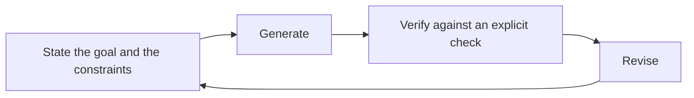

<!-- fr-synced: 254eaff1359db085b870b149459eb5dd80ce822b -->
# Why BASE

> **The real question is not where your servers are, but who owns the articulation of your thinking with AI.**
> BASE makes you sovereign over it: what the AI knows, what it does, what you expect, your instructions, set down in text you own. And it is this structure that keeps you able to verify, over time, where the verifying is yours to do.

This document explains *why* BASE exists. Not its commands (see [Quickstart](../start/quickstart.md)), not its architecture (see [Public framework](../reference/framework-public.md)): the method it makes executable for human-AI co-thinking.

## The imbalance between producing and verifying

Generative AI has inverted the economics of intellectual work. **Producing a plausible answer now takes little effort; making sure it is right is a different kind of work, one that depends on the task.** The core of a model, the famous "LLM", is a generator of probable completions. It can generate, compare, and simulate. But it does not verify reality, responsibility, or the consequences for your organization on your behalf.

In some domains, a verifier exists outside the model: a compiler for code, the rules of chess, a data schema. There, an error detects and corrects itself. **But most real work has no external verifier.** An analysis, an offer, a decision, an internal memo: it is up to you to detect and correct the errors, and you are best placed to know whether the output truly serves your intent, your context, your risk threshold.

The consequence is simple: **for this work, you are the verifier**, calibrated to the risk you accept. Reliability does not come ready-made: it is built, and it is built through verification.

## The real risk: verification debt

The problem is that we verify poorly by default. Fluent text inspires a trust it has not earned; an answer obtained without effort switches off critical thinking. And faced with a confident tone, we often prefer to defer to the source rather than assess the claim.

So the most common failure scenario sets in quietly: we verify well at the start, then the system produces faster than we can keep up. We lose the big picture. We stop developing the intuition needed to judge. Trust becomes blind, or collapses. Every claim accepted without scrutiny adds to a **verification debt**: a reserve of unverified assumptions that eventually gives way under the first real pressure. The project is impressive on the surface, fragile underneath.

## The four losses of control that BASE prevents

| Loss | What happens |
|-------|---------------|
| **Losing sovereignty** | operating without owning: your knowledge lives on someone else's platform. |
| **Losing understanding** | delivering without intuition: you produce results you could no longer defend. |
| **Losing over time** | deploying without knowing how to maintain: it works on day one, not on day one hundred. |
| **Losing verification** | producing without scrutiny: debt accumulates until the breaking point. |

BASE is, precisely, the structure that prevents these four losses.

## What BASE brings: a structure that makes verification light

Verifying must not drown you. A strong structure upstream makes verification light downstream. Here is how BASE goes about it:

- **Point to what matters.** A *process* opens only the resources useful to *this* task, not your entire folder. You decide what the AI sees. Less noise, better answers, and a human review focused on a legible step rather than an opaque block.
- **Make the boundary explicit.** This is first a security question: instructions are executed, content is not. Mixing the two opens the door to injection, when a processed document ends up dictating the model's behavior. So BASE separates **know-how** (text the model follows, with no guarantee) from **knowledge** (content it consults), and distinguishes the *consigne* from the **mechanism** actually enforced by the code. You document the boundary instead of papering over it.
- **Keep decisions visible.** A proposal is shown (a diff) before any write; the `[A VALIDER]` markers flag what awaits your judgment. These markers matter a great deal: they serve as a searchable landmark in your files and lend themselves to algorithmic handling (you can list them, count them, block while any remain). Nothing important happens without you.
- **Provide a shared memory.** A general-purpose chat model masters a great many verifiable domains, and knows nothing of yours. Two real shortcomings follow. First, by default, it does not share your memory: every exchange starts from scratch. Second, its relationship to language is underspecified, which is both its strength (it adapts to anything) and its weakness (it guesses instead of knowing). BASE addresses both: memory becomes a simple file structure; language becomes an explicit articulation, set down in black and white rather than left to guesswork.

The operational form is a **co-thinking loop**: state the goal and the constraints, generate, verify against an explicit check, revise. You start again, and the structure carries the context so each turn stays light.

## Fine-grained control is what makes for efficiency

**Having access to information is not having access to useful information.** Plugging in your whole inbox and your whole drive as context is noise if nothing is targeted. Choosing what the AI sees is a matter of confidentiality, but also and above all of **efficiency**: in information (the right context, not all of it), in cost (a tight context is faster and cheaper), and in attention (you review a framed step, not a mega-result).

This is also why the "multi-agent everything" reflex often misleads, and it is worth being precise about its true value. Delegating to several agents in parallel pays off when the pieces are genuinely independent, and especially when a clear verification signal means more compute yields more results: combing through logs to find incidents, searching code for vulnerabilities, generating then sorting a thousand variants. There, parallelism pays, and you should use it. The cost appears as soon as the task does not split cleanly, that is, as soon as the agents have to *share* context. Their only channel is then natural language, underspecified by nature: at each handoff, context is copied, summarized, re-verified, and a little coherence leaks away. Multiplying copies of the same model adds no extra eyes, only throughput: they share the same bias. For judgment work, which rarely splits without loss, a single agent that keeps the thread, carried by an explicit structure, costs less than a coordination that gets paid for in tokens and misunderstandings. **The bottleneck of agentic systems is not power, it is shared understanding.** The useful question is therefore not "one agent or several", but "does this task split without costing coherence": often no, and that is why "agentic everything" describes only a corner of real work.

## The limits of the task, the AI shares them

A model does not verify; nor does it escape the limits of the task itself. Finding information requires combing through where it might be; computing correctly requires following a procedure flawlessly; reasoning far requires holding ever more intermediate steps. Humans and AI alike run up against these three requirements, and answer them the same way: a search engine, a calculator, a medium to write on to stay coherent. The difference is not in the need for tools, but in whose hand they are: it is you who decides to use them, and you who judges what comes out.

These limits are not a flaw in the AI, they are properties of the problem, which no one bypasses by intelligence alone. A computation does not create the information absent from its inputs, and no physical process exceeds what is computable: that is the physical Church-Turing thesis (any physical process can be simulated on a Turing machine to the desired precision). Its extended version, about efficiency (a classical simulation at only polynomial overhead), is more delicate: quantum computing contradicts it for certain tasks, but under hardness assumptions that are accepted and not proven, and without touching language models, which are classical. The practical lesson fits on one line, it is [principle 6 of co-thinking](pratiques-co-pensee.md): what would require intermediate steps from you requires them from the AI, as from any system in the world.

## The AI retrieves only what you have made findable

We often hear that "the AI starts from scratch" at each exchange. Let us be precise, because the nuance changes what to do. It is not the whole system that forgets: it is the generative core, the language model. At each call, it starts with an empty **context window**, with no memory of the previous one. Memory has not disappeared for all that; it is simply *external* to the model. A larger system around it, like BASE, can perfectly well give it back: your files are that memory, and the whole challenge becomes filling the window, at the right moment, with the right pieces.

How are these pieces retrieved from your files? By mechanical means, the same as yours, but faster: you list folders, you search for words, you cross-reference by resemblance (glob, grep, and semantic search, in the vocabulary of the tools). From your world, then, the system retrieves only what you have made findable, and at the grain at which you have made it findable.

The practical consequence: **structure information every time you touch it, and put it away better than you found it.** Whether it serves as memory (a history, a past decision) or not (a rule, a fact, a catalog), the model will have it in view only if the system retrieves it and places it in its window. And not just for today's task, but for all those that follow: a clearly named note, a fact filed in the right place, a rule written cleanly once pay off every time you come back to draw on them, like an investment that returns on each use. It is the flip side of "an access is not a useful access": you do not file for today, you make findable for what comes next.

That leaves the right grain. Too coarse, and you can no longer point to the useful piece within an indistinct block; too fine, and the piece loses the meaning its surroundings gave it. The right granularity is the one you can point to with a single gesture and that stands on its own: small enough to open without dragging the rest along, large enough to keep its meaning. It is this repeated work that makes the right information surface in the window at the right moment, ready to serve precisely rather than to be groped for. The discipline is first human; BASE gives it support (named files, an external memory you own, reusable competences distinct from processes, a router that retrieves the right unit of work), but the habit of filing well, every time, remains yours.

## The freedom to think any process

Most work consists of following the thread of your own thinking, fluid, not cutting it up in advance into "agents". Yet many tools impose a grammar: break things down into agents, roles, handoffs, configured in their interface. It is the tool that dictates the process.

BASE does not impose this grammar. You can just as well keep a framed context and think. **Autonomy without dialogue stays fragile, whatever the intelligence on the other side.** Beyond the question "where are my servers?", the deeper risk is to lose the freedom of our interactions with AI, to end up thinking in agents and interfaces, through someone else's instructions. BASE defends the freedom to articulate *any* process, including none.

### Why we say "agent" even as we criticize the grammar of agents

Because the models and the tools, for their part, are used to the word. Models are trained on the vocabulary of "agents", "skills", "tools"; the tools (AI editors, agent platforms, MCP servers) are built around it. To be *executable* on these tools, BASE has to speak their language at the boundary. Refusing the word would not make BASE purer, only incompatible.

So we adopt "agent" **out of pragmatism, not conviction**: it is an interface term toward the tools, not the mental model of the work. Concretely, a BASE "agent" is **your** Markdown, readable, comparable, deletable, and **optional**. It is not an autonomous worker you launch and forget. What you own is the intelligence layer; the word "agent" belongs to the execution layer that runs it.

## The sovereignty that matters is around the models

Server sovereignty (where the compute runs) is **necessary, but it is not sufficient**. You can own your chips, your electricity, your hard drive, and remain a stranger to what matters most: your interactions with AI. An AI sovereign in its servers but foreign in its uses remains a trap: what you can neither articulate nor verify does not truly belong to you, wherever it runs.

This observation has a reassuring consequence. For most knowledge work, **a free model running on a good laptop already suffices**; raw power is not the limiting factor, and open models running locally will do more tomorrow, never everything (some applications, like large-scale search, demand far more compute). The pharaonic infrastructure investments are mostly about *another* kind of AI: the one that learns on data from the world beyond the human alone (for example by capturing wavelengths beyond the visible spectrum), and for which alignment with our representations is not the primary goal. This is not, for AI Swiss, the AI to develop first: many human problems can be solved before letting AI explore the world with little human representation. The sovereignty that matters is therefore not a race for compute. **It lies around the models: the freedom to articulate, to structure, to think with these intelligences.** It is *cognitive sovereignty*, the layer no one else gives back to you.

Hence a clean separation:

- **Your intelligence layer**: how you articulate the work, structure the knowledge, define the checks, keep the decisions. That is BASE. In text, yours, portable, model-independent.
- **The execution layer**: the compute, the models, the orchestration, the internal memory, the connectors. Interchangeable, to be rented and to evolve.

The right question is therefore not "where are my servers?" but **"who owns the articulation of my way of thinking with AI, me or my vendor?"**. BASE does not replace your tools and does not stop you from using them: it is their sovereign layer. Keep your tools for compute and execution; own, in BASE, the intelligence they execute. Details: [BASE and your AI tools](../reference/base-et-vos-outils-ia.md), and [where BASE sits in the landscape of tools](../reference/positionnement.md).

## An anchor, when tools change faster than literacy

Building with AI is not just about choosing a product. Interfaces change so fast that even those who design them do not know what they will look like in a few months. The common answer from the big players is implicit: try it, learn as you go, switch tools every few months. You do not build a durable literacy on that, and you do not train a team on shifting ground.

BASE **aims to serve as an anchor**, insofar as your files stay readable and portable. Your method, your processes, your checks live in a structure you own and that does not follow the pace of products. The depth of integration, for its part, varies by tool; but adapting to a new tool does not require relearning everything: it is done through BASE's **adaptation layers** (a bridge, an adapter), with little effort, and the AI itself can help you rewrite them. You change execution; your intelligence remains.

## Calibrated, not anti-automation

Co-thinking means **choosing consciously**, not doing everything by hand. Delegate what has a verifier or requires no judgment; co-think what carries risk and meaning. BASE simply makes human-in-the-loop the *default* choice, and delegation an *explicit and visible* choice, where the market trend is *invisible* automation.

## BASE puts what matters in front of you

A good collaboration does not make you search. Just as a *process* must give the AI the information that matters, BASE must give *you* what matters, without your having to ask:

- the **welcome** (concierge) orients you the moment you are lost; a **router**, rudimentary but effective and extensible through adapters, takes away the mental load of finding the right process; even its honest abstention sends you back to the welcome rather than into the void;
- each process highlights what you must verify or decide, and flags the decision points (`[A VALIDER]`, `[ATTENTION]`) before a problem arises.

You should never have to dig to encounter what matters.

## Going further

- [The principles of co-thinking](pratiques-co-pensee.md): the method, principle by principle.
- [The interactive documentation](../reference/documentation-interactive.md): the docs locally, and BASE Studio to see and tend your processes, two optional local interfaces.
- [Public framework](../reference/framework-public.md): the abstractions, sovereignty around the models, interoperability.
- [BASE and your AI tools](../reference/base-et-vos-outils-ia.md): with your tools, not in their place.
- [Manifesto](../../../MANIFESTO.md): the vision.
