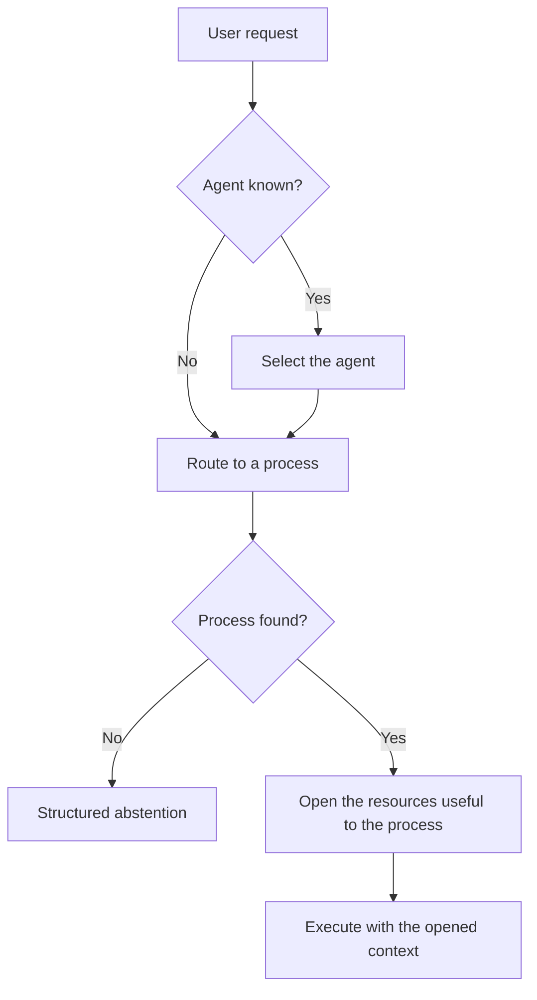

<!-- fr-synced: 26978391401c9a6f07d56c21001a07d8a31fe343 -->
# Adopting public BASE: from local to team

If you are an individual, a freelancer, a startup, a small or mid-sized business, or a small team, this page shows you what public BASE gives you: a way to structure your collaboration with AI without installing a heavy platform. It also explains how to adopt it in stages, staying simple on the surface without blocking your later growth.

The guiding idea: little imposed up front, complete abstractions underneath, requirements that rise with your needs, and rigor only where the context calls for it.

If you are discovering the repository, start with `docs/start/lire-dans-quel-ordre.md`. That document is the source of truth for the reading paths: what to read depending on your profile, what to skip at first, and what to audit later.

## Who should read what?

The reading path by profile (solo person, SMB, large enterprise) is maintained in a single place, to avoid divergent versions: see [Reading order](../start/lire-dans-quel-ordre.md). This document is one of the steps in those paths.

## Three layers not to confuse

| Layer | Contents | Why it exists |
| ------ | ------- | -------------------- |
| Usage | `README.md`, `docs/start/quickstart.md`, `exemples/` | Get started without understanding the whole architecture |
| Structure | `.ai/agents/`, `docs/reference/framework-public.md`, `base.schema.json` | Stabilize agents, skills, resources, and workflows |
| Integration | `tools/`, `mcp/`, `tests/`, `docs/reference/specification-v0.md` | Verify, connect, and audit without locking BASE inside one tool |

`CLAUDE.md` and `.cursor/rules/` are harness adapters. They help Claude Code and Cursor load the right context, but they are not the conceptual source of the framework. As a convenience, never a requirement, two optional local interfaces exist: Studio (`npm run studio -- <dossier>`, on `127.0.0.1:5174`) to browse and edit resources behind the propose-then-commit gate, and the documentation served locally (`npm run docs:serve`).

Public BASE is directly usable for local work and small teams. For a large enterprise, it serves as a structuring foundation and an architecture reference, not as a complete compliance platform.

To avoid any ambiguity, the real state of the public core is tracked in `docs/reference/etat-implementation.md`: what is implemented, what is planned as an extension, and what deliberately stays out of scope.

The page `docs/audiences/pour-qui.md` gives the reading by context: private life, startup, SMB, and large enterprise.

## Adoption levels

### Personal

Goal: get started without friction.

- free-form Markdown;
- optional YAML;
- a local agent or a copied example;
- human validation before writing;
- no mandatory manifest.

A personal file can simply be:

```markdown
# Reply to customer emails

When I receive an email...
```

### SMB / team

Goal: share without bureaucracy.

- minimal frontmatter recommended;
- `base validate --root <dossier>` before sharing;
- `base index --root <dossier>` to generate the manifest;
- `base entretien --root <dossier>` to spot broken links, open markers, and missing descriptions;
- controlled promotion of personal resources to the team.

The right organizational starting point is `docs/audiences/kit-demarrage-pme-suisse.md`: allowed data, validation owner, simple versioning, and a monthly ritual. That is often enough before adding heavier controls.

The team minimum is:

```yaml
---
schema_version: base.resource.v1
id: nouveau-devis
type: process
title: New quote
description: Create a professional quote from a client request.
scope: team
status: active
sensitivity: internal
---
```

### Large enterprise

Goal: keep a durable structure that can be governed.

BASE structures resources, processes, tools, policies, and adapters. The organization must add its own enterprise controls: identity, authorizations, classification, DLP, SIEM, legal archiving, compliance review, secrets management, and environment separation.

Do not make the public core carry these controls as a shortcut. BASE stays the layer of local structuring and mediation; the enterprise guarantees must be enforced by the systems that actually hold the technical and legal authority to do so.

The right reading is therefore:

```text
Public BASE = local-first framework + conventions + router + local MCP
Enterprise = governed integration + internal policies + additional technical controls
```

## Stable abstractions

| Concept | For the user | Durable role |
|---------|--------------------|--------------|
| Resource | a useful file | What can be discovered and used |
| Source | where it lives | A local origin or a future integration |
| Connector | access | The mechanism that reads or writes a source |
| Process | a way of doing | A reusable textual workflow |
| Tool | tool | An invocable action, often a local script |
| Policy | an access rule | An intent or a usage limit |
| Event | a useful trace | A minimal signal for maintenance or debugging |
| Adapter | AI-tool integration | A bridge to Cursor, Claude, ChatGPT, or another |

These concepts need not all appear in the beginner UX. Their purpose is to keep the structure from having to be thrown away when an organization grows.

**Language.** None of these abstractions is tied to French. Routing is lexical and language-independent (a comparison of normalized words, with no grammar and no lexicon of any given language), and an assistant declared with German or Italian keywords routes in that language. The framework's documentation begins in French; the assistants you build, for their part, speak their users' language.

In this table, `access` does not mean BASE replaces native permissions. A connector is the mechanism that attempts to read or write a source. Actual success always depends on the rights of the system involved: filesystem, Drive, API, token, user account, network, or harness.

## Two kinds of skills

BASE reuses the `SKILL.md` format, already familiar in several harnesses, but it does not treat every skill as the same block of instructions. This is first of all a security matter: the *consignes* of a process execute, the content of a competence is consulted without executing. Confusing the two opens the door to injection, where a piece of data tries to pass itself off as a consigne.

| Type | Question | Example |
|------|----------|---------|
| **Process skill** | What to do, in what order, with which decision points? | `nouveau-devis`, `traiter-candidature`, `preparer-newsletter` |
| **Competence skill** | What do you need to know to do it well? | VAT, discount policy, communication tone, markers, log |

This distinction keeps an agent from having only one big list of skills. A process can declare or suggest the competences it needs; the router can find the right process, then open only the useful knowledge. This is an important difference from harnesses that mostly expose a flat catalog of skills.

The full doctrine is: select the agent when it is known, route to a process when the workflow has to be chosen, then open the resources useful to the process. It is detailed in `docs/reference/routage-process-et-ressources.md`.



## Permission modes

Public BASE is honest about what it can guarantee:

- `advisory`: the default mode, where the agent guides and flags risks.
- `hybrid`: certain sensitive actions go through BASE, while the harness keeps declared native capabilities.
- `strict`: actions mediated by the CLI, the MCP, or a controlled connector, with confinement inside the project and refusal of symlinks outside scope when the connector supports it.

BASE does not promise enterprise RBAC or a total block when an agent has direct shell access.

The practical rule is simple: a permission is real only if the access or the action goes through BASE, a connector, or a tool that can enforce it. Otherwise it stays an instruction and an audit signal. Conversely, BASE never creates an access that the OS, the Drive, the API, or the harness already refuses.

Reference formula:

```text
advisory = guide/audit
hybrid = explicit partial enforcement
strict = mediated enforcement
```

## Local broker and router

The public broker, shared by the CLI and the MCP, provides:

- a resource inventory;
- explainable local search;
- agent-to-process routing with structured abstention (`base route`, `route_request`);
- domain routing tests (`base route-test`);
- confined resource opening with a `metadata`, `instructions`, or `full` projection;
- local access to files or resources;
- invocation of a tool (script) in dry-run by default, with confirmation when needed;
- project validation.

The router chooses among the agents and processes derived from the files. It does not search freely across the whole repository and does not load all the instructions. Competences, tools, templates, documents, and data are retrieved afterward as context.

BASE could evolve toward broader routing, for example to find a competence or a tool directly. The public core does not do this by default: routing an action and retrieving context are two different responsibilities, and keeping them separate makes the system more readable and testable.

Local search uses YAML metadata, Markdown titles, descriptions, keywords, and plain local text. The core also ships a zero-dependency `semanticHybridRanker` that can be enabled by config. For real embeddings, BASE provides the separate official package `@ai-swiss/base-ranker-semantic`, without adding any model or cloud SDK to the core. It accepts an explicit provider, ships an OpenAI-compatible connector, and offers an optional Ollama helper (`createOllamaEmbedder`, model `nomic-embed-text`) for teams that want a simple local path. See `docs/guides/routage-semantique-quickstart.md`, `docs/guides/choisir-provider-embeddings.md`, and `docs/trust/securite-donnees-routage.md`.

For scale, `@ai-swiss/base-index-local` provides an optional local index, derived and deletable. It does not become a source of truth and stays outside the core. See `docs/learn/comprendre-echelle.md` and `docs/guides/benchmarks-echelle.md`.

The `.ai/routing/registry.json` registry can be generated, but it remains an audit and scale-readiness projection. It is not a source of truth, and the router does not depend on it today. The precise limits are listed in `docs/reference/etat-implementation.md`.

## Sovereignty around the models

Server sovereignty (where the compute runs) is necessary but not sufficient: an AI that is sovereign in its servers and foreign in its uses is still a trap. For most everyday knowledge work (conversing, writing, rephrasing, following a framed process), a free model running on a good local machine already suffices, and this boundary keeps receding: the compute needed to reach a given capability falls by roughly half every eight months (Epoch AI, 2024), faster than hardware improves, and the capability obtained per parameter roughly doubles every three to four months (Xiao et al., 2024). For this class of work, raw power is therefore not the limiting factor, and the pharaonic infrastructure investments belong mostly to another kind of AI, one BASE does not aim to serve first. The sovereignty that matters lies, then, **around the models**: the freedom to articulate, structure, and think with these intelligences.

Hence a clean separation of responsibilities, best read layer by layer, not by technical maturity but by **who owns each tier**:

| Layer | Who usually owns it | What BASE gives back to you |
| --- | --- | --- |
| The compute and the models | Your AI provider | Nothing, and that is intended: rent it, upgrade it, switch it. |
| Internal memory and orchestration | The platform | The right to leave: your data stays text, readable elsewhere. |
| The read, write, and search tools | The tool's vendor | Targeted tools that you declare, bounded to the task at hand. |
| Routing and workflows | The product, through its menus and settings | Processes in text that you write, version, and govern. |
| **The interactions: the articulation of your thinking** | **No one gives it back to you** | **Cognitive sovereignty: how you think with AI stays yours, in the clear, independent of the model.** |

You own the middle layers and, above all, the interactions layer; the provider brings the compute and the models, which you rent and upgrade.

## Interoperability: with your tools, not in their place

BASE stays open. Being text plus an MCP server, it lets itself be consumed by any harness or platform able to read files or speak MCP:

- **MCP** (an open standard): BASE exposes an MCP server; a compatible tool can call BASE to route, open, and read its resources.
- **Files**: your Markdown can live wherever your tool reads it and feed an existing assistant.
- **Open agent protocols**: an evolution path for making agents defined in BASE cooperate with others, not implemented today; not to be presented as a given.

In concrete terms, three scopes, from the lightest to the most complete: your **files attached** to a chat, your **folder opened** in a tool that reads files, or the **MCP server** plugged into a compatible tool, up to a consumer chat when it speaks MCP.

The right question is therefore not "BASE or my tool?" but "who owns the articulation of how I think with AI?". Keep your tools for execution; own, in BASE, the intelligence they execute. Details, and help integrating your specific tool: [BASE and your AI tools](base-et-vos-outils-ia.md).

*Note: the capabilities of third-party tools evolve fast; this document stays independent of any specific product. For a detail specific to a tool, rely on its up-to-date documentation.*

## Enterprise: documented only

The following needs are possible, but are not part of the initial public core:

- full SSO and OAuth;
- advanced SharePoint or Drive connectors;
- RBAC;
- full audit;
- full trace;
- vector search;
- dev, staging, prod environments;
- data retention and legal holds;
- secrets manager;
- external policy engine;
- SIEM.

The BASE structure does not block these needs. They plug in through Sources, Connectors, Policies, IndexProviders, and Adapters.

The design rule stays conservative: do not add an enterprise abstraction to the public core until it is carried by a real need, a verifiable mechanism, and at least two plausible integrations. Otherwise, documenting the limit is better than adding a fragile promise.

## What BASE does not promise

BASE does not promise:

- automatic accuracy of AI answers;
- a model memory independent of the files;
- legal archiving;
- complete audit proof;
- security isolation when the agent has direct shell access;
- GDPR, FINMA, ISO, or SOC 2 compliance without additional organizational control.

BASE promises a readable, local-first, extensible framework in which the assumptions, decisions, resources, and processes are explicit.
