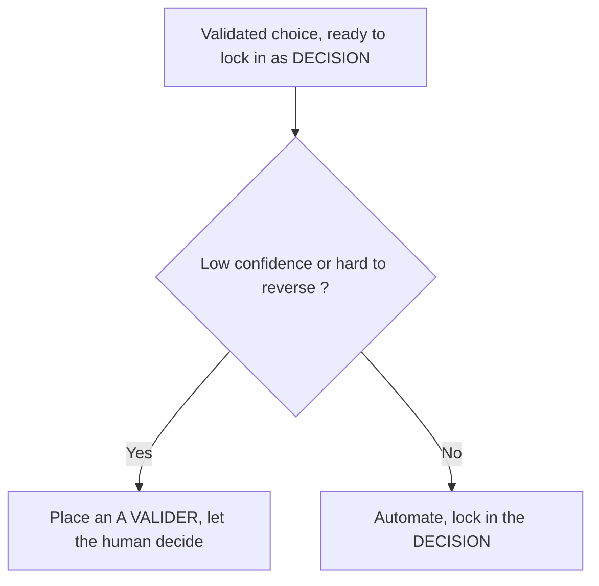

<!-- fr-synced: ea39bb91b48807f14ff61049a74807160db4cf19 -->
# BASE markers and when to place them

A marker placed badly, or understood differently by the human, the agent, and the tooling, loses track of the real state of the work. To prevent that, the vocabulary is defined once, here: which markers exist, what each one means, and when to place it. A marker is a searchable text cue, written in brackets inside a document, that makes that state visible without leaving the file. It serves as a shared reference for anyone writing or reviewing in BASE, as well as for the agent assisting them.

A marker is handled by text search (searchable, so traceable and scriptable), not by eye. That is exactly the point: a marker is a cue you find again through a standard algorithmic method (list the marked documents and process them one by one), instead of relying on a fuzzy semantic search that has to absorb everything by sheer volume. BASE recognizes a **closed** set of them, split across two levels that do not mix:

1. **The domain markers**, in user documents (quotes, client sheets, reports, the journal). They make the state of the work visible and traceable directly in the file.
2. **The specification-plan markers**, in the spec and the code. They flag a zone of acknowledged uncertainty or a code change declared without a spec change.

This page is the **single source** of that vocabulary. The scanner (`tools/core/markers.mjs`), requirement FR-CORE-010, the spec-sync check, and each agent's "markers" competence all derive from this closed set. The last section explains why none is added lightly.

## A. Domain markers

Four markers, and only four, live in user documents. Each corresponds to a phase of the human-AI co-thinking loop (Frame, Delegate, Evaluate, Adjust). They are searched by `base markers` (and the MCP tool `list_markers`), and **forbidden** in framework and spec files.

For each marker: its meaning, when to place it, and who closes it.

### `[A COMPLETER: champ]`

- **Meaning.** A piece of information needed to move forward is missing.
- **When to use it.** Frame phase: while writing, when an indispensable piece of data is not yet known (for example an IDE number, an email, an amount).
- **Who closes it.** It disappears once the information is supplied, by the agent or by the user.

### `[A VALIDER: description]`

- **Meaning.** The agent proposes something that the user has not yet confirmed.
- **When to use it.** Delegate phase: for any value, assumption, or wording the agent has produced and that awaits a human decision.
- **Who closes it.** The user. A confirmed `[A VALIDER]` becomes a `[DECISION]`.

### `[ATTENTION: description]`

- **Meaning.** A risk, an inconsistency, or an alert the user should examine.
- **When to use it.** Evaluate phase: when the agent spots a point that deserves a human look before going on.
- **Who closes it.** It stays as long as the risk is untreated; it closes when the point has been resolved or explicitly accepted.

### `[DECISION: choix | raison]`

- **Meaning.** A choice has been confirmed by the user, recorded for traceability.
- **When to use it.** Adjust phase: to lock in a validated choice and keep the reason it was made.
- **Who closes it.** Nothing. A `[DECISION]` is a durable record of the choice, which stays in the document as history, not an open item to handle.
- **Enriched form (high stakes).** When the choice has significant consequences (a large amount, a firm commitment, data that is hard to correct), you document the alternative ruled out, the level of confidence, and the cost of reversing course, for example: `[DECISION: Arche florale à 1100 CHF | Pivoines plus coûteuses | Alternative: roses standard 850 CHF | Confiance: haute | Réversibilité: faible (devis à refaire)]`. Suggested vocabulary, read by human and agent alike (it is not a field parsed by the scanner): **Confiance: haute | moyenne | basse**, **Réversibilité: facile | moyenne | difficile**.
- **Escalation rule.** An agent about to lock in a `[DECISION]` at **low confidence** *or* whose reversal would be **hard** does not decide alone: it places an `[A VALIDER]` and lets the human decide. We automate what is certain and easily reversible; we escalate the rest. This is a convention of judgment, not an imposed syntax.

### Rules common to domain markers

- They live in **generated documents** (quotes, client sheets, reports) and in the **journal**, never in framework files (`AGENT.md`, `SKILL.md`, templates) or in the spec.
- They are scanned by `base markers` (and the MCP tool `list_markers`), which returns only domain files: `listMarkers` ignores `.ai/agents/`, `docs/`, `specs/`, `tests/`, `tools/`, `mcp/`, the READMEs, and test files (FR-MARKERS-001). At the start of a session, the agent can summarize the open state in one line (for example "2 `[A VALIDER]`, 1 `[DECISION]` recorded").
- The maintenance report (`base entretien`, FR-CORE-010) counts these same markers as open items, and flags **stale** markers: a marker left open in a domain file whose modification date is more than 30 days old, the signal of "verification theater".
- The set is **closed and case-insensitive** in the scanner; any other bracket is not a domain marker and is not surfaced.

### Domain variants

The four business markers are the **canonical** set: it is what the scanner recognizes, what `base markers` surfaces, and what the standard "markers" competence teaches. An agent may, **in addition**, teach annotations specific to its domain, to make what matters there legible: the reflection assistant, for instance, writes `[HYPOTHESE: ...]` and `[INCERTITUDE: ...]`. These annotations are not canonical business markers (the scanner does not surface them) and they make no claim to the closed set.

The boundary is held by a check (`tools/spec/check-markers.mjs`): a "markers" competence that uses the canonical set (it mentions `A COMPLETER`) is a **copy** of it and must carry all four, dropping none; a competence that does not use `A COMPLETER` is treated as a **domain variant**, distinct from the canon and skipped by that completeness check. Choosing a variant stays an agent's owned choice; it does not change the canonical set, which changes only by decision (see below).

## B. Specification-plan markers

Two markers live in the technical plan (the spec and the code), never in user documents. They are not surfaced by `base markers`: they are repository conventions, enforced by the spec's discipline checks.

### `[NEEDS CLARIFICATION: reason]`

- **Meaning.** An acknowledged unknown in the specification: a zone where the expected behavior has not yet been settled.
- **Where it applies.** In the chapters of `specs/current/`. The spec's rule is to **never invent a requirement**: a genuine unknown is flagged inline rather than guessed. The reason in brackets is mandatory.
- **Why.** The spec describes present behavior, without status. A `[NEEDS CLARIFICATION]` is the honest way to say "this remains to be decided" without fabricating an answer or slipping planned work into a chapter (planned work lives in `CHANGELOG.md` and `.plans/`).

### `[SPEC-NEUTRAL: reason]`

- **Meaning.** The honest, reviewed declaration that a runtime code change alters no behavior described by the spec.
- **Where it applies.** In the commit message or the body of the pull request, read by the **spec-sync** check (`tools/spec/spec-sync-check.mjs`).
- **Why.** The spec-sync check guarantees that the truth does not lag behind the trajectory: a runtime source-code change must touch `specs/` in the same change, **or** declare `[SPEC-NEUTRAL: reason]`. It is the check's **safety valve**, not a silent shortcut: the declaration is an explicit review point, and reviewers verify that the change really has no effect on behavior. The reason in brackets is mandatory.

These two markers belong to the spec's discipline (NFR-CORE-010), on the same footing as the regenerated requirements-to-tests matrix and the immutability of identifiers. They have no business in a quote or a client sheet, and domain markers have no business in a spec chapter.

## Never (hard rules)

The hard rules for an agent working **inside** BASE (the framework repository), not for domain documents:

- **Never a domain marker in a framework or spec file.** The markers `[A COMPLETER]`, `[A VALIDER]`, `[ATTENTION]`, `[DECISION]` live in generated documents and the journal, never in `AGENT.md`, `SKILL.md`, templates, or the `specs/` tree.
- **Never hand-edit a generated artifact.** Any file whose header says it is generated (`AGENTS.md`, `CLAUDE.md`, `BASE_BOOTSTRAP.md`, `.cursor/rules/assistant.mdc`, `base.manifest.json`, the `requirements-matrix.md` matrix) is a projection: modify the canonical source (for example `tools/core/bootstrap.mjs` for the four entry points), then regenerate. The freshness gate (`build --write` then `git diff --exit-code`) refuses any drift.
- **Never invent missing data.** A missing piece of information is noted `[A COMPLETER: champ]` in a domain document, and an unknown in a spec is flagged inline with `[NEEDS CLARIFICATION: raison]`. Do not guess, do not fabricate a value, no simulated confidence.
- **Never write directly to a protected target.** Every write goes through the mediated propose-then-commit flow; proposing prepares a diff and writes nothing, committing rechecks the decision and the `base_hash` before writing and verifying. A proposal never self-exempts.
- **Never renumber, reuse, or delete a stable identifier** (`UR`/`NFR`/`FR`/`RC`/`AD`). A merged ID is immutable; a requirement removed from scope keeps its ID and carries `[DE-SCOPED: raison]`. New IDs are allocated by the tooling (`base spec new <PREFIX> <DOMAIN>`), never by hand.

## A closed set, changed only by decision

This page is the single source of truth for the markers vocabulary. Everything else derives from it:

- the scanner `tools/core/markers.mjs`, whose pattern recognizes only the four domain markers;
- requirement FR-CORE-010, which defines what the maintenance report counts and flags;
- each agent's "markers" competence, which teaches the assistant when to place each domain marker.

Because these derivatives must stay consistent with this page, **adding a marker (or changing its meaning) is a framework change, not an improvisation**: it goes through a decision record (`decisions/`) and then the regeneration of the artifacts that derive from it. You do not invent a marker as you write: you choose from this closed set, or you open a decision.
