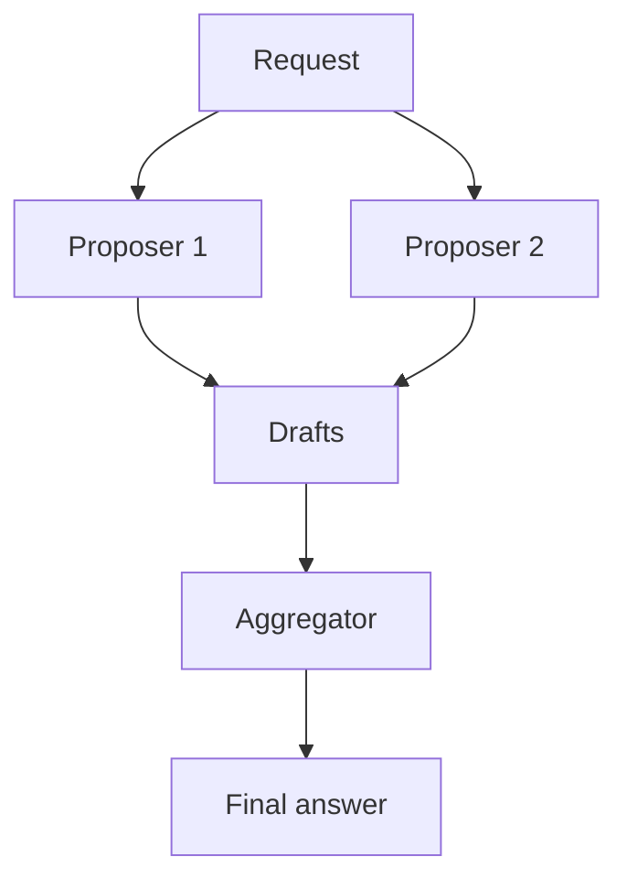

<!-- fr-synced: c3027d43be98ae750a20d8c860fdb5d9cf01023c -->
# Orchestrate several models and monitor calls

The `@ai-swiss/base-llm` package exposes a single model port: every model offers the same `complete` interface. Because meta-models respect this port, they compose: each wraps one or more models and is itself a model. It therefore drops in anywhere a single model is used, from settings to routing. Choosing a model stays an explicit decision.

## Mixture of agents

`createMoaModel` queries several proposers in parallel, then an aggregator synthesizes their drafts into one answer. Proposers work without tools and produce text; the aggregator receives the drafts as private guidance and keeps the original tools. Token usage sums across all calls, and synthesis continues even if some proposers fail.

## Triumvirat

`createTriumviratModel` follows the architecture of Sakana Fugu and TRINITY. Each turn, a coordinator picks a model from a swappable pool and assigns it a role: the thinker plans, the worker produces or fixes the answer and alone receives the tools, the verifier judges the draft and decides when to stop. The loop runs until acceptance or a turn budget.

The default coordinator relies on a model from the pool, with a deterministic thinker, worker, verifier fallback. A caller-supplied `decide` function replaces that coordinator without changing the interface.

## Configure ensembles from settings

An `ensembles` block in `.ai/studio.settings.json` makes these compositions available without code. Each entry names a `type` (`moa` or `triumvirat`) and member references in the `<provider>/<model>` form. The ensemble name then works anywhere a model reference works, for example in `routing.model`. Bad configuration fails with a clear message.

## Monitoring with Langfuse

`createLangfuseModel` wraps any model and traces every call to Langfuse: input, output, tokens, latency, and errors. The wrapper adds no dependency: it writes to the public ingestion interface through `fetch`. The send runs in the background and adds no latency to the call; `flush()` drains in-flight sends before a short process ends. A monitoring failure never interrupts the wrapped call. Keys come from the environment variables `LANGFUSE_PUBLIC_KEY` and `LANGFUSE_SECRET_KEY`, and a self-hosted host is declared through `LANGFUSE_HOST`.

## Choosing between mixture and triumvirat

Mixture aims for breadth in a single turn: parallel proposals then a synthesis, simple and economical. Triumvirat aims for depth in sequence: plan, produce, verify, repeat, with self-correction and tool use. Both share the same port, so Langfuse monitoring wraps them the same way.
