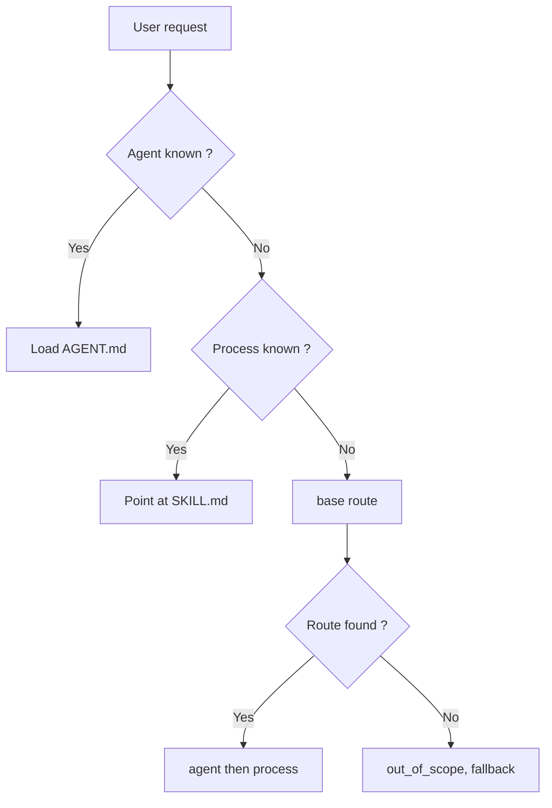

<!-- fr-synced: c192630befb37a2e09652f9440e6e5fc6841ed8a -->
# Routing a request to the right process (and opening the right resources)

A misrouted request loads everything, mixes everything together, and drowns the decisions that matter under a wall of instructions. BASE avoids this by distinguishing three gestures that AI tools often conflate: choosing an agent, routing to a process, opening the resources. Keeping them apart keeps what is actually being decided in plain sight. If you are building or using a BASE and want to know how a request finds its way, this page shows it.



## 1. Choosing an agent

When you know which assistant to use, the simplest thing is to select it directly:

```text
Read .ai/agents/assistant-devis/AGENT.md
```

The agent is the job description. It says which role to play, how to speak, which workflows exist, and where the useful files are.

For a single assistant, this manual selection is often enough. There is nothing to install, nothing to index, and no routing catalog to maintain.

## 2. Routing to a process

When several workflows are possible, BASE can route a request to the right process:

```bash
base route "I need to prepare a client quote" --root <base-folder>
```

The router picks an agent → process pair, or abstains with a readable reason. It does not load every instruction, and it does not search freely across the whole repository. Its mechanism stays rudimentary but effective, and it extends through adapters. Above all, it takes the mental load of hunting for the right process off the user.

This limit is deliberate. A process answers the question:

```text
What needs to be done now?
```

This is a workflow decision. It must stay short, testable, and explainable.

The recommended signals for a routable process are:

- `description`: what the process does;
- `use_when`: when to use it;
- `routing.examples`: real user phrasings;
- `routing.avoid_when`: counterexamples that prevent false routes.

The `.ai/routing/route-tests.json` fixtures protect the important routes against regressions.

## 3. Opening the useful resources

Once the process is chosen, it can reference the resources it needs:

- domain competences;
- documents;
- templates;
- tools;
- local data;
- external sources via connectors.

These resources answer a different question:

```text
What should it be done with?
```

They are context, tools, or data. Keeping this boundary is first and foremost a matter of security: a process's instructions execute, a resource's content does not. Mixing the two opens the door to injection, where a piece of data tries to pass itself off as a *consigne*. The choice of the main workflow therefore stays apart.

A process can declare them in its frontmatter:

```yaml
requires:
  - ref: calculer-devis
    access: execute
    purpose: price the quote
may_use:
  - catalogue/services.json
```

Use `requires` for a resource the process must open or execute in a structured way, ideally via its `id`. The `access` field describes the use the process expects, for example reading or executing. It does not grant a right of access.

Use `may_use` for simple or optional context, often a readable path in the project. The process can also cite these resources in its steps when the context stays simple. What matters is that the logic stays readable: the router chooses the process, then the process indicates what to open.

## Who enforces the rights?

BASE does not replace the environment's normal rights. If a source lives in a folder, a Drive, an API, or an external tool, the actual rights remain those of that folder, that Drive, that API, or that tool.

BASE enforces its own guardrails only on the actions that pass through it:

- `base open` or `open_resource` to open an inventoried resource;
- `base access` or `access_resource` to read a path confined to the project;
- `base invoke` or `invoke_tool` to prepare or execute a tool;
- `base propose` then `base commit`, or `propose_change` then `commit_change`, for a mediated write.

The practical rule is:

```text
The process declares the needs.
BASE mediates certain actions.
The actual rights stay carried by the OS, the tool, the connector, or the API.
```

## Why not route all resources?

BASE could evolve toward broader routing: finding a competence, a tool, a template, or a document directly from a request.

That would be useful in some contexts, but it must stay an explicit extension. Routing an action and retrieving context are not the same responsibility.

The current choice is therefore conservative:

```text
route = choose the process to follow
discover/open = find or open the useful resources
```

This separation keeps the system understandable for a single person, testable for a team, and extensible for an organization.

## When BASE finds no route: the fallback

The router stays honest: if the request matches no workflow, it abstains (`out_of_scope`) instead of inventing a route. But the user must never be left without a next step.

A project can declare a help fallback in `base.config.json` or `base.config.mjs`:

```json
{
  "routing": {
    "fallback": { "agent": "concierge-base", "process": "accueil" }
  }
}
```

When the router abstains honestly, it adds a `fallback` pointer to the result. This is separate metadata, never a false route: the `status` stays the honest abstention. The assistant then loads this fallback (an agent → welcome process) rather than leaving the user stuck.

The core stays agnostic: the target is configured, never hard-coded; a target that cannot be found attaches no fallback (and `base validate` flags it). The fallback simply orients, promising nothing more.

```text
Routing "Hello": out_of_scope (below_floor)
Fallback: concierge-base -> accueil
```

This promise holds when routing is enabled and when the fallback target exists in the selected root. In a copied example that loads a domain agent directly, "Help" may simply open the local domain help. To get the BASE concierge, add the fallback and the `concierge-base` folder, or load `.ai/agents/concierge-base/AGENT.md` directly when it exists.

## Root and workspace

A **root** is a confined BASE project: a folder with its `.ai/`, its agents, its data. Every read, write, or execution stays within the selected root.

Three situations, from simplest to most advanced:

- **A single root.** The default case. Open the folder, that is your BASE.
- **Nested subprojects.** A container folder with several `.ai/agents/` underneath: the CLI and the MCP detect the nearest root.
- **Several declared roots (multi-client).** A `base.workspace.json` file lists named roots:

```json
{
  "schema_version": "base.workspace.v1",
  "id": "agence",
  "roots": [
    { "id": "client-a", "path": "clients/a", "default": true },
    { "id": "client-b", "path": "clients/b" }
  ]
}
```

`base route "<request>" --workspace base.workspace.json` can then search across the roots; `--root-id client-b` targets a specific root. Routing traverses the roots, but each action stays confined to the chosen root. Details in `specs/current/10_core/cli.md` and `mcp/README.md`.

## Practical rule

- If you know which agent to use, load its `AGENT.md`.
- If you already know which process to follow, point at its `SKILL.md` directly: routing is an entry point, not a mandatory passage.
- If the request could follow several workflows, use `base route` or `route_request`.
- If the process needs context, open only the resources it references or that you discover for that need.

This discipline avoids the wall of instructions, limits wasted tokens, and keeps the important decisions visible.
