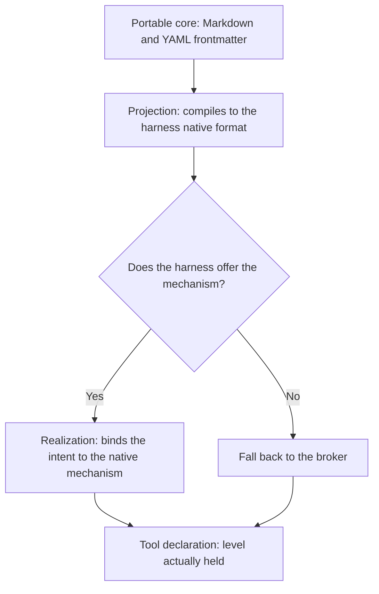

<!-- fr-synced: 07917297c3698cc37ef72c539981af908b860cf0 -->
# BASE Spec v0: founding principle and where to read the current spec

This page is a landmark for anyone looking for the BASE specification. It states the founding principle and points to the up-to-date engineering specification, so you don't end up working from a stale text.

> **This page is deliberately short.** The engineering specification of the BASE tooling (broker, CLI, MCP, ports, schemas) lives in `specs/current/`, in English, verified against the code and the tests; each published version is frozen by a git tag (`git show v1.0.0:specs/current/…`). In case of divergence, `specs/` is authoritative.

Entry point: [`specs/current/README.md`](../../../specs/current/README.md).

"v0" referred to the initial conceptual narrative of BASE, before the engineering specification existed. Its normative content has been absorbed into `specs/current/`; this page keeps the founding principle and the reading map.

## The fundamental principle, unchanged

> The human and the AI work with text files. The code guarantees the invariants that natural language cannot.

BASE is a minimal protocol for durably articulating knowledge, instructions, processes, data, executable tools, permissions, human decisions, useful traces, and adapters to different agents or harnesses. To clear up common confusions: it is not an app, not an automation UI, not a workflow engine, not a database, and not a packaged prompt.

## Where to read what now

| What v0 described | Where it lives today |
| ---------------------- | ----------------------- |
| Definitions (Resource, Source, Connector, Broker, etc.) and invariants | [`specs/current/00_overview/`](../../../specs/current/00_overview/vision.md) and [`specs/current/10_core/requirements.md`](../../../specs/current/10_core/requirements.md) |
| Stable shape of resources (YAML frontmatter + free-form Markdown) | [`specs/current/10_core/frontmatter.md`](../../../specs/current/10_core/frontmatter.md) and [`base.schema.json`](../../../base.schema.json) |
| Process skills vs competence skills | [Understanding BASE](../learn/comprendre.md) and [Routing, processes, and resources](routage-process-et-ressources.md) |
| Advisory / hybrid / strict modes and the honesty rule | [Trust and limits](../trust/securite-et-limites.md) and the generated [Harness compatibility](compatibilite-harnesses.md) matrix |
| Router and broker primitives | [`specs/current/10_core/routing.md`](../../../specs/current/10_core/routing.md) and [`specs/current/10_core/architecture.md`](../../../specs/current/10_core/architecture.md) |
| Propose → commit flow, execution, promotion | [`specs/current/10_core/writes.md`](../../../specs/current/10_core/writes.md) |
| Testing discipline | [`specs/TESTING.md`](../../../specs/TESTING.md) |
| What is shipped, planned, or out of scope | [Implementation status](etat-implementation.md) |

## The key invariants, one line each

The detail lives in `specs/current/`, but three invariants deserve to stay legible here:

- **Derived index**: manifests, caches, and indexes are not the source of truth; they regenerate from the files.
- **External data ≠ instruction**: an email, a résumé, or web content is treated as data, never as a governance instruction.
- **Canonical broker**: the CLI, the MCP, and the adapters delegate to the same primitives instead of reimplementing parsing, search, permissions, or tracing.

## The honesty rule of the modes

```text
advisory = guide/audit
hybrid = explicit partial enforcement
strict = mediated enforcement
```

An adapter must declare its real level. BASE does not promise strict mode if the harness only allows advisory. The generated [Harness compatibility](compatibilite-harnesses.md) matrix makes this rule computable.

## The long-term vision kept here: portability

The only part of v0 that stays forward-looking is the target of portability across harnesses. "Total" compatibility is not an attainable goal and must not be promised; the achievable goal is **graceful degradation + declared level**. Three strata:

1. **Portable core**: Markdown and semantic YAML frontmatter, declaring intents and hooks, never mechanisms specific to a single tool.
2. **Intermediate layer**: the projection compiles the core to each harness's native format (generated output, never source); the realization binds each intent to the best mechanism the harness offers, otherwise falls back to the broker, and records the level reached.
3. **Tool declaration**: per agent, harness, and intent, the level actually held, computable rather than editorial. This is what `.ai/tools.md` already projects.



The broker is the fallback realization: whatever a harness does not do natively, the broker takes on as soon as the action passes through it (confinement, dry-run, trace, mediated write). An intent like `requires_confirmation` reaches a strict level only for the actions that actually pass through it.

Documented migration target: a single semantic dialect (`base.resource.v2`) that would absorb the resource dialect and the skill dialect that are distinct today; the native frontmatter would become projections, generated and verified in CI like any derived artifact.

---

BASE is a framework by [AI Swiss](https://a-i.swiss). Use case in partnership with [Innovaud](https://innovaud.ch).
