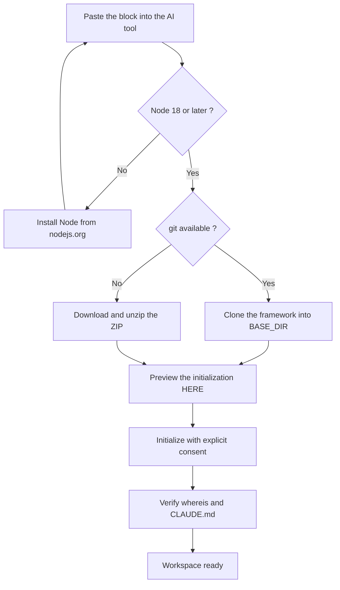

<!-- fr-synced: 54f945b325d420c33afb1ca56d89d61d651a0abd -->
# Have your AI install BASE

Installing BASE can be your AI's job, not yours: you walk away with a ready-to-use
workspace without having typed a single command, provided you have a tool that can run those
commands for you and that you can review each step before it's applied. In practice, you paste a
block into an AI tool that can run commands (for example GitHub Copilot, Antigravity, Claude Code
or Cowork, OpenCode, Kilo Code), it does the installation for you and tells you when your
workspace is ready.

## Before you paste the block

1. Create an empty folder for your work: for example, in your Documents, a folder
   `mon-assistant`.
2. Open that folder in your AI tool that can read your files (for example GitHub
   Copilot, Antigravity, Claude Code or Cowork, OpenCode, Kilo Code): depending on the tool, this
   is a *File → Open Folder*, or a `cd mon-assistant` followed by launching the tool in that
   folder.
3. Open the chat in **agent mode** (the one that can run commands): depending on the tool,
   this is an *Agent* mode to enable in the chat panel, or the default mode.
4. Paste the block below and send it.

## The block to paste

```text
Mission: install BASE and create my workspace in the current folder.

First, ask me: "Where do you want to install the BASE framework?"
(suggest the "base" subfolder of my Documents, and call that path <BASE_DIR>).

Steps; check each output before continuing:
1. `node --version`: Node 18 or later is required. Otherwise, guide me to install it from
   nodejs.org. After installing, I close and reopen my tool, paste this prompt again,
   and you pick up here.
2. Install the framework in <BASE_DIR> if it is not already there:
   `git clone https://github.com/ai-swiss/base.git <BASE_DIR>`
   If git is not available, download
   https://github.com/ai-swiss/base/archive/refs/heads/main.zip, unzip it, and
   place its contents in <BASE_DIR>, then continue. (On Mac, typing git may open a
   developer-tools install dialog: that is normal, and the ZIP avoids it.)
3. Show me what initialization would create HERE (my working folder, not <BASE_DIR>):
   `node <BASE_DIR>/tools/base.mjs init`
   then, with my explicit consent: `node <BASE_DIR>/tools/base.mjs init --yes`
4. Verify: `node <BASE_DIR>/tools/base.mjs whereis` shows <BASE_DIR>,
   and the file CLAUDE.md now exists in my folder.
5. Tell me the exact phrase to send you to begin
   ("import my existing procedures" if I already have documents to convert).

Guardrails: NEVER overwrite an existing file; do not install anything else without
asking me; if a step fails, show me the exact error instead of improvising.
```

Here is the flow your AI follows:



## What happens next

Your folder now contains an agent, its configuration, and the files your tool
reads to become the **router** for your domain (depending on the tool, a `CLAUDE.md`, an
`AGENTS.md` or an equivalent rules file in the tool's folder). Talk to it
normally: it directs each request to the right process and follows it, without you having to
figure out which one to use.

- **Convert your existing documents**: say "importer mes procédures existantes". Each
  conversion is offered to you as a diff; nothing is written without you.
- **The Studio**: to browse, edit and evaluate your assistants in an interface,
  `node <BASE_DIR>/tools/base.mjs studio --root .` opens BASE Studio.
- **Keep the framework up to date**: `node <BASE_DIR>/tools/base.mjs update`.
- **Where BASE lives**: `node <BASE_DIR>/tools/base.mjs whereis` (the location is also noted
  in `~/.config/base/config.json`, editable by hand).

Prefer to do everything yourself? See [Get BASE](obtenir-base.md) and
[Install a workspace](installer.md).
