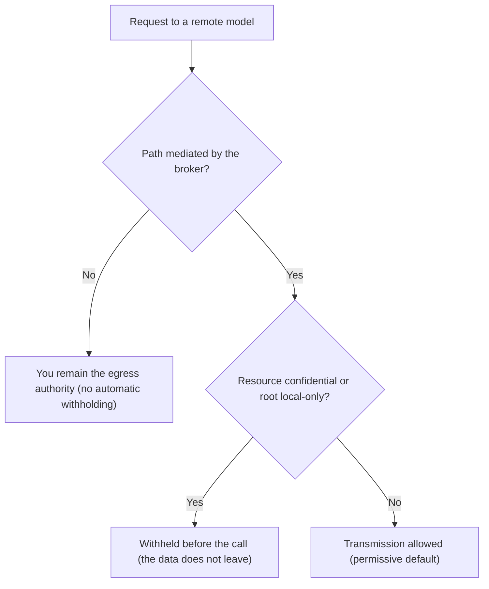

<!-- fr-synced: d6b9fdf9cda323341e86fafd0ba43b7f99fee844 -->
# The boundary: local by default

Knowing what stays on your machine and what may leave for a remote service is knowing what you can entrust to BASE with your eyes open. This page draws that boundary, for an institution that needs to know what to expect. It is informational and is neither legal advice nor a compliance opinion: the institution remains responsible for its own data protection impact assessment (DPIA) and security policy.

Throughout this page, we distinguish two levels of guarantee:

- a **mechanism**: a behavior enforced by the BASE broker, verifiable, that does not depend on a model's goodwill;
- a ***consigne***: an instruction written into a file and followed by a cooperative model, with no technical guarantee.

This distinction is the foundation of BASE's honesty. A guarantee is real only when it runs through a mechanism able to enforce it.

## 1. What is local by default

In its default configuration, BASE makes no network calls.

- **Routing is 100% lexical and local.** Agent and process selection happens by lexical matching on the machine, with no network call whatsoever (mechanism). Semantic ranking by embeddings is an option, disabled by default.
- **Files do not leave the machine.** BASE keeps your resources local. The BASE core never calls a provider on its own; in a configuration with no provider, no data is sent off the machine (mechanism).
- **The `.ai/trace` log is local.** Operations mediated by the broker write a local line in `.ai/trace/`, on the machine, with no domain content by default (mechanism). See the dedicated section below.

The fact that your files stay local does not mean that everything you then entrust to an AI tool stays local. The content of a conversation, or of a file opened in an AI tool, may be transmitted to that tool's provider. That is the subject of the next two sections.

## 2. What can only leave on explicit choice

No network call happens without a deliberate configuration choice. Two outbound paths are possible, and only if you enable them.

- **An embeddings provider, if you enable it.** Optional semantic ranking sends text (the query, and the text of routable resources) to an embeddings service. This outbound path exists only if you supply an embedder. You can keep it entirely local with Ollama (`createOllamaEmbedder`), in which case there is still no network call. You can also route it through an internal gateway you control. The details are in [Routing security and data](securite-donnees-routage.md).
- **The call to the model itself.** The call to the language model is made by the AI tool you use (the CLI, the extension, or the application), to the provider the institution has chosen. This call happens **outside BASE**: the choice of model and provider, and any processing on the provider's side, are not within BASE's scope. Before processing personal, customer, HR, financial, medical, or regulated data, check that tool's terms of use, retention options, contractual guarantees, and where the processing takes place.

## 3. Under whose authority

The boundary is guarded in two places, by two distinct authorities.

- **The institution chooses the model and the provider.** This choice is external to BASE. BASE does not select a model, does not impose a provider, and does not stand in for the institution's policy.
- **BASE refuses to let confidential or strictly local resources leave for a remote model, before any call.** This is an egress control mechanism: a resource marked confidential, or a root declared local-only, is not transmitted to a remote model, and the check happens **before** the call, not after. This mechanism protects against the unintended transmission of resources placed under the broker's control. It does not control what the user types directly into an AI tool outside BASE, nor what the provider then does with the data it receives.

A concrete example. A customer record contains an IBAN, and you mark it `confidential`. You ask your assistant, wired in through the broker, to draft a payment reminder with a remote model. Before the call, BASE sees the marker, holds the record back, and the assistant works without the IBAN leaving for the provider. The sensitive data does not leave your machine, and you had nothing to watch over.

The egress decision follows this path before any call to a remote model:

**Exact scope of the mechanism.** The withholding operates on the paths mediated by the broker, where BASE prepares what goes out to the model: the MCP server, the Studio chat, evaluation. On a direct command line (for example `base open` on a resource, then copy-pasting into an AI tool), you remain the egress authority: no automatic withholding operates, by design. And the withholding triggers on a resource's **explicit `confidential` flag** (or a local-only root), not on the `sensitivity` taxonomy: data classified `restricted` or `sensitive` but not marked `confidential` is not withheld. Mark `confidential` any resource that must never reach a remote model. Finally, the **default is permissive**: a root has egress policy `any` unless declared otherwise, so apart from `confidential` resources its content may be transmitted; declare the root `local-only` in `base.config.json` to withhold everything from a remote model.

In short, the institution decides where the data goes at the provider level; BASE prevents, at the broker level, an explicitly confidential or local resource from leaving for a remote model.

## The trace log

The `.ai/trace` log makes mediated operations auditable locally, without becoming a surveillance tool.

- **What it records.** Operations that go through the broker (opening a resource, accessing a confined file, invoking a tool, proposing then committing a write) write a minimal JSONL line: identifiers, decisions, durations. By default, **no domain content** is recorded.
- **Where it lives.** The log is local, in the project's `.ai/trace/` folder. It is not transmitted to a remote service by BASE, and that folder is ignored by git.
- **How to purge it.** You can empty the log with `base trace clear`, keep only the last N days with `base trace prune --keep-days N`, or, as a last resort, manually delete the `.ai/trace/` folder.

Retention of this log is not managed by BASE. It is the operator's or the institution's responsibility: defining a retention period, the purge, and, where applicable, archiving fall under your internal policy. BASE provides neither regulatory retention nor legal archiving.

## Limits to keep in mind

- BASE is not an agent runtime, not an orchestration engine, not a RAG system, not a platform, and not an IAM, DLP, SIEM, or RBAC. It provides neither regulatory retention nor legal archiving.
- BASE does not guarantee the accuracy of the model's answers, nor the processing carried out by the AI provider.
- The egress and confinement mechanisms apply to actions mediated by the broker. An action that bypasses BASE depends on the native rights of the tool and the environment.

For the full security model and the limits by adoption level, see [Security and limits](securite-et-limites.md). For the details of the strings sent during semantic routing, see [Routing security and data](securite-donnees-routage.md).
