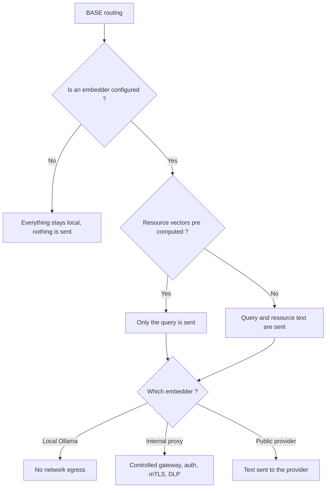

<!-- fr-synced: bba615a9b31faa3b7934e2d24861000553a552de -->
# Keeping your data under control when routing uses a provider

As soon as BASE's semantic routing relies on an embeddings provider, text leaves your machine, and you need to be able to say exactly which text and how to control it. For teams wiring up this routing, this page shows what is actually sent, how to reduce exposure, how to go through an internal proxy, and how to log without ever exposing domain content.

## Nothing is sent without explicit configuration

The BASE core **never** calls a provider. In a zero-provider configuration, no data leaves the machine. Sending becomes possible only if you supply an `embed` (directly or via `createOpenAICompatibleEmbedder` / `createOllamaEmbedder`). The zero-config path (lexical + `semanticHybrid`) is entirely local.

## Which strings are sent

With a provider configured, two kinds of text can be embedded:

1. **The query** (the user's request).
2. **The text of each routable resource**: by default `route_text` + `title` + `description` +
   `keywords` + `body` (`textForResource`). You control this scope.

## Reducing exposure

The following diagram summarizes what leaves the machine depending on the configuration:



- **Pre-compute** the resource vectors in a controlled environment (`@ai-swiss/base-index-local`)
  and serve them through `getResourceEmbedding`. At query time, **only the query** is sent.
- **Trim `textOf`** to the minimum that still routes well; often `route_text` alone is enough:

  ```js
  createSemanticRanker({ embed, textOf: (r) => [r.route_text, r.title].filter(Boolean).join("\n") });
  ```

- **Stay local** with `createOllamaEmbedder()`: no network egress.
- **Go through an internal gateway**: `createOpenAICompatibleEmbedder({ baseUrl })` pointing to a reverse
  proxy you control (auth, mTLS, DLP). Configured well, this proxy keeps domain text out of any public endpoint.

## Secrets

`createOpenAICompatibleEmbedder` reads `OPENAI_API_KEY` by default, or accepts an explicit `apiKey`.
Store keys in a secrets manager or environment variables, never in the repository. An auth failure is typed `EmbeddingAuthError` (`code: "semantic.auth"`) and is **never
retried**: a bad key fails fast instead of hammering the provider.

## Logging without domain content

The `onMetric` hook reports only operational signals (`{ provider, batchSize, attempt,
latencyMs, cacheHit, similarity, dimension }`): **no text, no vectors**. Log them
freely; never log the embedded strings or the raw query if the corpus is sensitive.

```js
createSemanticRanker({ embed, onMetric: (m) => logger.info({ embedding: m }) }); // safe: no content
```

## Cancellation and limits

Every provider call respects a `timeoutMs` and an `AbortSignal` (`ctx.signal`): an embedding that runs too long or
spins out of control can be bounded and canceled from the CLI, the MCP, or a server.

## Scope

Semantic routing improves **relevance**; it does not replace your organization's IAM, DLP, SIEM, or
retention policies. See also [`docs/trust/securite-et-limites.md`](securite-et-limites.md).
