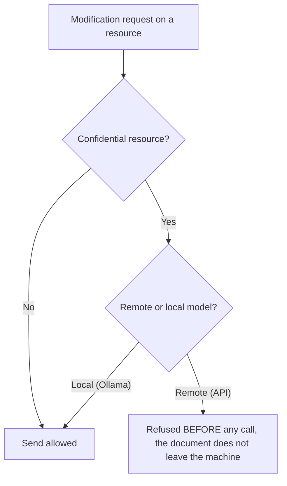

<!-- fr-synced: 677f5f82e5965291bdd5fadd5e565f06d119a93d -->
# Perimeters and egress governance

*⏱ ~15 min · module 2/3, Team track*

**You will**: trigger, then read, an egress refusal on a real confidential resource, proven by the ✅ below.
**You need**: module 1 completed; Studio open on `exemples/agence-multi-clients`; a REMOTE model (API) connected in Settings (guide "Connect a model", Practitioner track module 6). The check happens BEFORE any call to the model: even an invalid key is enough to observe the refusal.
↻ **Reminder**: without looking, what does a root guarantee? (an isolated write perimeter)

The Dupont Conseil client contains a resource already marked confidential:
`clients/dupont-conseil/tarifs/remises-confidentielles.md` (`confidential: true`).

1. In Studio, open this resource.
2. Open its chat, choose your REMOTE model.
3. Ask for a modification (for example, *"rephrase this discount table"*).

✅ **Check**: BASE refuses to send to the remote model and explains why ("this document is confidential ... choose a local model"); you see the reason on screen. The same request with a LOCAL model (Ollama) goes through: that is exactly the rule.

💡 **Why it worked**: governance lives in files (`confidential: true` on a resource, or `egress: local-only` on a whole root), not in a console. There is a single rule: nothing confidential leaves for a remote model, and the check happens BEFORE the call, so the document never leaves the machine. The refusal is SPOKEN: that is the difference between a *consigne* (followed) and a mechanism (enforced).

🔁 **At home**: which of your data must NEVER leave your machine for an API? Mark it `confidential: true`, or switch the whole root to `egress: local-only`.

→ **And now**: [Module 3: distribute](equipe-3-distribuer.md).

🆘 **Common failures**: *No refusal*: is the chosen model really REMOTE? (a local model like Ollama is allowed, that's intended). Does the resource carry `confidential: true`? *No model to choose in the chat*: first add a provider in Settings (Practitioner track module 6).
