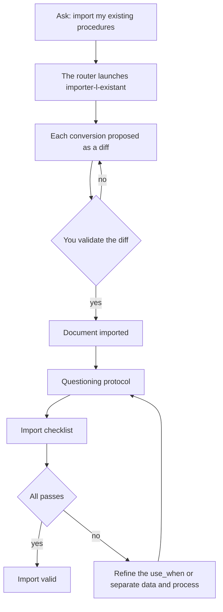

<!-- fr-synced: f338f764998f078a3f148c1681946fe159d0a91c -->
# Migrate YOUR content

*⏱ ~15 min · module 9/9, Practitioner track*

**You will**: turn two or three of your real documents into content your assistant actually uses, proven by the ✅ below.
**You need**: the previous modules; your `mon-office-tourisme` folder (or a folder of your own) open.
↻ **Reminder**: without looking, what does every write in BASE go through? (the gate: propose then commit)

You have built up a "Back home" list across the modules. That's your backlog.

1. In your folder, ask: *"import my existing procedures"*. The router launches the
   `importer-l-existant` process, which proposes each conversion as a diff: nothing is written without you.
2. Import two or three documents from your list.
3. Check each import with the **questioning protocol** (Discovery module 3): a
   question only the document can answer, a trick question outside the document, a routing request.
4. Run through the **import checklist**:
   - [ ] each process's use_when describes an intent, not a title;
   - [ ] the data (rates, fact sheets) is separated from the processes that use it;
   - [ ] the steps with a human decision carry an `[A VALIDER]`;
   - [ ] anything that can expire carries a date (`valid_until`).

✅ **Check**: for each imported document, the questioning protocol passes (cites the right doc, admits ignorance, routes correctly) AND the checklist is ticked.

💡 **Why it worked**: this is where the tutorial becomes your tool: the same structure as the Veytaux tourism office, applied to your domain. The checklist encodes what the modules taught: you import with a grid, never blind.

🔁 **Back home**: plan the next one: which third document, which next task to automate?

→ **And now**: you've finished the Practitioner track: YOUR assistant answers about YOUR content. For several people, see the [Team track](equipe-1-workspace.md).

🆘 **Common breakdowns**: *The import proposes nonsense*: guide it document by document rather than all at once. *The protocol fails*: refine the use_when, or separate data from process.
