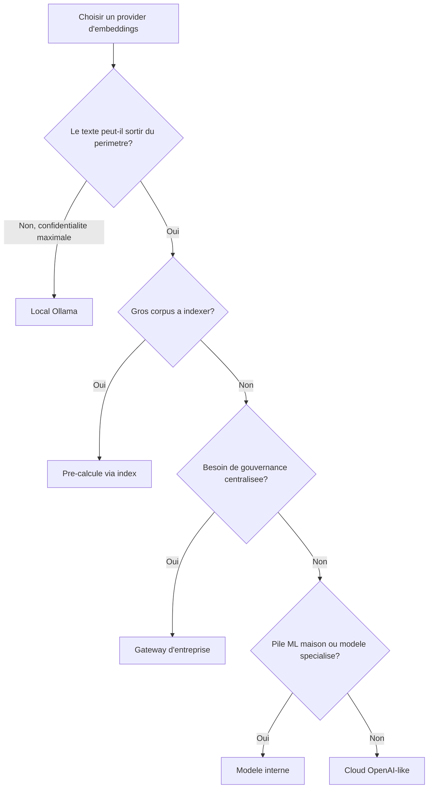

# Choisir son provider d'embeddings

Cette page aide quiconque met BASE en production à choisir d'où viennent ses embeddings, selon ses
contraintes de confidentialité, de coût et de gouvernance. Embedder du texte est un choix explicite:
vous passez un `embed` à `createSemanticRanker`, et BASE n'en impose **aucun** à votre place.

## Les options

| Option | Comment | Quand |
|---|---|---|
| **Local (Ollama)** | `createOllamaEmbedder()`, tout reste sur `localhost` | confidentialité maximale, offline, démos, postes individuels |
| **Cloud (OpenAI-like)** | `createOpenAICompatibleEmbedder({ model })` | qualité élevée, zéro infra à gérer, données peuvent sortir |
| **Gateway d'entreprise** | `createOpenAICompatibleEmbedder({ baseUrl })` vers un proxy interne | grande organisation: auth, journalisation, DLP au niveau du proxy |
| **Modèle interne** | un `embed: async (t) => monModele.embed(t)` quelconque | pile ML maison, souveraineté, modèle spécialisé |
| **Pré-calculé (index)** | `getResourceEmbedding` servi par `vectorFor(index, resource)` de `@ai-swiss/base-index-local` | gros corpus; le texte ressource ne transite pas à la requête |

BASE ne fournit volontairement **aucun** helper «meilleur provider»: figer une préférence technique
dans le cœur reviendrait à choisir à votre place.

## Les critères

- **Confidentialité.** Le texte sort-il de votre périmètre? Local et gateway interne le gardent;
  cloud public l'envoie. Voir [Sécurité & données](../trust/securite-donnees-routage.md).
- **Coût.** Cloud = coût par token; local = coût matériel; pré-calculé = coût amorti au build.
- **Latence.** Local dépend de votre machine; cloud de la liaison réseau; pré-calculé est quasi nul à
  la requête (seule la requête est embeddée).
- **Qualité.** Les grands modèles cloud dominent souvent; un bon modèle local suffit fréquemment pour
  du routage (le `route_text` est court et discriminant).
- **Gouvernance.** Un gateway donne un point unique pour l'auth, la journalisation expurgée, la
  rétention et la conformité, sans toucher au cœur BASE.

## Robustesse, quel que soit le choix

Tous les providers du package héritent des mêmes garanties: `timeoutMs`, `AbortSignal` (`ctx.signal`),
retries bornés sur erreurs transitoires uniquement, backoff avec jitter, erreurs typées (`.code`).
Une mauvaise clé échoue vite (`semantic.auth`, jamais retentée); une panne réseau est retentée
(`semantic.network`).

## Réduire ce qui est envoyé

- **Pré-calculez** les vecteurs ressource via un index: seule la requête est envoyée en direct.
- **Limitez `textOf`** au strict utile (souvent `route_text` suffit).
- **Passez par un proxy** interne pour éviter d'exposer directement un endpoint public.

Détail complet: [Sécurité & données du routage](../trust/securite-donnees-routage.md).
