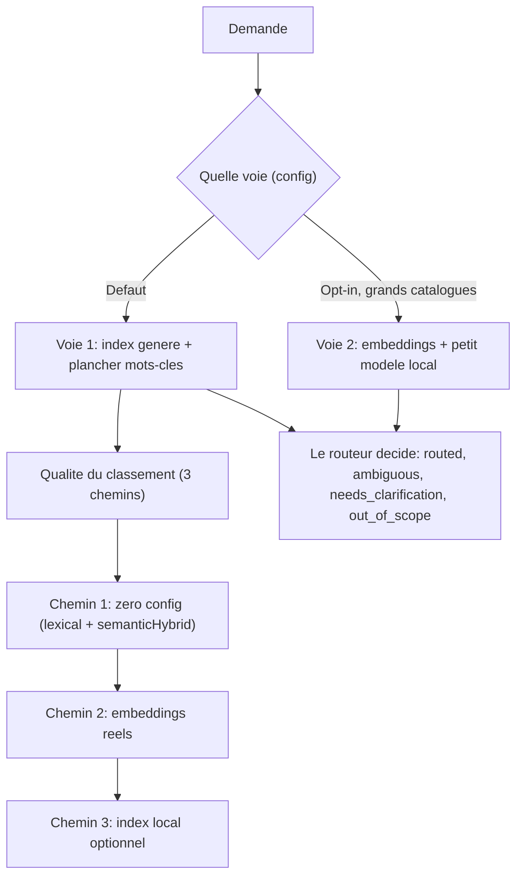

# Mettre en place le routage sémantique, du zéro config aux embeddings réels

Dès que vous installez BASE, les demandes doivent atteindre le bon agent et le bon process sans config
initiale, puis gagner en qualité quand le besoin se présente: c'est ce que vous réglez ici. BASE route
une demande, ou s'abstient honnêtement quand rien ne convient.

BASE route de **deux façons, choisies par la configuration**. La **Voie 1** est le défaut: l'assistant
lit l'index généré et choisit, avec un plancher déterministe par mots-clés en filet hors-ligne. La
**Voie 2** est optionnelle, pour les grands catalogues: des embeddings retrouvent quelques candidats et
un petit modèle local les raffine (il choisit, ou demande une précision); voir
[Voie 2, le routage par embeddings](voie-2-routage-embeddings.md). Cette page-ci détaille la Voie 1 et,
en son sein, la **qualité du classement** des candidats: un ranker classe, mais c'est le routeur qui
décide. Vous passerez par trois chemins, du plus simple au plus robuste; commencez par le premier,
n'allez plus loin que si vous en avez besoin.



Le routage BASE choisit le workflow primaire, pas toutes les ressources possibles. La chaîne complète
est la suivante: choisir un agent, router vers un process, puis ouvrir les compétences, tools, templates,
documents ou données dont ce process a besoin. Pour la doctrine complète, voir
[`docs/reference/routage-process-et-ressources.md`](../reference/routage-process-et-ressources.md).

## Atteindre le bon agent (le plus simple d'abord)

Avant la *qualité* du classement (les «chemins» ci-dessous), voici comment l'assistant arrive sur
le bon agent, du plus simple au plus automatique:

- **Manuel, zéro outil.** Si vous savez quel agent vous voulez, pointez directement son `AGENT.md`:
  c'est le seul fichier à charger. «Lis `exemples/assistant-devis/.ai/agents/assistant-devis/AGENT.md`»
  suffit (chemin relatif au dépôt; dans un projet d'assistant, c'est simplement `.ai/agents/<agent>/AGENT.md`).
  Aucun routage, aucune installation.
- **CLI.** `base route "<demande>" --root <projet>` choisit l'agent → process de façon déterministe, et s'abstient
  honnêtement si rien ne convient. Le même routeur, par le terminal.
- **MCP.** L'outil `route_request` expose ce même routeur à un outil IA capable de lire vos fichiers
  (par exemple GitHub Copilot, Antigravity, Claude Code ou Cowork, OpenCode, Kilo Code).
  Pour le brancher, suivez le process `activer-routage`.

Le routage (CLI/MCP), déterministe par défaut, sert surtout quand plusieurs process ou agents peuvent
répondre, ou quand vous voulez des garanties (abstention testée, fixtures). Il épargne à l'utilisateur la
peine de chercher le bon process. Dès qu'un ranker à embeddings entre en jeu, le classement dépend du
fournisseur choisi; les statuts et les fixtures, eux, ne changent pas. Pour un seul assistant simple,
le chargement manuel suffit.

Les trois «chemins» ci-dessous traitent une question différente: la qualité du classement des
candidats au sein de la Voie 1, du lexical zéro-config aux embeddings réels. (À ne pas confondre avec la
Voie 2, qui est une autre voie de routage, pas un ranker.)

## Chemin 1: zéro configuration

Écrivez des agents et des process en Markdown, avec un `use_when` par process. BASE route avec son
cœur zéro-dépendance: lexical + `semanticHybridRanker` (token overlap, alias par sous-ensemble de
tokens, similarité floue), abstention structurée, fixtures de routage, MCP.

```bash
node tools/base.mjs route "le client conteste sa facture" --root exemples/routage-pme
node tools/base.mjs route-test --root exemples/routage-pme   # rejoue les routes attendues
```

Idéal pour une personne seule, une petite équipe, une démo, un premier déploiement. Voir l'exemple
[`exemples/routage-pme`](../../exemples/routage-pme/README.md).

### Renforcer sans dépendance: `semanticHybrid`

Dans `base.config.json`, déclarez des alias (synonymes métier), toujours zéro dépendance:

```json
{
  "rankers": [
    { "type": "semanticHybrid", "aliases": { "proposition": ["offre commerciale", "devis"] } }
  ]
}
```

La règle est simple: utilisez `base.config.json` pour les options déclaratives (`semanticHybrid`, seuils,
validateurs), et `base.config.mjs` quand vous devez importer du code, par exemple un fournisseur
d'embeddings. Si les deux existent, BASE préfère le JSON déclaratif; gardez donc un seul format par
projet quand vous activez des embeddings réels.

## Chemin 2: embeddings réels

Installez `@ai-swiss/base-ranker-semantic`, choisissez un fournisseur, ajoutez un ranker dans
`base.config.mjs` (config exécutable, car un ranker est du code). Le cœur ne gagne aucune dépendance
modèle ou cloud.

```bash
npm install @ai-swiss/base-ranker-semantic
```

Dans le monorepo BASE, pour contribuer localement, le package vit dans
`packages/base-ranker-semantic/`.

```js
// base.config.mjs : endpoint OpenAI-compatible (OpenAI, Azure-like, gateway interne)
import { createOpenAICompatibleEmbedder, createSemanticRanker } from "@ai-swiss/base-ranker-semantic";

const embed = createOpenAICompatibleEmbedder({
  model: "text-embedding-3-small",
  // baseUrl: "https://gateway.interne/v1",  // un gateway d'entreprise
  timeoutMs: 10_000,
  retries: 2,
});

export default { rankers: [createSemanticRanker({ embed, minSimilarity: 0.25 })] };
```

```js
// base.config.mjs : Ollama, tout reste en local
import { createOllamaEmbedder, createSemanticRanker } from "@ai-swiss/base-ranker-semantic";
export default { rankers: [createSemanticRanker({ embed: createOllamaEmbedder() })] };
```

```js
// base.config.mjs : n'importe quel provider, ou des vecteurs pré-calculés (aucun texte ressource envoyé)
import { createSemanticRanker } from "@ai-swiss/base-ranker-semantic";
import { vectorFor } from "@ai-swiss/base-index-local";
export default {
  rankers: [createSemanticRanker({
    embed: async (textOrTexts, ctx) => monModele.embed(textOrTexts, { signal: ctx?.signal }),
    getResourceEmbedding: (r) => vectorFor(index, r),
  })],
};
```

Le package est robuste par défaut sur les appels provider: il gère les timeouts, l'`AbortSignal`, des
retries bornés (transitoires seulement) et des erreurs typées. Pour coalescer beaucoup d'appels
concurrents, enveloppez le provider avec `createBatchingEmbedder`. Détails:
[`packages/base-ranker-semantic/README.md`](../../packages/base-ranker-semantic/README.md) et
[la page provider](choisir-provider-embeddings.md).

## Chemin 3: index local optionnel

Quand le corpus devient grand, dérivez un index local supprimable avec `@ai-swiss/base-index-local`.
Le modèle utilisateur reste le même, sans catalogue à tenir à la main, et les statuts de routage par
défaut ne bougent pas. Voir [Comprendre l'échelle](../learn/comprendre-echelle.md).

## Lancer les fixtures

`.ai/routing/route-tests.json` liste des demandes et la route attendue (statut, agent, process). C'est
un test de régression, pas une mesure de performance académique:

```bash
node tools/base.mjs route-test --root <projet>          # sortie lisible, exit ≠ 0 si une route casse
```

## Lire les raisons de score

`route --json` rend chaque composante de score explicite, avec des raisons consultables plutôt qu'un
score de confiance opaque.

```bash
node tools/base.mjs route "panne au login" --root exemples/routage-pme --json
```

| Raison | Signifie |
|---|---|
| `route:<terme>` | le terme a matché le `route_text` (signal de routage le plus fort) |
| `route_text:use_when` | le `route_text` vient du `use_when` (signal voulu); `:title`/`:path` = signal faible |
| `route_avoid:<terme>` | un `routing.avoid_when` a matché: le score est **annulé** (contre-exemple) |
| `semantic:alias:*`, `semantic:fuzzy:*` | apport du `semanticHybridRanker` zéro-dépendance |
| `semantic:embedding:<sim>` | similarité cosinus d'embeddings réels (package sémantique) |

Le statut (`routed | ambiguous | needs_clarification | out_of_scope`) et son `reason_code` disent
*pourquoi* BASE a tranché, ou pourquoi il a préféré demander.
