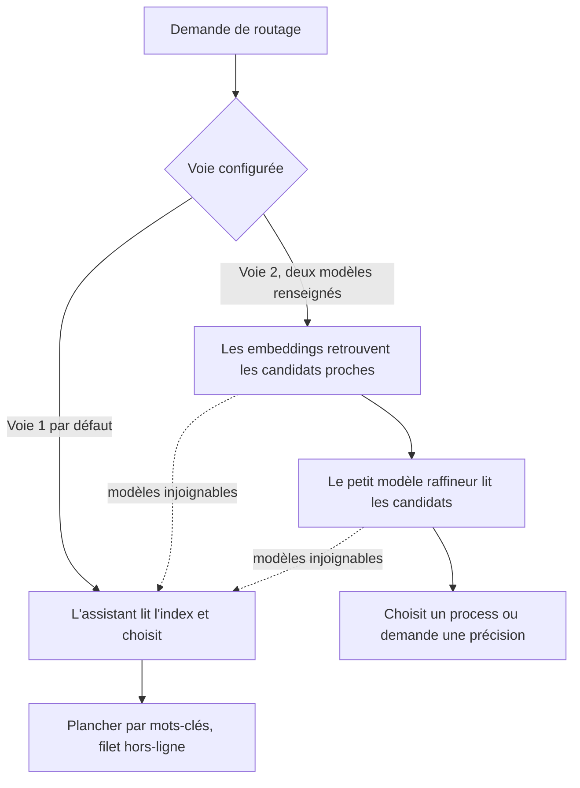

# Voie 2, le routage par embeddings (optionnel, pour l'échelle)

BASE route de deux façons, et vous choisissez par la configuration. La Voie 1 est le défaut et suffit
à la plupart des BASE. La Voie 2 est un confort pour les grands catalogues. Vous n'en avez besoin que
si vous l'avez décidé.

## Les deux voies, en une phrase chacune

- **Voie 1 (défaut, déjà active).** L'assistant lit l'index généré et choisit; un plancher déterministe
  par mots-clés sert de filet hors-ligne. Aucun modèle, rien à installer.
- **Voie 2 (optionnelle).** Les embeddings retrouvent les quelques candidats les plus proches de la
  demande, puis un petit modèle les lit et tranche (il choisit, ou demande une précision). En local.

Les deux voies sont indépendantes: la Voie 2 n'est pas un étage au-dessus de la Voie 1, c'est une autre
voie que la configuration sélectionne.

## En avez-vous besoin?

Soyez honnête avec vous-même avant d'installer quoi que ce soit.

- **Petit ou moyen BASE** (quelques agents, quelques dizaines de process): la **Voie 1 suffit**. La Voie 2
  n'apporterait rien, et ajouterait une installation à entretenir.
- **Grand BASE** (beaucoup de process, ou un routage qui hésite parce que la liste est longue à départager
  par mots-clés): la Voie 2 affine le choix. C'est là qu'elle gagne sa place.

## L'installation, c'est essentiellement «juste Ollama»

La promesse est simple. Voici ce qu'il faut faire:

1. Installer **Ollama** (l'application qui fait tourner des modèles en local).
2. Télécharger **deux modèles**: un modèle d'embedding et un petit modèle raffineur.
3. Les renseigner tous les deux dans la page **Réglages** du Studio, section «Routage / Voie 2» (ou
   directement dans le fichier de configuration).

**Local, souverain, sans nuage, sans clé d'API.** Tout reste sur votre machine. Un fournisseur hébergé
compatible OpenAI reste possible pour qui le veut, mais le récit par défaut est *Ollama seul*.

La Voie 2 s'active seulement quand **les deux** modèles sont renseignés. Un seul ne fait rien, et BASE
reste sur la Voie 1. Et si un modèle devient injoignable, BASE retombe automatiquement sur la Voie 1:
jamais de blocage, jamais de silence.

## Quels modèles choisir? (vous êtes libre)

BASE ne vous impose aucun modèle. À titre **illustratif et non prescriptif**, deux modèles locaux légers
font une bonne démonstration: `qwen3-embedding:0.6b` pour l'embedding (multilingue, utile car BASE est
francophone) et `qwen3:4b` pour le raffineur (petit modèle instruct). Ce sont des exemples, pas une
recommandation figée: choisissez les vôtres si vous préférez (par exemple un embedding à contexte long,
ou un raffineur d'une autre famille).

L'écosystème bouge vite. Plutôt que de mémoriser des versions, **consultez les modèles recommandés du
moment** sur la documentation d'Ollama, et vérifiez la balise exacte au téléchargement. Pour les critères
de choix d'un fournisseur d'embeddings (local, cloud, gateway, interne), voir
[Choisir son provider d'embeddings](choisir-provider-embeddings.md). Pour faire tourner des modèles en
restant souverain, voir [Modèles souverains](modeles-souverains.md).

Ne cherchez pas le «meilleur» petit raffineur à coups de pourcentages. Ce que l'éval de routage mesure
honnêtement, c'est un **signal de structure** (les embeddings font-ils remonter le bon candidat?), pas la
performance d'un modèle: le choix final, ou la demande de précision, revient à **votre propre IA**, bien
plus forte que tout petit modèle local. Le raffineur local n'est qu'un filet à l'échelle, sans Studio
ouvert. Inutile donc d'ajuster vos prompts ou votre structure pour gonfler le score d'un petit modèle.

## Se faire accompagner pas à pas

Le plus simple est de demander à votre assistant: **«active la Voie 2»**. Le process `activer-voie2` vous
guide, dans l'ordre: vérifier que le besoin est réel, installer Ollama en suivant sa documentation
officielle à jour, choisir et télécharger les deux modèles, puis les renseigner dans les Réglages. Il
montre chaque commande avant de l'exécuter, et ne fige aucune version.

## Où vivent les réglages

Dans le Studio, la section «Routage / Voie 2» des Réglages expose les deux modèles et le nombre de
candidats que voit le raffineur (un compte, pas un seuil à régler; la valeur par défaut convient).
Sans Studio, les mêmes valeurs vivent dans le bloc `routing` du fichier `.ai/studio.settings.json`
(`embedding_model`, `refiner_model`, et `k` optionnel). La règle tout-ou-rien est validée à l'écriture:
les deux modèles, ou aucun.

Pour la mise en place plus large du routage (zéro config, ranker à embeddings, lecture des scores), voir
[Mettre en place le routage sémantique](routage-semantique-quickstart.md).
